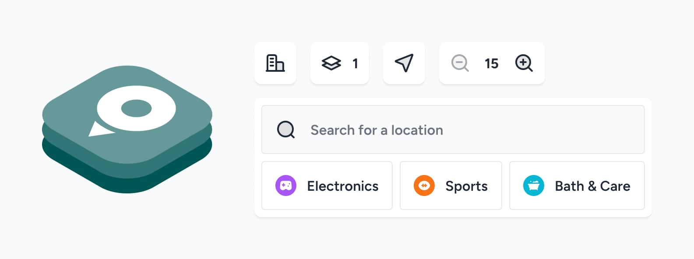

---
layout:
  title:
    visible: true
  description:
    visible: false
  tableOfContents:
    visible: true
  outline:
    visible: false
  pagination:
    visible: false
---

# MapsIndoors Developer Docs

Your go-to resource for tapping into the full potential of the MapsIndoors platform. Dive into comprehensive guides, tutorials, and reference materials designed to make your implementation process seamless and your indoor mapping solution shine.\

***

## ⚡ Simplified Map Implementation with Map Template   &#x20;

_Show your map with all the UI needed in less than 10 minutes_

<figure><picture><source srcset=".gitbook/assets/maptemplatedarkmode.min.jpg" media="(prefers-color-scheme: dark)"></picture><figcaption></figcaption></figure>

In less than 10 minutes you can seamlessly incorporate MapsIndoors into your system. We have developed all the required UI components and bundled them together for your convenience.

[<mark style="color:purple;">**Learn more about Map Template**</mark>](products/fast-track-maptemplate/)\

***

## SDKs & Frameworks

<table data-view="cards"><thead><tr><th></th><th data-hidden></th><th data-hidden></th><th data-hidden data-card-cover data-type="files"></th><th data-hidden data-type="content-ref"></th><th data-hidden data-card-target data-type="content-ref"></th></tr></thead><tbody><tr><td>Web SDK</td><td></td><td></td><td><a href=".gitbook/assets/web (11).jpg">web (11).jpg</a></td><td></td><td><a href="broken-reference">Broken link</a></td></tr><tr><td>Android SDK</td><td></td><td></td><td><a href=".gitbook/assets/android (7).jpg">android (7).jpg</a></td><td></td><td><a href="broken-reference">Broken link</a></td></tr><tr><td>iOS SDK</td><td></td><td></td><td><a href=".gitbook/assets/ios (2).jpg">ios (2).jpg</a></td><td></td><td><a href="broken-reference">Broken link</a></td></tr><tr><td>Integration API</td><td></td><td></td><td><a href=".gitbook/assets/api (6).jpg">api (6).jpg</a></td><td></td><td><a href="sdks-and-frameworks/integration-api/">integration-api</a></td></tr><tr><td>React Native</td><td></td><td></td><td><a href=".gitbook/assets/react (9) (1).jpg">react (9) (1).jpg</a></td><td></td><td><a href="broken-reference">Broken link</a></td></tr><tr><td>Flutter</td><td></td><td></td><td><a href=".gitbook/assets/flutter (8).jpg">flutter (8).jpg</a></td><td></td><td></td></tr></tbody></table>

***

## 🔥 Feature Highlight: 3D Maps

_The next generation of indoor maps is here_

<figure><figcaption></figcaption></figure>

Starting with the V4 versions of our SDKs, MapsIndoors has introduced the functionality to have your map viewed in 3D, with the appropriate navigational features, rather than just a flat 2D image.

[<mark style="color:purple;">**Learn more about 3**</mark>](key-features/3d-maps/)<mark style="color:purple;">**D maps**</mark>\

***

## Products

<table data-view="cards"><thead><tr><th></th><th data-hidden></th><th data-hidden></th><th data-hidden data-card-target data-type="content-ref"></th><th data-hidden data-card-cover data-type="files"></th></tr></thead><tbody><tr><td>Product Overview</td><td></td><td></td><td><a href="broken-reference">Broken link</a></td><td><a href=".gitbook/assets/overview.jpg">overview.jpg</a></td></tr><tr><td>Map Template</td><td></td><td></td><td><a href="products/fast-track-maptemplate/">fast-track-maptemplate</a></td><td><a href=".gitbook/assets/map template (2).jpg">map template (2).jpg</a></td></tr><tr><td>CMS</td><td></td><td></td><td></td><td><a href=".gitbook/assets/cms (9).jpg">cms (9).jpg</a></td></tr></tbody></table>

## Other Docs

<table data-view="cards"><thead><tr><th></th><th data-hidden></th><th data-hidden></th><th data-hidden data-card-target data-type="content-ref"></th><th data-hidden data-card-cover data-type="files"></th></tr></thead><tbody><tr><td>Glossary</td><td></td><td></td><td><a href="other-docs/glossary.md">glossary.md</a></td><td><a href=".gitbook/assets/glossary (1).jpg">glossary (1).jpg</a></td></tr><tr><td>Changelog</td><td>Reference Docs</td><td></td><td><a href="other-docs/changelog/">changelog</a></td><td><a href=".gitbook/assets/changelog (5).jpg">changelog (5).jpg</a></td></tr><tr><td>Reference Docs</td><td>Changelog</td><td></td><td><a href="other-docs/reference-docs/">reference-docs</a></td><td><a href=".gitbook/assets/ref docs (1).jpg">ref docs (1).jpg</a></td></tr><tr><td>Legacy Docs</td><td></td><td></td><td><a href="other-docs/legacy-docs/">legacy-docs</a></td><td><a href=".gitbook/assets/legacy docs (4).jpg">legacy docs (4).jpg</a></td></tr></tbody></table>
