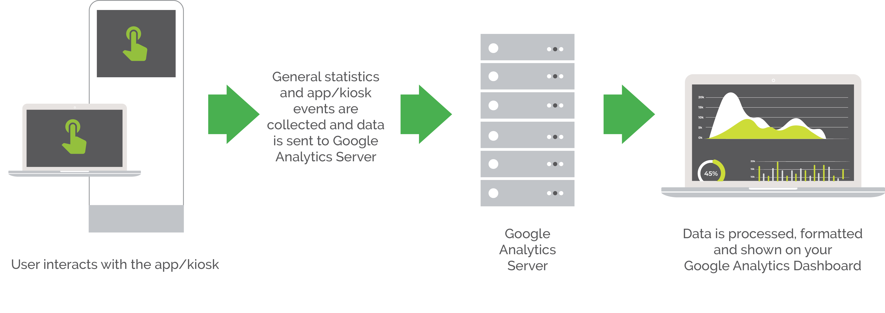

# Google Analytics & Logging

While Google Analytics is a useful tool that can help a lot in tracking data for your MapsIndoors application, it has it's own documentation maintained by Google, which will be referred to a lot on this page. This page will mainly serve as an overview and inspiration as to what you might want to use Google Analytics for in your MapsIndoors application.

## Overview[​](https://docs.mapsindoors.com/analytics-and-logging#overview) 

Google Analytics is a free tool that gives you the opportunity to analyze data to get a deeper understanding of your customers and how they use your app. Examples include understanding which places are hardest to find in your venue or what users typically search for when looking for a location. When implementing your own application using the MapsIndoors SDKs, you can implement event tracking using your analytics service of choice, however this page will focus on using Google Analytics.

The following diagram represents the flow of information from MapsIndoors to Google Analytics.

<figure><figcaption></figcaption></figure>

<figure><figcaption></figcaption></figure>

### Getting Started with Google Analytics[​](https://docs.mapsindoors.com/analytics-and-logging#getting-started-with-google-analytics) 

* If you are developing using the Android SDK for MapsIndoors, we recommend this "Getting Started" guide for Google Analytics.
  * [Get started with Google Analytics for Android](https://firebase.google.com/docs/analytics/get-started?technology=android\&platform=android#java)
* If you are developing using the iOS SDK for MapsIndoors, we recommend this "Getting Started" guide for Google Analytics.
  * [Get started with Google Analytics for iOS](https://firebase.google.com/docs/analytics/get-started?technology=android\&platform=ios#swift)
* If you are developing using the Web SDK for MapsIndoors, we recommend this "Getting Started" guide for Google Analytics.
  * [Get started with Google Analytics for Web](https://firebase.google.com/docs/analytics/get-started?technology=android\&platform=web#web-version-9)

### Capturing Events with Google Analytics[​](https://docs.mapsindoors.com/analytics-and-logging#capturing-events-with-google-analytics) 

Almost any events can be logged using Google Analytics. Below is a list of potential events that could be useful to log and keep data on.

#### **MapsIndoors Events**[**​**](https://docs.mapsindoors.com/analytics-and-logging#mapsindoors-events)

* Search queried and enter key pressed
* Location selected in search results list
* Category selected
* "Get Directions" clicked
* Directions with "From" location and "To" location
* Input cleared
* Avoid stairs selected
* Location clicked on map
* Cluster clicked on map

In order to define custom events, such as the ones above, in your application, you need to tell Google Analytics what to keep track of. This is done differently depending on the platform:

* If you are developing using the Android SDK for MapsIndoors, this guide describes how to set up logging of custom events in Google Analytics.
  * [Log events on Android with Google Analytics](https://firebase.google.com/docs/analytics/events?platform=android)
* If you are developing using the iOS SDK for MapsIndoors, this guide describes how to set up logging of custom events in Google Analytics.
  * [Log events on iOS with Google Analytics](https://firebase.google.com/docs/analytics/events?platform=ios#swift)
* If you are developing using the Web SDK for MapsIndoors, this guide describes how to set up logging of custom events in Google Analytics.
  * [Log events on web with Google Analytics](https://firebase.google.com/docs/analytics/events?platform=web#web-version-9)

#### **General Analytics**[**​**](https://docs.mapsindoors.com/analytics-and-logging#general-analytics)

Google Analytics also track certain statistics by default. They are follows:

* Current active users, their geography, and whether they're accessing on desktop or mobile
* Current active sessions by country
* Users by time of day
* Number of users and new users
* Number of sessions and sessions per user
* Page views
* Pages per session
* Average session duration
* Bounce rate
* Number of and percentage of users for each language
* Browser type
* Service provider
* Mobile device type
* ...And more!
