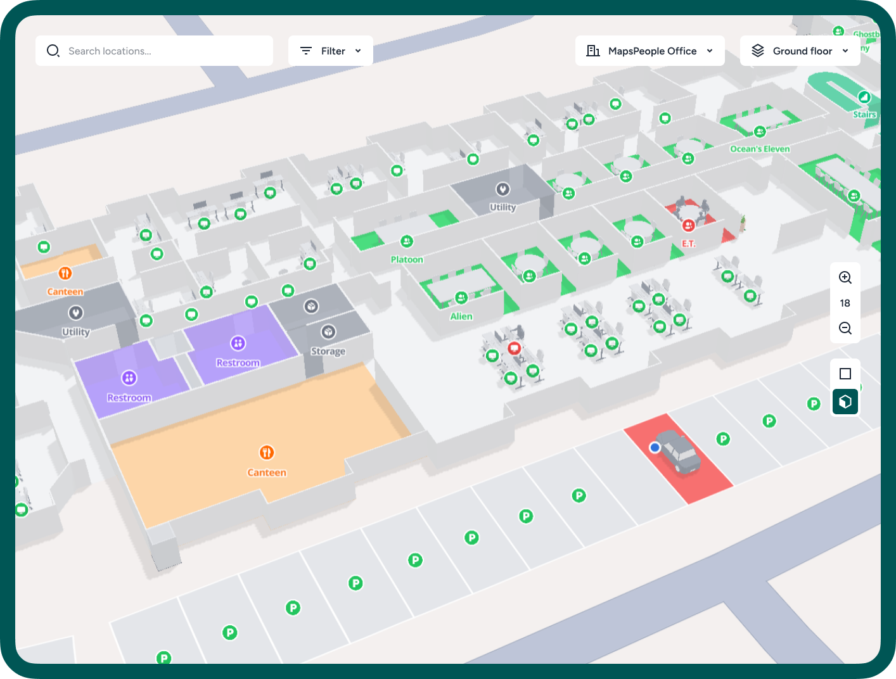
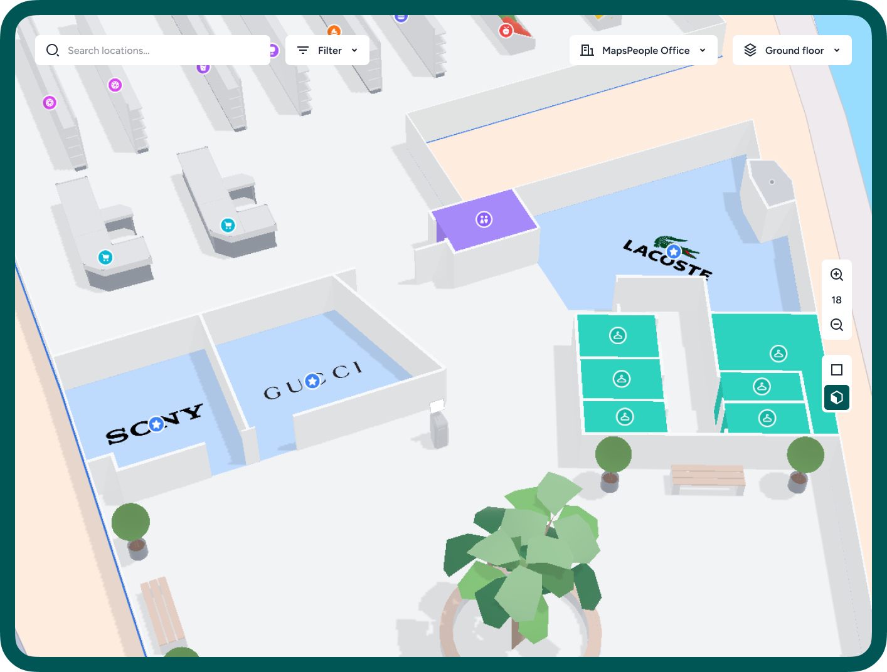

# Map Design

MapsIndoors empowers you to tailor maps to fit your brand and user interface. This customization enhances user experience. Yet, the multitude of options poses challenges. The abundance of choices can be overwhelming, hindering decision-making. So, let's begin by setting a clear goal.

## Making the map easy to scan 

Maps are most effective when they're easy to scan at a glance. Scannability should be considered the highest priority when designing an indoor map because it directly affects how quickly and accurately users can locate themselves and navigate to their destinations.&#x20;

<figure><figcaption>
Office map using MapsIndoors default styling
</figcaption></figure>

A map that's easily scannable allows users to understand the layout of a space within seconds, making navigation feel intuitive and effortless. This is accomplished through clear design choices, such as a consistent color scheme and iconography, that guide the user's eye to crucial information without overwhelming them with details.

### Use a consistent color scheme 

Choosing a consistent color scheme is crucial for enhancing the scannability of your map. This method simplifies the visual experience, allowing users to quickly identify different sections, landmarks, or points of interest based on color coding. Consistency in color usage reduces cognitive load, providing a more intuitive navigation experience. It also aids in reinforcing brand identity, as users begin to associate certain colors with specific types of information or locations on your map. When colors are used strategically, they can direct attention, signify importance, and improve overall comprehension for a smoother user journey.

<figure><figcaption>
MapsIndoors default color scheme
</figcaption></figure>

### Use consistent iconography 

Using a consistent icon style is fundamental to enhancing the scannability of your map. Icons serve as visual shorthand, conveying important information and functions with simple imagery. By maintaining a unified style, users can quickly recognize and understand what each icon represents without needing to stop and study them individually. This consistency helps in reducing confusion and ensures a smoother navigation process as users become familiar with the iconography used throughout the map. Moreover, a well-chosen icon set complements the overall design aesthetic and contributes to a cleaner, more organized visual layout, thereby improving the user's ability to scan and comprehend the map efficiently.

<figure><figcaption>
MapsIndoors default icon style
</figcaption></figure>

By prioritizing scannability, you significantly enhance the usability and effectiveness of your map, ensuring a positive user experience.

## Improve user engagement and satisfaction 

### Use 2D models 

Using 2D models, such as logos or representations of models like plants and furniture, can greatly enhance the clarity and readability of your maps. These simplified icons allow for quick recognition and understanding, making it easier for users to navigate through complex environments. By incorporating clear, visually distinct 2D models, you can improve the user's ability to identify specific locations or amenities, resulting in a more efficient and user-friendly experience. This approach is especially useful in densely populated or intricate spaces where too much detail can overwhelm or confuse the viewer.

<figure><figcaption>
2D logos used on mercant stores
</figcaption></figure>

### Use 3D models 

Integrating 3D models into your maps can significantly enhance user experience by offering a more immersive and interactive way to explore spaces. These models can represent buildings, landmarks, or interior spaces with realism and depth, making it easier for users to visualize their surroundings. This depth of interactivity not only aids in navigation but also significantly boosts user engagement by providing a detailed perspective that 2D models cannot achieve.&#x20;

<figure><figcaption>
3D model used to show occupied workstation
</figcaption></figure>

### Combine 2D & 3D 

Combining 2D and 3D models on your map allows for seamless transitioning between different viewing modes, catering to various user preferences and needs. By providing both perspectives, users can switch effortlessly between a simplified 2D layout for basic orientation and navigation, and a detailed 3D visualization for a more immersive exploration of spaces.

<figure><figcaption>
MapsIndoors offers several of these 2D &#x26; 3D responsive models to all customers
</figcaption></figure>
