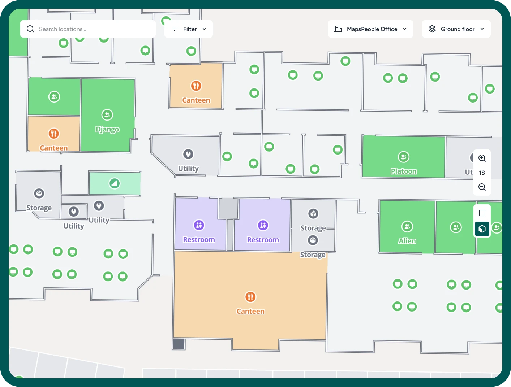
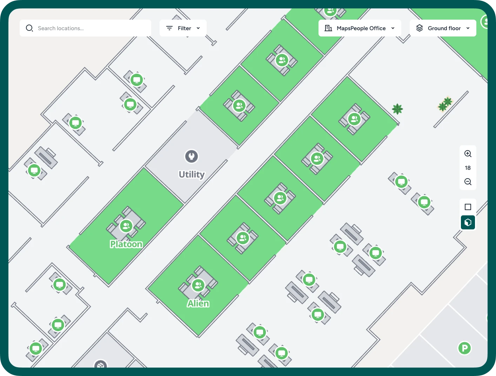
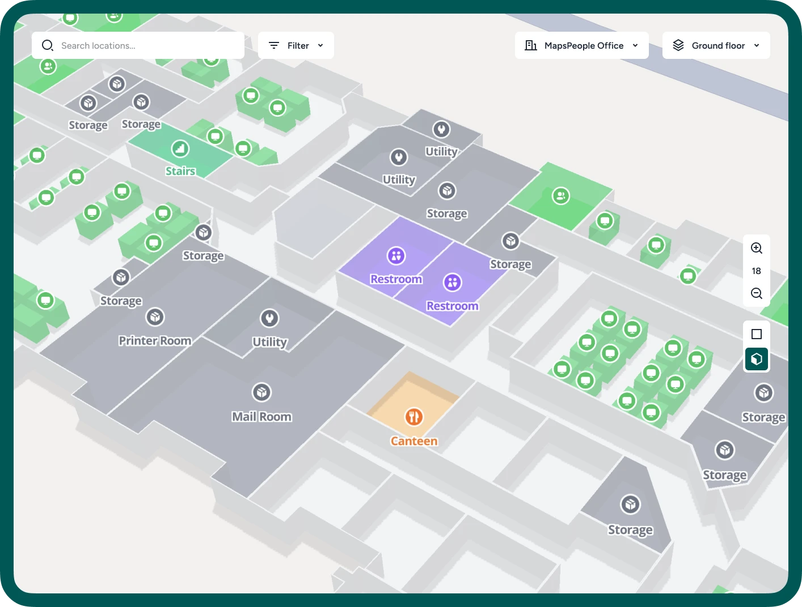
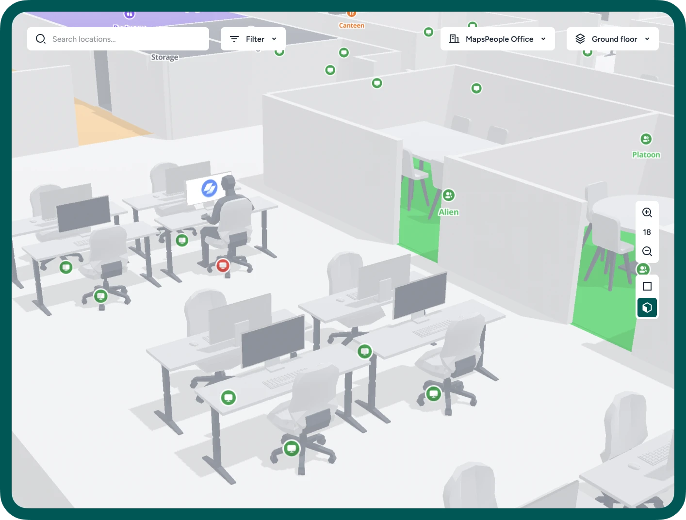

# Standard MapsIndoors Map Style

MapsIndoors solutions come with a default map style that balances ease of reading with visual appeal. This style is standard with every map we provide. You also have the option to customize this style to better suit your specific requirements.

<figure><figcaption>
Office map using MapsIndoors standard map style
</figcaption></figure>

<figure><figcaption>
MapsIndoors standard map style - color system for location types
</figcaption></figure>

## Rendering Options

The standard map style can be rendered in the **four** **following ways** to suit various application requirements:

1. **2D **<mark style="background-color:red;">**Without Models**</mark> (base map providers: Google, Mapbox)

<figure><figcaption></figcaption></figure>

2. **2D **<mark style="background-color:green;">**With Models**</mark> (base map providers: Google, Mapbox)

<figure><figcaption></figcaption></figure>

3. **3D **<mark style="background-color:red;">**Without Models**</mark> (base map provider: Mapbox only)

<figure><figcaption></figcaption></figure>

4. **3D **<mark style="background-color:green;">**With Models**</mark> (base map provider: Mapbox only)

<figure><figcaption></figcaption></figure>
