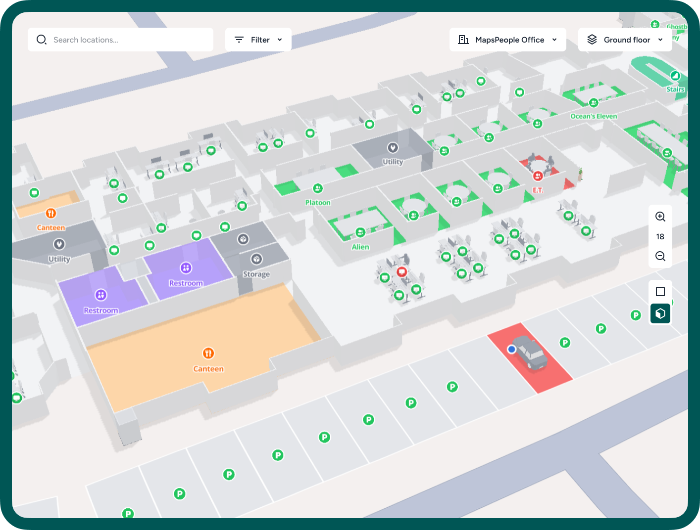

# Standard MapsIndoors Map Style

MapsIndoors solutions come with a default map style that balances ease of reading with visual appeal. This style is standard with every map we provide. You also have the option to customize this style to better suit your specific requirements.

<figure><figcaption>
Office map using MapsIndoors standard map style
</figcaption></figure>

<figure><figcaption>
MapsIndoors standard map style - color system for location types
</figcaption></figure>

## Rendering Options

The standard map style can be rendered in the **four** **following ways** to suit various application requirements:

1. **2D **<mark style="background-color:red;">**Without Models**</mark> (base map providers: Google, Mapbox)

<figure><figcaption></figcaption></figure>

2. **2D **<mark style="background-color:green;">**With Models**</mark> (base map providers: Google, Mapbox)

<figure><figcaption></figcaption></figure>

3. **3D **<mark style="background-color:red;">**Without Models**</mark> (base map provider: Mapbox only)

<figure><figcaption></figcaption></figure>

4. **3D **<mark style="background-color:green;">**With Models**</mark> (base map provider: Mapbox only)

<figure><figcaption></figcaption></figure>

## Outdoor decoration

If you want more details on the outdoor surroundings of your indoor map, we also have ways to make that happen. Here are your options:

### **Using Google base map**

We can draw on top of Google Maps to create custom outdoors for your map. Here's an example of a parking lot:

<figure><figcaption>
Custom drawn outdoor elements
</figcaption></figure>

Here's how that looks without our custom drawing:

<figure><figcaption></figcaption></figure>

### **Using Mapbox base map**

We don't draw custom land when using the Mapbox base map, but instead place items such as bushes, trees, stones, etc., as 2D models.

<figure><figcaption>
Notice the added trees. These have been placed as 2D models in our CMS.
</figcaption></figure>

And when using Mapbox 3D, trees and other environmental items are a part of the base map. If more is wished, you can always add more using 3D models.

<figure><figcaption>
Mapbox base map 3D landscape
</figcaption></figure>

<figure><figcaption>
Mapbox 3D map includes extrusions and landmarks for other buildings (this can be turned off)
</figcaption></figure>
