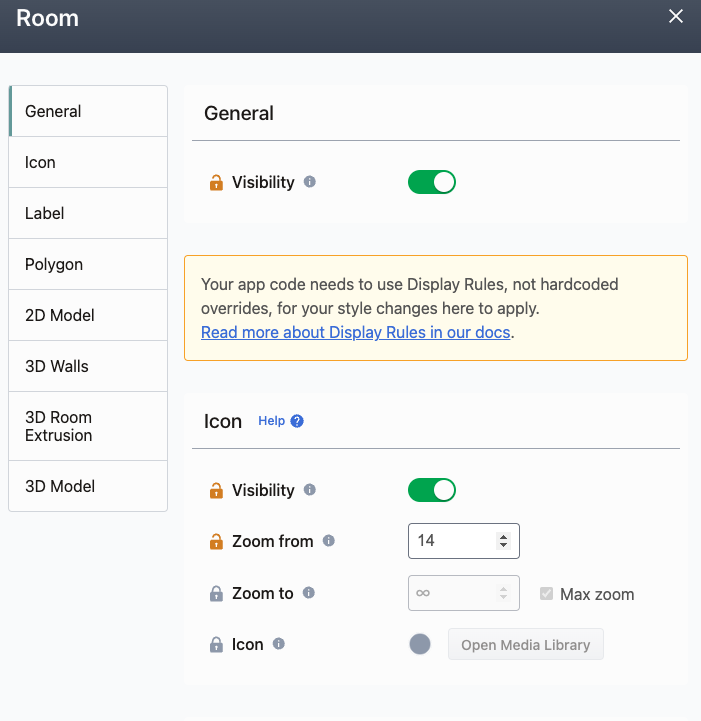
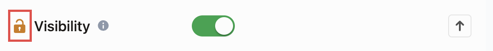
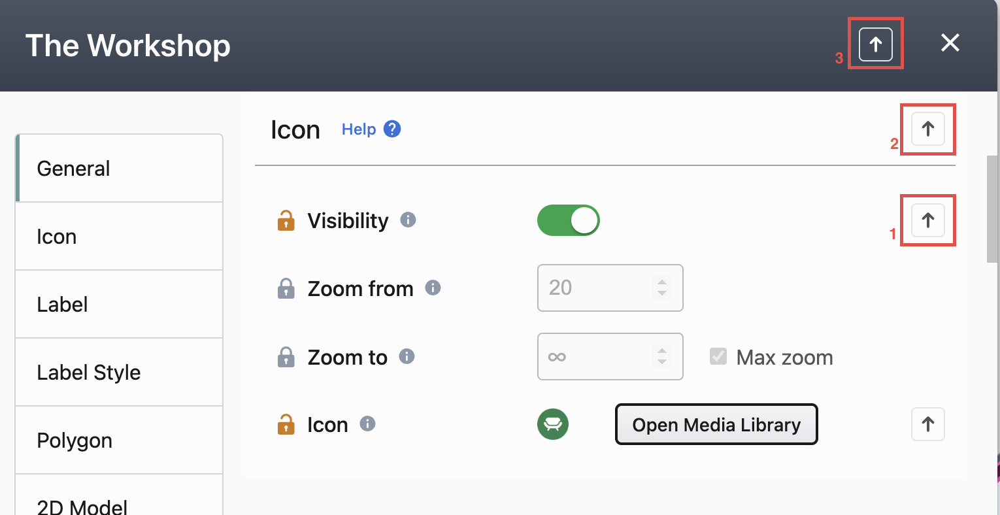

# Display Rules

## Introduction

Display Rules are the backbone of how you style the MapsIndoors data on your map. They are an incredibly powerful and flexible way to decide at which zoom levels icons appear, what colors to use for different types of places, and which 3D Models to use for your bookable desks, landmarks, or office decoration.

With the MapsIndoors CMS, you can control the initial appearance of Locations. In your app, at _runtime_, you can change Display Rules individually for a Location, or collective for a specific Type. You can do this based on logic inside your app, or as a result of outside logic in an external system that should reflect on the map. Besides the CMS, and in your app at runtime, you are also able to use the [Integration API](../../sdks-and-frameworks/integration-api/) to control Display Rules.

Here are a few examples for cases where it could make sense to change the Locations' Display Rules, but there are a lot of other use cases besides these too.

1. You can use Display Rules to match the colors of the selected Location's polygon to your brand guidelines to ensure a coherent visual expression throughout your application.
2. It is possible to connect your MapsIndoors Solution to an _occupancy_ monitoring system using [Live Data integrations](../../sdks-and-frameworks/web/data-visualization/live-data/), so the information about whether or not a room is occupied, and by how many people, is relayed to the MapsIndoors system. This information could then be used to color a Room red when it is occupied, or green if it is available.
3. A similar concept could be applied to Icons. Instead of the color of the Polygon changing depending on occupancy status, the Icon used for the Location could change based on whether or not the room is available.

## How to access Display Rules?

You have two convenient pathways for accessing Display Rules: via Location Details or Location Types. To initiate Display Rules through Location Details, simply select any location on the map. Once the Location Details Editor is displayed, you'll notice a small icon representing Display Rules in the top right corner:

<figure><figcaption>
Location Details Editor
</figcaption></figure>

By clicking this icon, you'll gain access to the Display Rules specifically tailored to that particular location. Alternatively, you can access Display Rules through Location Types. Here's how:\

<figure><figcaption>
Open Solution Details
</figcaption></figure>

<figure><figcaption>
Open Display Rules for a given Location Type
</figcaption></figure>

Navigate to Display Rules for a designated Location Type to manage Display Rules for the entire type efficiently. This method provides a comprehensive approach to editing Display Rules across multiple locations within a specific type.

## Display Rule Hierarchy[​](https://docs.mapsindoors.com/display-rules#display-rule-hierarchy) 

In each MapsIndoors SDK, the "Main Display Rule" outlines a list of sensible defaults for all geodata. Each Location Type inherits its values from this Main Display Rule, unless the value is specifically overridden.

Each Location (Room, Area or POI) uses the Display Rule from the combined Main and Type Display Rules, except for values that are specifically set for the individual Location.

Here's a visualisation of the inheritance principle:

<figure><figcaption>
Location's Display Rule
</figcaption></figure>

Unlocked properties are Location's specific values. Locked ones are inheriting value from Type Display Rules.

As an example, you set all polygons to be `red` in your Main Display Rule. The Location Type for "Meeting Room" specifies that their polygons should be `blue`, while the "Executive Meeting Room" Location specifically has an `orange` polygon.

No matter what is specified in this hierarchy, you can override it _runtime_ in your app. That means, as an example, that all matches for a specific search query can be specified to have a polygon color that is `pink`, regardless of what exists in the Main Display Rule, on their Types, and for those Locations specifically.

To remove a value from the Display Rule (to make it inherit from further up the hierarchy) set the property to `null`.

### Pushing Display Rules from Location to Type

When you open the Display Rules at the Location level and have specific settings defined, you have the option to push these settings to the Location's Type. The settings that can be pushed are identifiable by the state of the lock button at the beginning of each setting's row. If the button is unlocked, the setting is available to be pushed.

<figure><figcaption></figcaption></figure>

To push a Display Rule to the Location Type, you have three options. First, you can click the upward-pointing arrow on the right side of a specific setting to push that individual Display Rule to the Location Type. When one or more settings in a section are unlocked, an upward-pointing arrow will appear for the entire section. Clicking this arrow will push all the Display Rules in that section to the Location Type. Lastly, if any settings are unlocked, an upward-pointing arrow will also appear in the editor's header. Clicking this arrow will push the entire Display Rule to the Location Type.

<figure><figcaption></figcaption></figure>

Once the Display Rules are pushed to the Location Type, the settings will automatically be set to inherit from the Location Type, indicated by a locked lock button. Before pushing the Display Rules, a confirmation box will appear, informing you of the number of changes you are about to apply. It is important to review the settings carefully, as once they are pushed, the only way to revert the Location Type's Display Rule to its original state is by directly editing it—there is no undo option.

### Display Rule Properties[​](https://docs.mapsindoors.com/display-rules#display-rule-properties) 

In the CMS, you can edit your Types' Display Rules in `Solution Details > Types > Edit [Location Type name] > Display Rules`. This will open an overview of all Display Rules properties.

### General 

The "General" visibility switch determines whether Locations of this Type are visible on the map. The system will accept a Boolean here, so either `true` or `false`.

<figure><figcaption>
General Display Rules section
</figcaption></figure>

### Icon 

The "Icon" section contains options related to the appearance of the Icon.

1. **Visibility** - Controls whether the Icon is visible on the map.
   * The system will accept a Boolean here, so either `true` or `false`.
2. **Zoom from** - Sets the minimum Zoom Level at which the Icon is visible.
   * The value must be a number between 1 and 999, with 1 being very far away, and 999 acting as "max zoom". **Google Maps** only supports up to zoom level 22 at most, with **Mapbox** supporting up to level 25. Setting a value above these, your Icons will not show up on the map.
   * In a general use case, most maps will only need values from zoom level 15, unless you're building a view to show multiple Venues across a country or the like.
3. **Zoom to** - Sets the maximum Zoom Level at which the Icon is visible.
   * The value must be a number between 1 and 999, with 1 being very far away, and 999 acting as "max zoom". **Google Maps** only supports up to zoom level 22 at most, with **Mapbox** supporting up to level 25.
   * The recommended setting is to click the "Max zoom" checkbox, which sets the value to 999 in the data.
4. **Icon** - Use the Media Library in the CMS to control which Icon is shown on the map.
   * The Media Library is a tool to select the displayed Icon from either a pre-loaded selection of Icons, or for you to upload your own.
   * In-app, you can provide a URL to a desired Icon.
   * In-app, you can also define `iconSize`, by giving the desired size in pixels.

<figure><figcaption>
Icon Display Rules section
</figcaption></figure>

### Label

The "Label" section contains options related to the appearance of the Label. The Label is the text associated with the Location on the map, positioned next to the Icon or on its own.

Label is visible in the CMS, only when Location is being edited. In other words, by default view, labels are not visible. When Location is selected, label for this specific location is shown while editing.

1. **Visibility** - Controls whether the Label is visible on the map. The system will accept a Boolean here, so either `true` or `false`.
2. **Zoom from** - Sets the minimum Zoom Level at which the Label is visible. The value must be a number between 1 and 999, with 1 being very far away, and 999 acting as "max zoom". **Google Maps** only supports up to zoom level 22 at most, with **Mapbox** supporting up to level 25. Setting a value above these, your Labels will not show up on the map.
3. **Zoom to** - Sets the maximum Zoom Level at which the Label is visible. The value must be a number between 1 and 999, with 1 being very far away, and 999 acting as "max zoom". **Google Maps** only supports up to zoom level 22 at most, with **Mapbox** supporting up to level 25.The recommended setting is to click the "Max zoom" checkbox, which sets the value to 999 in the data.
4. **Template** - Controls the information the Label should contain. \
   Template options are:\
   Location Name - Only displays the Name of the Location.\
   External ID - Only displays the External ID set on the Location.\
   External ID & Location Name - Displays both the External ID and the Location Name, with the External ID first.\
   Location Name & External ID - Displays both the Location Name and the External ID, with the Location Name first.
5. **Max width** - Only for Google Maps Map Provider: Specify how wide (in pixels) a Label can be before forcing a line-break.A value of `0` will ensure no line-breaks for this label.

<figure><figcaption>
Label Display Rules section
</figcaption></figure>

### Label Style

The "Label Style" section contains options related to the style of the Label. **Google Maps** does not support Label Style section inside Display Rules.

1. **Label Type** - Controls which label Type is used. The system will accept either **Text Label, Flat Label** or **Graphic Label**.
2. **Text Size** - Sets the size of the Label. The value must be a number between 1 and 255, with 1 being very small, and 255 being the maximum size of the Label.
3. **Text Color** - Sets the color of the Label. In the CMS, you can select a color using the color picker displayed when clicking the color input field.If setting the color in-app, the value provided must be in 6-digit HEX code (eg. #3071D9).
4. **Text Opacity** - Controls the text opacity of the Label.The value here should be between `0` and `1`. A value of `1` gives 100% opacity, `0.2` gives 20% opacity, etc.
5. **Halo color** - Sets the halo color of around the Label. In the CMS, you can select a color using the color picker displayed when clicking the color input field.If setting the color in-app, the value provided must be in 6-digit HEX code (eg. #3071D9).
6. **Halo Width** - Sets the halo thickness/width. Defined in pixels.
7. **Halo Blur** - Sets when halo blurring effect should be applied. (eg. With Halo Width = 10px, and Halo Blur = 5px, blurring effect will be applied in the middle of the Halo Width).

<figure><figcaption>
Label Style Display Rule Section
</figcaption></figure>

By choosing Floating Label type, the new sub-section will appear: Label Position. It controls the position of the Floating Label relative to the anchor point of the Location. Options are: bottom, top, right or left.

<figure><figcaption>
Label Position Display Rules sub-section
</figcaption></figure>


Note: The ability to change label positioning is expected to be available at the end of November in the SDKs with the following versions: Web SDK (v4.38.0) and Mobile SDKs (Android v4.9.0 and iOS v4.8.0). For the Mobile SDKs this changes the previous default postioning. See the [changelog](https://docs.mapsindoors.com/other-docs/changelog) for the actual versions of the SDKs once released.


It is possible to define what position the label by choosing Flat Label type, the new sub-section will appear: Bearing. It controls the rotation of the Flat Label. Measured in degrees, like a compass bearing.

<figure><figcaption>
Bearing Display Rules sub-section
</figcaption></figure>

By choosing Graphic Label, type the new sub-section will appear: Add Graphic Label. It controls which background is going to be used for label.

<figure><figcaption>
Graphic Label Display Rules sub-section
</figcaption></figure>

After clicking 'Add Graphic Label' button, pre-filtered Media Library will be opened:

<figure><figcaption>
 Media Library for Graphic Labels
</figcaption></figure>

The use of graphic labels is currently in a preview phase, meaning that you can only choose from MapsIndoors Labels. When you choose a specific label, you'll see it updated on the map:\

<figure><figcaption></figcaption></figure>

### Polygon[​](https://docs.mapsindoors.com/display-rules#polygon) 

Polygons are independent from tiles. Tiles are drawn by MapsPeople and overlaid onto the mapping engine (Mapbox or Google Maps). Polygons are an overlay with customisable attributes that are then overlaid on top of the Tiles. Therefore, while you can edit the "Polygon" attributes of a Location connected to a Tile, be that an Area or a Room, you need to account for attributes such as the opacity of the Polygon in the resulting appearance. It is not currently possible to override the appearance of Tiles.

The "Polygon" section contains options related to the appearance of the Polygon.

1. **Visibility** - Controls whether the Polygon is visible on the map.
   * The system will accept a Boolean here, so either `true` or `false`.
2. **Zoom from** - Sets the minimum Zoom Level at which the Polygon is visible.
   * The value must be a number between 1 and 999, with 1 being very far away, and 999 acting as "max zoom". Google Maps only supports up to zoom level 22 at most, with Mapbox supporting up to level 25. Setting a value above these, your Polygon will not show up on the map.
3. **Zoom to** - Sets the maximum Zoom Level at which the Polygon is visible.
   * The value must be a number between 1 and 999, with 1 being very far away, and 999 acting as "max zoom". Google Maps only supports up to zoom level 22 at most, with Mapbox supporting up to level 25.
   * The recommended setting is to click the "Max zoom" checkbox, which sets the value to 999 in the data.
4. **Stroke color** - Controls the stroke color of the Polygon.
   * In the CMS, you can select a color using the color picker displayed when clicking the color input field.
   * If setting the color in-app, the value provided must be in 6-digit HEX code (eg. #3071D9).
5. **Stroke width** - Controls the stroke width (in pixels) of the Polygon.
6. **Stroke opacity** - Controls the stroke opacity of the Polygon.
   * The value here should be between `0` and `1`. A value of `1` gives 100% opacity, `0.2` gives 20% opacity, etc.
7. **Fill color** - Controls the fill color of the Polygon.
   * In the CMS, you can select a color using the color picker displayed when clicking the color input field.
   * If setting the color in-app, the value provided must be in 6-digit HEX code (eg. #3071D9).
8. **Fill opacity** - Controls the fill opacity of the Polygon.
   * The value here should be between `0` and `1`. A value of `1` gives 100% opacity, `0.2` gives 20% opacity, etc.

<figure><figcaption>
Polygon Display Rules Section
</figcaption></figure>

### 2D Model[​](https://docs.mapsindoors.com/display-rules#2d-model) 


Please note that this functionality needs to be enabled by MapsPeople. You can contact your MapsPeople representative to have the 2D model functionality enabled for your Solution(s).


2D Models are a way of including images on the map, and customising their appearance. They are uploaded using the Media Library.

The size of the 2D Models on the map follow the zoom levels, as opposed to how icons work, which always keep their size. The most common use case is to have logos for exhibitors, stores, or the like on the map.

1. **Visibility** - Controls whether the 2D model is visible on the map.
   * The system will accept a Boolean here, so either `true` or `false`.
2. **Zoom from** - Sets the minimum Zoom Level at which the 2D model is visible.
   * The value must be a number between 1 and 999, with 1 being very far away, and 999 acting as "max zoom". Google Maps only supports up to zoom level 22 at most, with Mapbox supporting up to level 25. Setting a value above these, your Polygon will not show up on the map.
3. **Zoom to** - Sets the maximum Zoom Level at which the 2D model is visible.
   * The value must be a number between 1 and 999, with 1 being very far away, and 999 acting as "max zoom". Google Maps only supports up to zoom level 22 at most, with Mapbox supporting up to level 25.
   * The recommended setting is to click the "Max zoom" checkbox, which sets the value to 999 in the data.
4. **2D Model** - Open the Media Library, where you can choose which 2D model to display.
   * The Media Library is a tool to select the displayed Icon from either a pre-loaded selection of Icons, or for you to upload your own.
   * In-app, you can provide a URL to a desired 2D Model.
5. **Width x Height** - Controls the width and height of the 2D model, measured in meters. These values cannot be changed individually, the 2D model must maintain its original aspect ratio.
   * "Fit to Location" is a great option for quickly setting a Width and Height that makes the 2D Model take up as much space as possible in the polygon.
     * Note that the "anchor point" is the deciding factor here. For Locations where the anchor point has not been moved (the place where the icon is shown inside the polygon), it will be computed to be in the center of the polygon. This is also the point that is used for the calculation of where to place the 2D Model and have it take as much space as possible — if the anchor point is close to an edge of the polygon, there will not be a lot of space as there would be if it was placed at the center.
6. **Bearing (rotation)** - Controls the rotation of the 2D model. Measured in degrees, like a compass bearing.

<figure><figcaption>
2D Model Display Rules section
</figcaption></figure>


[Please visit this page](https://docs.mapsindoors.com/3d-maps) to see what the requirements are to use the 3D functionality in MapsIndoors.


The MapsIndoors CMS gives you the options for to display your map in 3D. This is achieved by visualising Rooms as Walls and Extrusions. The appearance of these can be determined by these Display Rule configurations.

1. **Visibility** - Controls whether the 3D Walls are visible on the map.
   * The system will accept a Boolean here, so either `true` or `false`.
2. **Zoom from** - Sets the minimum Zoom Level at which the 3D Walls are visible.
   * The value must be a number between 1 and 999, with 1 being very far away, and 999 acting as "max zoom". Mapbox supports up to level 25. Setting a value above these, your 3D Walls will not show up on the map.
3. **Zoom to** - Sets the maximum Zoom Level at which the 3D walls are visible.
   * The value must be a number between 1 and 999, with 1 being very far away, and 999 acting as "max zoom". Mapbox supports up to level 25.
   * The recommended setting is to click the "Max zoom" checkbox, which sets the value to 999 in the data.
4. **Wall color** - Controls the color of the 3D Walls.
   * In the CMS, you can select a color using the color picker displayed when clicking the color input field.
   * If setting the color in-app, the value provided must be in 6-digit HEX code (eg. #3071D9).
5. **Wall height** - Controls the height of the 3D Walls, measured in meters.

<figure><figcaption>
3D Walls Display Rules section
</figcaption></figure>

### 3D Room Extrusion[​](https://docs.mapsindoors.com/display-rules#3d-room-extrusion) 


[Please visit this page](https://docs.mapsindoors.com/3d-maps) to see what the requirements are to use the 3D functionality in MapsIndoors.


The MapsIndoors CMS gives you the options for to display your map in 3D. This is achieved by visualising Rooms as Walls and Extrusions. The appearance of these can be determined by these Display Rule configurations.

1. **Visibility** - Controls whether the Extrusion is visible on the map.
   * The system will accept a Boolean here, so either `true` or `false`.
2. **Zoom from** - Sets the minimum Zoom Level at which the Extrusion is visible.
   * The value must be a number between 1 and 999, with 1 being very far away, and 999 acting as "max zoom". Mapbox supports up to level 25. Setting a value above these, your 3D Walls will not show up on the map.
3. **Zoom to** - Sets the maximum Zoom Level at which the Extrusion is visible.
   * The value must be a number between 1 and 999, with 1 being very far away, and 999 acting as "max zoom". Mapbox supports up to level 25.
   * The recommended setting is to click the "Max zoom" checkbox, which sets the value to 999 in the data.
4. **Extrusion color** - Controls the color of the Extrusion.
   * In the CMS, you can select a color using the color picker displayed when clicking the color input field.
   * If setting the color in-app, the value provided must be in 6-digit HEX code (eg. #3071D9).
5. **Extrusion height** - Controls the height of the Extrusion, measured in meters.

<figure><figcaption>
3D Room Extrusion Display Rules section
</figcaption></figure>

### 3D Model[​](https://docs.mapsindoors.com/display-rules#3d-models) 


[Please visit this page](https://docs.mapsindoors.com/3d-maps) to see what the requirements are to use the 3D functionality in MapsIndoors.


3D Model section is essential for creating a great 3D map experience. They are uploaded using the Media Library.

1. **Visibility** - Controls whether the 3D Model is visible on the map.
   * The system will accept a Boolean here, so either `true` or `false`.
2. **Zoom from** - Sets the minimum Zoom Level at which the Extrusion is visible.
   * The value must be a number between 1 and 999, with 1 being very far away, and 999 acting as "max zoom". Mapbox supports up to level 25. Setting a value above these, your 3D Walls will not show up on the map.
3. **Zoom to** - Sets the maximum Zoom Level at which the Extrusion is visible.
   * The value must be a number between 1 and 999, with 1 being very far away, and 999 acting as "max zoom". Mapbox supports up to level 25.
   * The recommended setting is to click the "Max zoom" checkbox, which sets the value to 999 in the data.
4. **3D Model** - Open the Media Library, where you can choose which 3D model to display.
   * The Media Library is a tool to upload and select the model you want to show on the map.
   * In-app, you can provide a URL to a desired model.
5. **X-axis rotation** - Controls the rotation of the model on the X-axis.
   * This value is the rotation on a given axis measured in degrees, and can be any value between 0 and 360.
6. **Y-axis rotation** - Controls the rotation of the model on the Y-axis.
   * This value is the rotation on a given axis measured in degrees, and can be any value between 0 and 360.
7. **Z-axis rotation** - Controls the rotation of the model on the Z-axis.
   * This value is the rotation on a given axis measured in degrees, and can be any value between 0 and 360.
8. **Scale** - Control the scale of the model. Can be used to make the model larger or smaller on the map.
   * This value is a multiplier in relation to the original size of the uploaded model.

<figure><figcaption>
3D Model Display Rules section
</figcaption></figure>

All properties are optional

<table><thead><tr><th width="240">Properties</th><th>Type</th><th>Validation</th><th>Description</th></tr></thead><tbody><tr><td><code>visible</code></td><td>boolean</td><td></td><td>Must be true for the location to be shown in the map. If not true all other parameters are ignored.</td></tr><tr><td><code>iconVisible</code></td><td>boolean</td><td></td><td>Must be <code>true</code> for the icon to be visible in the map. If this is not <code>true</code> the <code>zoomFrom</code>, <code>zoomTo</code>, <code>iconUrl</code>, <code>iconScale</code> and <code>iconSize</code> parameters are ignored.</td></tr><tr><td><code>zoomFrom</code></td><td>number</td><td><code>1</code>-<code>999</code></td><td>The minimum zoom level the image/icon will be visible on the map.</td></tr><tr><td><code>zoomTo</code></td><td>number</td><td><code>1</code>-<code>999</code></td><td>The maximum zoom level the image/icon will be visible on the map.</td></tr><tr><td><code>icon</code></td><td>string</td><td></td><td>A URL to an image to represent the Location on the map.</td></tr><tr><td><code>iconScale</code></td><td>double</td><td><code>> 0</code></td><td>⚠️ Deprecated</td></tr><tr><td><code>iconSize</code></td><td>object</td><td></td><td>Specifies the size that the image will appear on the map. <code>{{ "{width: number, height: number" }}}</code>.</td></tr><tr><td><code>labelVisible</code></td><td>boolean</td><td></td><td>Must be <code>true</code> for the label to be visible on the map. If it is <code>false</code> all parameters  under label are ignored.</td></tr><tr><td><code>labelZoomFrom</code></td><td>number</td><td><code>1</code>-<code>999</code></td><td>The minimum zoom level the image/icon will be visible on the map.</td></tr><tr><td><code>labelZoomTo</code></td><td>number</td><td><code>1</code>-<code>999</code></td><td>The maximum zoom level the image/icon will be visible on the map.</td></tr><tr><td><code>labelMaxWidth</code></td><td>number</td><td><code>>0</code></td><td>Specify how wide (in pixels) a Label can be before forcing a line-break.A value of <code>0</code> will ensure no line-breaks for this label</td></tr><tr><td><code>label</code></td><td></td><td></td><td>Controls the information the Label should contain</td></tr><tr><td><code>labelStyle</code></td><td>object</td><td></td><td>Everything under this parameter apply only to locations that have label style data defined.</td></tr><tr><td><code>labelStyle.textSize</code></td><td>number</td><td><code>1</code> - <code>255</code> in pixels</td><td>Defines the size of the label on the map.</td></tr><tr><td><code>labelStyle.textColor</code></td><td></td><td>Valid hex color</td><td>The color of the label.</td></tr><tr><td><code>labelStyle.textOpacity</code></td><td>number</td><td><code>0</code> - <code>1</code></td><td>The opacity of the label.</td></tr><tr><td><code>labelStyle.haloColor</code></td><td></td><td>Valid hex color</td><td>The color of the halo around the label.</td></tr><tr><td><code>labelStyle.haloWidth</code></td><td>number</td><td><code>1</code> - <code>64</code></td><td>The width of the halo around the label. </td></tr><tr><td><code>labelStyle.haloBlur</code></td><td>number</td><td><code>1</code> - <code>64</code></td><td>Sets the distance on the halo width when the blur effect should be applied.</td></tr><tr><td><code>labelStyle.bearing</code></td><td>number</td><td><code>0</code> - <code>360</code></td><td>Sets the bearing of the flat label on the map.</td></tr><tr><td><code>labelStyle.graphic</code></td><td>object</td><td></td><td>Everything under this parameter apply only to locations that have label style and label graphic data defined.</td></tr><tr><td><code>labelStyle.graphic.backgroundImage</code></td><td>string</td><td></td><td>A URL to an image to represent the Location's Graphic Label on the map.</td></tr><tr><td><code>labelStyle.labelPosition</code></td><td>string</td><td></td><td>Sets the Label Position of the floating label on the map.</td></tr><tr><td><code>iconSize.width</code></td><td>double</td><td><code>> 0</code></td><td></td></tr><tr><td><code>iconSize.height</code></td><td>double</td><td><code>> 0</code></td><td></td></tr><tr><td><code>polygon</code></td><td>object</td><td></td><td>Everything under this parameter apply only to locations that have polygon data defined such as Rooms and Areas, but not POIs.</td></tr><tr><td><code>polygon.visible</code></td><td>boolean</td><td></td><td>Must be <code>true</code> for the polygon to be visible on the map. If this is not <code>true</code> all parameters under polygon are ignored.</td></tr><tr><td><code>polygon.zoomFrom</code></td><td></td><td><code>1</code>-<code>999</code></td><td>The lowest zoom level where the polygon will be shown.</td></tr><tr><td><code>polygon.zoomTo</code></td><td></td><td><code>1</code>-<code>999</code></td><td>The highest zoom level where the polygon will be shown. This number must be higher than <code>polygon.zoomFrom</code> unless <code>polygon.zoomFrom</code> is equal to the highest available zoom level for the Solution (this is <code>22</code> in some cases).</td></tr><tr><td><code>polygon.strokeWidth</code></td><td></td><td><code>>= 0</code></td><td>The width of the outline of the polygon.</td></tr><tr><td><code>polygon.strokeColor</code></td><td></td><td>Valid hex color</td><td>The color of the outline of the polygon.</td></tr><tr><td><code>polygon.strokeOpacity</code></td><td></td><td><code>0</code>-<code>1</code></td><td>The opacity of the outline of the polygon. Set this to <code>0</code> if only the interior is to be shown.</td></tr><tr><td><code>polygon.fillColor</code></td><td></td><td>Valid hex color</td><td>The color of the interior of the polygon.</td></tr><tr><td><code>polygon.fillOpacity</code></td><td></td><td><code>0</code>-<code>1</code></td><td>The color of the interior of the polygon. Set this to 0 if only the outline is to be shown.</td></tr></tbody></table>
