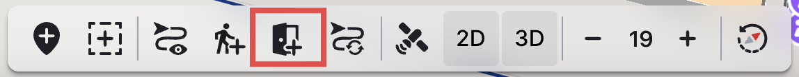

# Route Network

Using the CMS you have the option to modify and update your route network. It is important to note that depending on your user role and Graph Setup , you have different options to alter with the route network.

**Available toolbar actions based on App User Roles:**

* **Admin**
  * Add POI
  * Add Area
  * Show Network
  * Add Barrier Route Element
  * Add Door Route Element (if auto route enabled)
  * Reload Route Network
  * Show Satellite Map
  * 2D (if enabled in Solution module)
  * 3D (Mapbox only and if enabled in Solution module)
  * Zooming in/out
  * Reset map rotation and tilt (Mapbox only)
* **Editor**
  * Add POI
  * Add Area
  * Show Satellite Map
  * 2D (if enabled in Solution module)
  * 3D (Mapbox only and if enabled in Solution module)
  * Zooming in/out
  * Reset map rotation and tilt (Mapbox only)

**Editing options and differences based on Graph Setup:**

* **Manual** - having a Manual Graph setup means that your Route Network is drawn manually by MapsPeople.
* **Automatic** - having an Automatic Graph setup means that your Route Network is generated automatically based on the available route elements on the map.

Within the toolbar, you'll discover a variety of interactive buttons, each with a distinct function designed to enhance and customise your route network.

<figure><figcaption></figcaption></figure>

### The Toolbar actions

* **Show/Hide Route Network** - Clicking this button will load your route network if it is not visible, or hide it if it is already loaded. It will also be toggled on if other Route Element-related actions are being taken and the Network is not shown on the map. E.g. clicking Add Door Route Element also enables the Network for showing routing context on the Map.

<figure><figcaption></figcaption></figure>

* [**Add Barrier Route Element** ](barrier-route-element.md)- Clicking this button will add a new [barrier](../interface-overview.md#doors--barriers) to the route network.

<figure><figcaption></figcaption></figure>

* [**Add Door Route Element**](door-route-element.md) **-** Clicking this button will add a new door to the route network.

<figure><figcaption></figcaption></figure>

* **Reload Route Network -** Clicking this button will reload the route network. To see the updates/changes to the Route Network you have to click this button. The button will get an indicator when changes affecting the Network have been made

<figure><figcaption></figcaption></figure>
