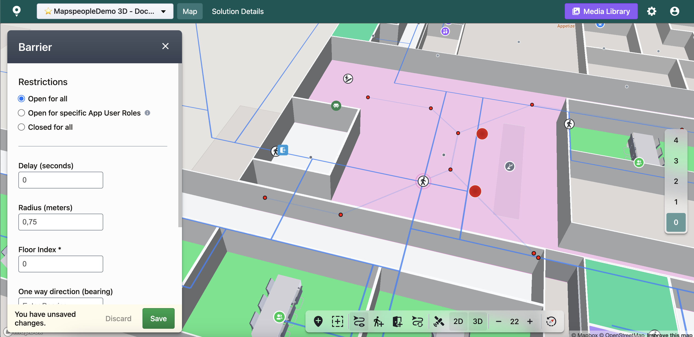
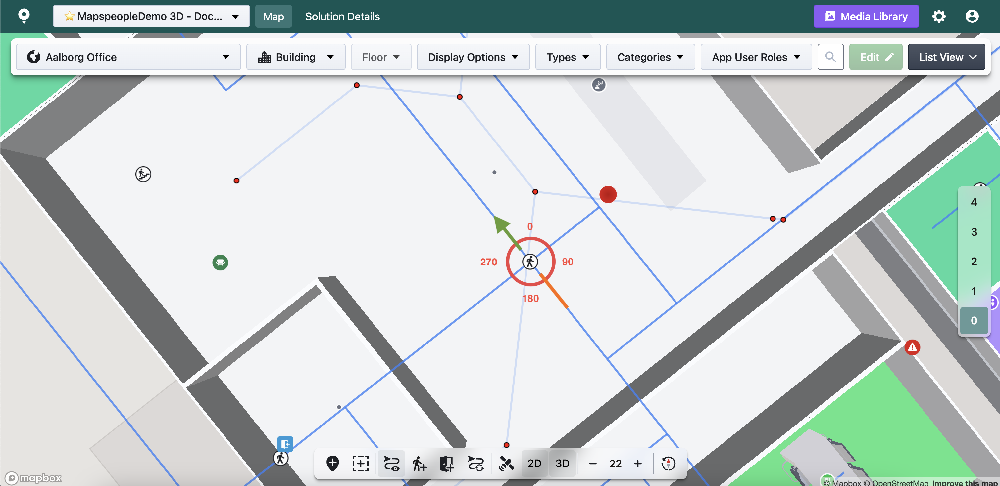
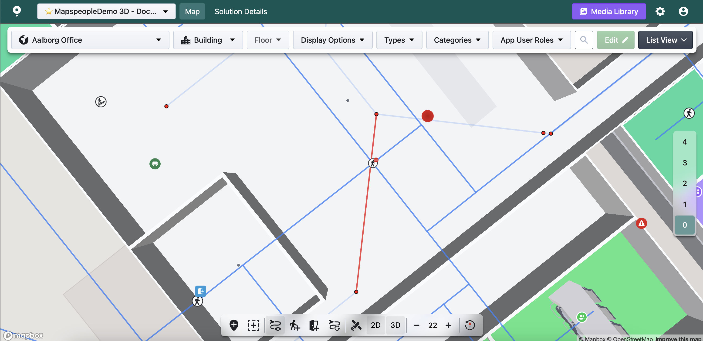

# Barrier Route Element

Adding a new **Barrier Route Element** to your Network enables you to change the underlaying graph data. Common applications encompass the adjustment of wait times, the imposition of access restrictions, and the establishment of one-way designations in specific directions for a particular location.

<figure><figcaption></figcaption></figure>

When adding a new **Barrier Route Element** you have the option to modify different settings.

<figure><figcaption></figcaption></figure>

* **Restrictions** - you can set which types of App User Roles are allowed or prohibited from accessing certain parts of the Route Network.
  * **Open for all** - all App User Roles are allowed.
  * **Open for specific App User Roles** - certain App User Roles are allowed. You must select the specific App User Roles you wish to give access to. If no App User Roles are selected, the **Closed for all** option will be selected automatically.
  * **Closed for all** - no App User Roles are allowed&#x20;
* **Delay** - to be able to calculate the different routes accurately, you may add some delay to a **Barrier Route Element**. This property can help us serve your users the fastest/most optimal route. An example can be a very high-traffic area. It is used in estimated arrival time calculations.
* **Radius** - you can set the Radius (in meters) for the **Barrier Route Element**, to ensure it touches the Route Network.
* **Floor Index** - the floor onto which the **Barrier Route Element** should be added. By default, we fill it with the currently active [floor's index](#user-content-fn-1)[^1].
* **One way direction (bearing)** - the value can be set from 0-360 degrees. It defines the orientation of the one way direction. It is always north faced, so for example if you set a bearing to 45 the one way direction goes from the centre and North East.

<figure><figcaption></figcaption></figure>

At the bottom of the editor you will also find additional information about the **Barrier Route Element** including the element's id, coordinates, who and when modified it last.

After Saving / Editing / Deleting a **Barrier Route Element** remember to reload the Route Network to see your changes applied (in case of Automatic Route Network).

<figure><figcaption></figcaption></figure>

[^1]: Floor indices might differ from floor names that you see on the right side of the screen. Please make sure you are using the correct floor index before saving.
