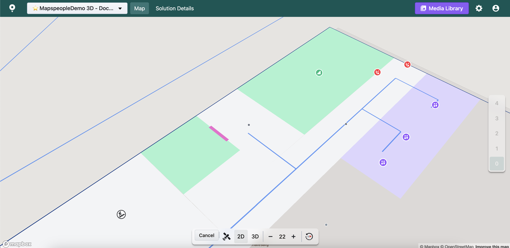

# Door Route Element

Doors are Route Elements that allow you to manipulate certain portions of the Route Network and indicate the presence of a door - or other entryway - in a building. A Door is a connection between two Rooms, or from outside a Building and into it.

Automatically calculating the Route from an Origin to a Destination in reality means calculating how to get from Door to Door between the Origin and Destination while avoiding all Walls.

Doors are a Route Element that indicates the presence of a door - or other entryway - in a building.

<figure><figcaption></figcaption></figure>

When adding a new **Door Route Element** you have the option to modify different settings.

<figure><figcaption></figcaption></figure>

* **Type** - you can define what type of Door the new Route Element is. Each type of Door has different default values.
  * **Door** - a Door between two Rooms inside the same Building.
  * **ElevatorDoor** - a Door for an elevator comes with a built-in Delay.
  * **ExternalDoor** - a type of Door that links to the outside Route Network. This type only connects to one Room.
  * **InterBuildingDoor** - a Door that connects two Rooms in two different Buildings.
  * **Opening** - an entryway between two Rooms inside the same Building, but with no physical door.
  * **Hatchway** - a specific kind of Door used for smaller rooms in some specific situations.
* **Restrictions** - you can set which types of App User Roles are allowed or prohibited from accessing certain parts of the Route Network.
  * **Open for all** - all App User Roles are allowed.
  * **Open for specific App User Roles** - certain App User Roles are allowed. You must select the specific App User Roles you wish to give access to. If no App User Roles are selected, the **Closed for all** option will be selected automatically.
  * **Closed for all** - no App User Roles are allowed&#x20;
* **Delay** - you can set a Delay (in seconds) for routes that pass through this door. It is used in estimated arrival time calculations.
* **Radius** - you can set the Radius (in meters) for this Door, to ensure it touches the Route Network.
* **Floor Index** - the floor onto which the **Barrier Route Element** should be added. By default, we fill it with the currently active [floor's index](#user-content-fn-1)[^1].
* **One-way direction (bearing)** - The _exit angle_ of a one-way Door, in degrees, like a compass bearing. In the illustration below, the entered value would be 45, as the user would exit at a 45-degree bearing.

At the bottom of the editor you will also find additional information about the **Door Route Element** including the element's id, coordinates, who and when modified it last.

After Saving / Editing / Deleting a **Door Route Element** remember to reload the Route Network to see your changes applied (in case of Automatic Route Network).

<figure><figcaption></figcaption></figure>

### Creating a new Door

This feature is only available for solutions with [Automatic Graph Setup](./).

When adding a new Door, by default the doors are snapping. This means that they are following the lines of the current solution's wall geometry.

When holding down the Shift key on the keyboard and move the mouse, the doors will:

* snap to the middle point of the nearest wall of the nearest polygon (Area, Room) to the mouse cursor,
* snap to the corners of the nearest polygon (Room) to the mouse cursor

**Different doors creation modes:**

* **Single** -  Can be accessed by Add Door Route Element button in the toolbar.

<figure><figcaption></figcaption></figure>

* **Multiple with fixed width** - Creates multiple doors on the map with fixed width. Can be accessed by keyboard shortcut: Ctrl+Shift+D for **Windows**, Shift+Control+D for **MacOS**.

<figure><figcaption></figcaption></figure>

* **Multiple with custom width** - Creates multiple doors on the map with custom width. Can be accessed by keyboard shortcut: Ctrl+Shift+F for **Windows**, Shift+Control+F for **MacOS**.

<figure><figcaption></figcaption></figure>

When accessing the mode for creating multiple doors, there is an option to choose door type for all the doors that will be created. You can also undo latest door creation.

**NOTE:** This is the only property that you can change while creating doors. The rest of the properties have to be edited for each door individually.

<figure><figcaption></figcaption></figure>

[^1]: Floor indices might differ from floor names that you see on the right side of the screen. Please make sure you are using the correct floor index before saving.
