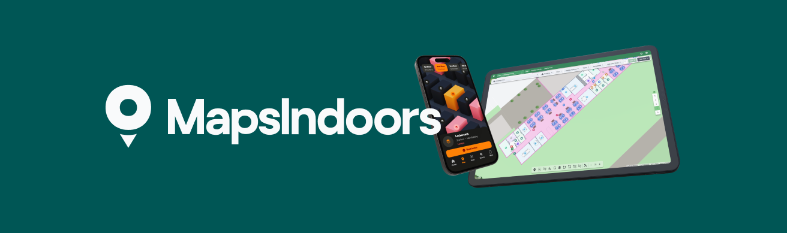
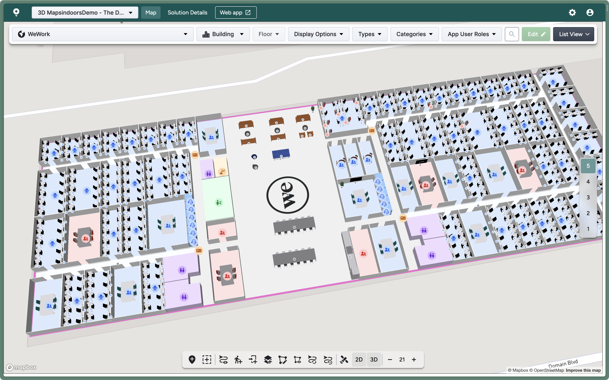

# Product Overview

<figure><figcaption></figcaption></figure>

#### Introducing MapsIndoors: Your Ultimate Indoor Mapping Solution

MapsIndoors is the dynamic mapping platform that seamlessly integrates indoor maps, points of interest (POIs), wayfinding, and location data into your own application. Whether you need it for web, mobile, kiosk, or as a standalone solution, MapsIndoors has you covered.

### Explore the MapsIndoors Platform

MapsIndoors is more than just a mapping tool. It's a versatile platform designed to meet your unique needs. Here's what it includes:

* Web SDK (JavaScript)
* iOS SDK
* Android SDK
* Integration API

#### Native SDKs: Your Building Blocks

Our Software Development Kits (SDKs) empower you to craft a tailored app that seamlessly integrates with your existing software. Available for web, iOS, and Android, these SDKs are the engines that enable users to view, navigate and interact with indoor spaces effortlessly.

With MapsIndoors SDKs, the possibilities are endless. Here are just a few common scenarios:

* Provide outdoor-to-indoor directions
* Search for indoor locations
* Display location-specific information
* Showcase dynamic location data
* And much more!

#### Integration API: Connecting the Dots

The Integration API allows you to make location or POI related data changes when needed, like bulk floor plan updates and map data population. Leverage the Integration API's various endpoints to access data with ease:

* Update data seamlessly
* Connect via tools like Postman
* Use the Swagger frontend

## Getting Started

Implementation of MapsIndoors can be done in several ways depending on your need for customization, integrations or available developer resources.

* Native SDKs: Unleash boundless customization and integration possibilities.
* Cross-Platform Bindings: Extend your mobile map solutions using Flutter and React Native for a versatile cross-platform experience.
* Map Template: Speed up integration with our pre-built UI elements or customize it to align with your unique brand and systems.

### Effortless Map Management

<figure><figcaption></figcaption></figure>

The MapsIndoors Content Management System (CMS) is your self-service tool for keeping your map solution updated by making location or POI related changes and customizing how your floor plan(s) looks in an easy-to-use visual interface. The CMS is a web-based portal used for day-to-day management of your map(s). Within the CMS you can manage Venue, Building, Room, Point of Interest (POI), and Route attributes. The content updated within the CMS is immediately accessible to the SDKs.\
