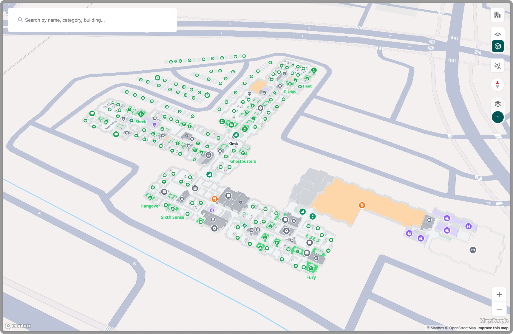

# Web App

The MapsIndoors Web App allows you to get started with MapsIndoors within minutes. You can configure the appearance, features, and map settings with a few clicks in the CMS. You can embed the map in your solution using an iframe or share the direct link (map.mapsindoors.com/my-indoor-map) with colleagues, customers, and others.

<figure><figcaption>
The MapsIndoors Web App
</figcaption></figure>

## Configuration

To configure your MapsIndoors Web App, navigate to navigate to :wrench: **Solution Details** → **App Settings** → [**App Configuration**,](https://cms.mapsindoors.com/app-settings/app-config) under the solution you want to deploy. Here, you can configure how your web app behaves regarding language, styling, load view, categories, and more.

<figure><figcaption>
App Configuration Page
</figcaption></figure>

### General

**Language**: Set the default language in which the web app loads. By default, the web app adapts to the user's browser language settings (provided the browser language is supported; otherwise, it defaults to English).

For route details, the unit of measure will be metric, unless the user has set the browser language to English - United States, in which case the unit of measure will be imperial.

**Note:** If the language is set to "German", the web app's UI will be shown in German on load. However, location names and categories will only show in German if they have been translated to German in the CMS or via the Integration API.

**Venue used on initial load:** Allows you to set the default venue to load. This option is only available if more than one venue is available in the solution.

**Map Markers Visibility:** The MapsIndoors maps are layered on top of either Google or Mapbox basemaps. This setting allows you to:

* Completely hide basemap markers (e.g., POIs).
* Always make them visible.
* Use the default setting, which removes them at zoom level 17 or closer (or according to the MITransitionLevel set using [Query Parameters](https://docs.mapsindoors.com/products/fast-track-maptemplate/configuration/query-parameters)) if your map uses Mapbox as basemap.

**Road Names Visibility:** Similar to Map Markers Visibility, this setting controls basemap road names. You can:

* Completely hide basemap road names.
* Always make them visible.
* Use the default setting, which removes them at zoom level 17 or closer (or according to the MITransitionLevel set using [Query Parameters](https://docs.mapsindoors.com/products/fast-track-maptemplate/configuration/query-parameters))) if your map uses Mapbox as basemap.

This configuration only applies to Mapbox maps.

**View Selector visibility:** The view selector allows users to quickly jump between buildings. This can only be enabled if there is more than one building on the map.

**Language Selector visibility**: The language selector allows users to choose the desired language. Supported languages: English, Danish, French, German, Italian, Spanish, Dutch and Chinese.

### Map Provider

Input either your Mapbox Access Token or your Google Maps API key. Once you have successfully entered a key/token, you'll be able to open your Web App, ready for you and your customers to use.


If you don't have a Mapbox token/Google Maps API key yet, [go here](../sdks-and-frameworks/web/tutorial/getting-started/map-engine-provider/).


### Styling

**Loading screen logo:** Customize the logo that appears on the loading screen/splash screen by browsing through the MapsIndoors Media Library. You can upload any JPG, PNG, or SVG file to the Media Library (we recommend limiting the image file size to below 1 MB). By default, the MapsIndoors logo will be displayed on load.

**Primary Color:** Sets the primary color used in the web app's UI using hex color code.&#x20;

### Kiosk Styling

**Horizontal Categories Enabled:** Controls the styling of the kiosk view. If enabled, the categories will be displayed horizontally instead of vertically.

### Initial load view

**Start Zoom Level:** Sets the zoom level at which the map loads. Depending on the map size, values from 17 to 19 are most common. Zoom 22 is the maximum and very close, while any value of 15 and lower will be deemed too far away by most users.

**Bearing:** Controls the rotation of the map. Bearing=0 is due North, 90=East, 180=South, 270=West. Can only be used on Mapbox maps.&#x20;

**Pitch:** Controls the angle at which the map is viewed. Pitch=0 is top-down. Pitch=85 is flat. Can only be used on Mapbox maps.&#x20;

### Center

**Longitude and Latitude:** Set the default center of the map. To find your desired latitudinal and longitudinal coordinates, you can find a location on your map close to the center of your map. Click on it and find the coordinates at the bottom of "Location Details".&#x20;

### App Title

Find more information in our [CMS documentation](https://docs.mapsindoors.com/products/cms/interface-overview#app-configuration).&#x20;

### Alias

Find more information in our [CMS documentation](https://docs.mapsindoors.com/products/cms/interface-overview#app-configuration).&#x20;

### App User Roles

Find more information in our [CMS documentation](https://docs.mapsindoors.com/products/cms/interface-overview#app-configuration).&#x20;

### App Categories

Find more information in our [CMS documentation](https://docs.mapsindoors.com/products/cms/interface-overview#app-configuration).&#x20;

## How Web App Configuration works with Query Parameters

In addition to the configurations applied directly in the CMS, you can also use query parameters to configure the Web App's behavior upon load. You can find an extensive overview of all configurable parameters [here](https://docs.mapsindoors.com/products/fast-track-maptemplate/configuration/query-parameters).

Using query parameters, you can override any setting that has been applied in the CMS. For instance, if you have set the "Center" option in the CMS, you can use the "center" query parameter to set a different center for a specific URL. This will not change the setting applied in the CMS, but will be limited to the specific URL you created.

### Parameters Configurable in CMS vs Query Parameters Only&#x20;

The table below shows which parameters can be configured from the MapsIndoors CMS and which parameters can only be configured through query parameters.

You can find an extensive overview of all configurable parameters [here](fast-track-maptemplate/configuration/query-parameters.md).

<table><thead><tr><th>Parameters</th><th>Configurable in CMS</th><th data-hidden></th></tr></thead><tbody><tr><td>apiKey</td><td>✅</td><td></td></tr><tr><td>venue</td><td>✅</td><td></td></tr><tr><td>locationId</td><td>❌</td><td></td></tr><tr><td>primaryColor</td><td>✅</td><td></td></tr><tr><td>logo</td><td>✅</td><td></td></tr><tr><td>appUserRoles</td><td>❌</td><td></td></tr><tr><td>directionsFrom</td><td>❌</td><td></td></tr><tr><td>directionsTo</td><td>❌</td><td></td></tr><tr><td>externalIDs</td><td>❌</td><td></td></tr><tr><td>tileStyle</td><td>❌</td><td></td></tr><tr><td>mapboxAccessToken</td><td>✅</td><td></td></tr><tr><td>gmApiKey</td><td>✅</td><td></td></tr><tr><td>startZoomLevel</td><td>✅</td><td></td></tr><tr><td>gmMapId</td><td>❌</td><td></td></tr><tr><td>pitch</td><td>✅</td><td></td></tr><tr><td>bearing</td><td>✅</td><td></td></tr><tr><td>language</td><td>✅</td><td></td></tr><tr><td>kioskOriginLocationId</td><td>❌</td><td></td></tr><tr><td>timeout</td><td>❌</td><td></td></tr><tr><td>useKeyboard</td><td>❌</td><td></td></tr><tr><td>miTransitionLevel</td><td>❌</td><td></td></tr><tr><td>category</td><td>❌</td><td></td></tr><tr><td>searchAllVenues</td><td>❌</td><td></td></tr><tr><td>useMapProviderModule</td><td>❌</td><td></td></tr><tr><td>hideNonMatches</td><td>❌</td><td></td></tr><tr><td>showRoadNames</td><td>❌</td><td></td></tr><tr><td>showExternalIDs</td><td>❌</td><td></td></tr><tr><td>searchExternalLocations</td><td>❌</td><td></td></tr><tr><td>center</td><td>✅</td><td></td></tr><tr><td>useAppTitle</td><td>❌</td><td></td></tr></tbody></table>
