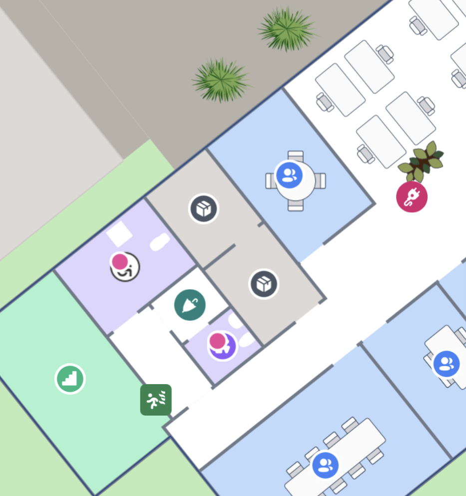

# Highlight and Select

## How to change the appearance of different states



The MapsIndoors Android SDK supports Select and Highlight Display Rules and they can be retrieved and edited through `MapsIndoors`.\
\
**Example**

```kotlin
// Changing the visibility of a polygon for selection
MapsIndoors.getDisplayRule(MPSolutionDisplayRule.SELECTION)?.let {
    it.isPolygonVisible = true
}

// Changing the visibility of a label for highlights
MapsIndoors.getDisplayRule(MPSolutionDisplayRule.HIGHLIGHT)?.let {
    it.isLabelVisible = false
}
```

## Highlight



### **Highlight all Restrooms**

```kotlin
// Create a filter to only receive locations with the category Toilet
val filter = MPFilter.Builder().setCategories(Collections.singletonList("Toilet")).build()
// Query locations with the created filter
MapsIndoors.getLocationsAsync(null, filter) { locations, error ->
    if (locations != null) {
        // Highliting all current toilets, with default MPHighlightBehavior. 
        // The MPHighlightBehavior can be used to customize the camera and map behavior,
        // like fitting the view to show all highlighted locations.
        mMapControl?.setHighlight(locations, MPHighlightBehavior.DEFAULT)
    }
}
```

<figure><figcaption><p>An example of the highlight solution Display Rule in action</p></figcaption></figure>

#### **Clear the highlight**

```kotlin
mMapControl?.clearHighlight()
```

### Styling the Highlight Badge <a href="#selection" id="selection"></a>

The new Highlight Display Rule has a collection of new properties that can be used to change the style of the Highlight badge. You can see all current Display Rule properties in [the reference documentation](https://app.mapsindoors.com/mapsindoors/reference/android/4.11.3/MapsIndoorsSDK/com.mapsindoors.core/-m-p-display-rule-options/index.html).

#### **Example: Change the color of the Highlight Badge**

```kotlin
MapsIndoors.getDisplayRule(MPSolutionDisplayRule.HIGHLIGHT)?.apply {
    badgeFillColor = "#FF0000FF"
    badgeStrokeColor = "FFFF0000"
}
mapControl?.setHighlight(listOf(loc), MPHighlightBehavior.DEFAULT)
```

#### **Example: Hide the Highlight Badge**

```kotlin
MapsIndoors.getDisplayRule(MPSolutionDisplayRule.HIGHLIGHT)?.apply {
    isBadgeVisible = false
}
mapControl?.setHighlight(listOf(loc), MPHighlightBehavior.DEFAULT)
```

## Selection

The selection Display Rule is for changing the appearance of single selected Location, for example when the user clicks on it. To select a Location programmatically, call the method [MapControl.selectLocation(location: MPLocation, behavior: MPSelectionBehavior)](https://app.mapsindoors.com/mapsindoors/reference/android/4.2.10/MapsIndoorsSDK/com.mapsindoors.core/-map-control/index.html#504222062%2FFunctions%2F651798082).

```kotlin
mMapControl?.selectLocation(location, MPSelectionBehavior.DEFAULT)
```

<figure><figcaption><p>An example of the selection solution DisplayRule in action</p></figcaption></figure>

#### **Clear current selection**

```kotlin
mMapControl?.deSelectLocation()
```

### Styling the Selection Marker <a href="#previous-selection" id="previous-selection"></a>

You can easily change the icon to an image of your liking. In this example it is assumed that you have a method `getSelectionBitmap()`  that loads, fetches or generates the image you want to use.

```kotlin
val myBitmap = getSelectionBitmap()
MapsIndoors.getDisplayRule(MPSolutionDisplayRule.SELECTION)?.apply {
    setIcon(myBitmap)
}
mapControl?.selectLocation(loc, MPSelectionBehavior.DEFAULT)
```

##

<figure><figcaption><p>Example of a custom Selection Marker.</p></figcaption></figure>

## Deprecated Selection Highlight



Before the release of 4.3.0 the Android SDK already had a visual implementation of selection with a Display Rule. This is the [`MPSolutionDisplayRule.SELECTION_HIGHLIGHT`](https://app.mapsindoors.com/mapsindoors/reference/android/4.11.3/MapsIndoorsSDK/com.mapsindoors.core/-m-p-solution-display-rule/index.html#-486711157%2FClasslikes%2F651798082) that can also be changed like the newly introduced `MPSolutionDisplayRule`. If you want to retain the old selection rendering, it can be toggled through the Solution Config on the SDK.

**Example**

```kotlin
MapsIndoors.getSolution()?.config?.isNewSelection = false
MapsIndoors.getDisplayRule(MPSolutionDisplayRule.SELECTION)?.apply {
    polygonFillColor = "FF0000FF"
    polygonFillOpacity = 0.2f
    polygonStrokeWidth = 2.0f
    polygonStrokeColor = "FF0000FF"
    isPolygonVisible = true
    isIconVisible = false
}
mapControl?.selectLocation(loc, MPSelectionBehavior.DEFAULT)
```

Note that the `isNewSelection` setting lives on the Solution, so with any subsequent load of MapsIndoors it will be necessary to set the value to `false` again, as it defaults to `true`.
