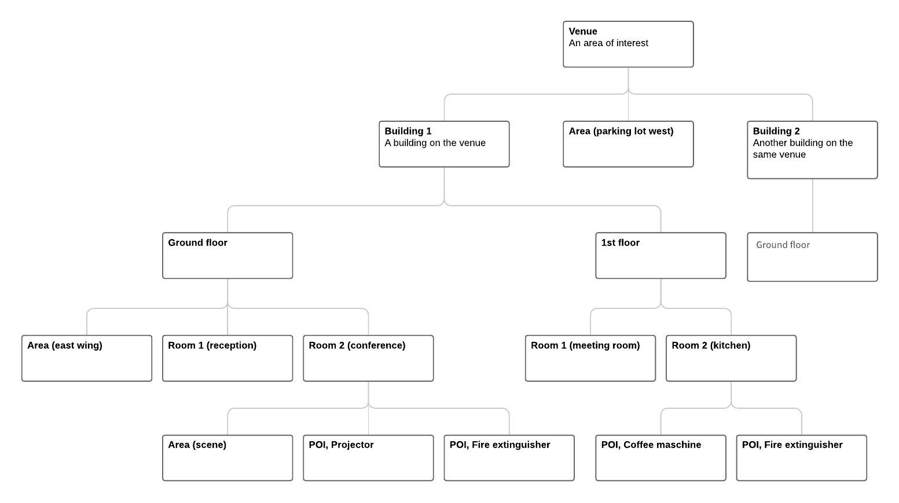

# Data Description

#### Dataset[​](https://docs.mapsindoors.com/api-data-description#dataset) <a href="#dataset" id="dataset"></a>

The main starting point for your data is the dataset object. This object contains information about the entire data set such as languages and where to find more data.

The demo dataset looks like this:

```json
{
  "id": "550c26a864617400a40f0000",
  "name": "RTX",
  "availableLanguages": [
    "en",
    "da"
  ],
  "baseLanguage": "en",
  "rootObjects": [
    "550c286964617400a4100000"
  ]
}
```

It tells which languages are defined for this project, which language is the default one (English in this case) and it has a `rootObjects` reference list which refers to the geospatial data that makes up the bulk of a MapsIndoors Solution the root objects are Geodata objects.

#### Geodata[​](https://docs.mapsindoors.com/api-data-description#geodata) <a href="#geodata" id="geodata"></a>

All geospatial data, Geodata, is arranged in a simple tree. Each element has a parent ID (except the root) so as an example, a point of interest (POI) can have a Room parent. The Room will typically be on a Floor in a Building on a Venue. Venues are always the root object (identified with parent ID is null), and is defined by "_An overall geographical area which typically comprises the area of one or more buildings and their relevant surrounding areas such as lawns and parking lots_".

<figure><figcaption></figcaption></figure>

You can create, update, delete all Geodata types: Venue, Building, Floor, Room, Area and POI.

All Geodata BaseTypes have some common keys that is available for all, and then there is some specific ones for each type, listed in BaseTypeProperties.

**Object Definition**[**​**](https://docs.mapsindoors.com/api-data-description#object-definition)

**A Geodata object contains the following:**

* `Id [string(24)]`
  * MapsIndoors generated ID. Should be _null_ if you are creating an object.
* `DatasetId [string]`
  * The dataset ID of your MapsIndoors Solution.
* `ParentId [string(24)]`
  * The MapsIndoors ID that this Geodata object is a child of.
* `BaseType [string]`
  *   The BaseType this Geodata covers.

      _See more in the intro of the Geodata above._
* `BaseTypeProperties [Dictionary]`
  *   Properties that directly changes the behaviour of the BaseType itself.

      _See more details below._
* `DisplayTypeId [string(24)]`
  *   ID of a Display Type to follow.

      _Only relevant for POI/Room/Area._
* `DisplaySetting [DisplayRule]`
  *   An overriding Display Rule to use, instead of the one from the Display Type.

      See "DisplayRules" under Display Type.

      _Only relevant for POI/Room/Area._
* `Geometry [GeoJSON.Geometry]`
  * The geometry related to the Geodata according to the [GeoJSON](https://geojson.org/) structure in the [WGS84](https://en.wikipedia.org/wiki/World\_Geodetic\_System) coordinate system.
* `Anchor [GeoJSON.Point]`
  * Generally the anchor is the center of the Geometry itself.
* `Aliases [Array<string>]`
  * A list of searchable aliases that should be associated with the Geodata.
* `Categories [Array<string>]`
  * List of Only relevant for POI/Room/Area.
* `Status [bitfield]`
  *   Bit 1: Active. Bit 2: Searchable.

      _See more details in the following example._
* `Properties [Dictionary<string, string>]`
  *   Custom properties contains meta information related to the Geodata in a key-value structure.

      _See more details in the following examples._
* `TilesUrl [string]`
  *   The URL where the tiles are located. These should be identical across Venues in the same Dataset.

      _Only relevant for Venue._
* `TileStyles [TileStyle]`
  * How the tiles should Only relevant for Venue.
* `AdditionalDetails [Array<GeodataDetail>]`
  * A list of details related to the Geodata. Can contain emails, phone numbers, links and opening hours.

**BaseTypeProperties for Venue**[**​**](https://docs.mapsindoors.com/api-data-description#basetypeproperties-for-venue)

* `Administrativeid [string]` - \* required
  * Unique ID for this Venue.
* `Defaultfloor [nullable int]`
  * The AdministrativeId from a Floor that should be the default selected for the Venue.
* `Imageurl [string]`
  * URL for the image that should be displayed in relation to the Venue.
* `Activestylefolder [string]`
  * The default Style that should be used in the Tiles.
* `Graphid [string(24)]`
  * The ID for the MapsIndoors Graph used to navigate in the building.

**BaseTypeProperties for Building**[**​**](https://docs.mapsindoors.com/api-data-description#basetypeproperties-for-building)

* `Administrativeid [string]` - \* required
  * Unique ID for this Building.
* `Defaultfloor [nullable int]`
  * The AdministrativeId from a floor that should be the default selected for this Building).
* `Imageurl [string]`
  * URL for the image that should be displayed in relation to the Building.

**BaseTypeProperties for Floor**[**​**](https://docs.mapsindoors.com/api-data-description#basetypeproperties-for-floor)

* `Name [string]` - \* required
  *   Floor identifier that will be used in the floor selector e.g. ‘0', ‘42', ‘B1', etc.

      Keep it as short as possible. Recommendation is 1-3 characters.
* `Administrativeid [int]` - \* required
  * The index of the Floor inside of its parent Building.

**BaseTypeProperties for a Location (POI/Room/Area)**[**​**](https://docs.mapsindoors.com/api-data-description#basetypeproperties-for-a-location-poiroomarea)

* `Administrativeid [string]` - \* required
  * Unique ID for this Location.
* `Class [string]`
  * The MapsIndoors color class that the Location should follow.
* `Imageurl [string]`
  * URL for the image that should be displayed in relation to the Location.
* `Activefrom [Nullable Datetime]`
  * A datetime of when it should be available from. Times are defined in UTC.
* `Activeto [Nullable Datetime]`
  * A datetime of when it should be available to. Times are defined in UTC.

Venue, Building, Floor, Room and Area have a polygon that describes where its position is on the map. POIs are noted with a single point on the map and is typically located inside a Room or on a Floor - important things like the coffee machine.

To read, change or delete Geodata use the Geodata endpoints described here: [https://integration.mapsindoors.com/doc/index.html#/Geodata](https://integration.mapsindoors.com/doc/index.html#/Geodata)

> Note: When you get data, you only specify the `apiKey` hence you get the entire tree! The other Geodata endpoints works on individual Geodata objects.

### Detailed Data Description[​](https://docs.mapsindoors.com/api-data-description#detailed-data-description) <a href="#detailed-data-description" id="detailed-data-description"></a>

#### Geodata[​](https://docs.mapsindoors.com/api-data-description#geodata-1) <a href="#geodata-1" id="geodata-1"></a>

Each Geodata element has a number of properties. Let's look at an example - a coat hanger.

**Example: POI**[**​**](https://docs.mapsindoors.com/api-data-description#example-poi)

```json
{
  "id": "13889288f79d4abfb7021ad7",
  "parentId": "f43b931f09314f3f9dd796f9",
  "datasetId": "550c26a864617400a40f0000",
  "baseType": "poi",
  "baseTypeProperties": {
    "class": null,
    "imageurl": null,
    "activefrom": null,
    "activeto": null,
    "administrativeid": "RTX"
  },
  "displayTypeId": "d7558711f7c64534972cc65f",
  "geometry": {
    "coordinates": [
      9.956830884329975,
      57.085763732415764
    ],
    "type": "Point"
  },
  "aliases": [],
  "categories": [],
  "status": 3,
  "properties": {
    "name@en": "Coat stand (RT)",
    "name@da": "Jakkeholder (RT)",
    "description@en": "Just a regular coat stand",
    "description@da": "En almindelig jakkeholder"
  }
}

```

*   **id**

    All elements have a unique 24 character string.

    If you are creating, this should be `null`, since it will be generated upon saving the object.
*   **ParentId**

    For elements (other than the root) there is a parentId which links to the element it's connected to.

    This will be a 24 character string, just as _Id_ is.
*   **BaseType**

    Tells what kind of data it is - it can be poi, room, area, floor, building, or venue.
*   **BaseTypeProperties**

    Defines a dictionary setup with properties that is bound by its BaseType.

    It is not possible to add any other keys to BaseTypeProperties, except the predefined ones.
*   **DisplayTypeId**

    Is a reference to the display type as described below. All rooms and poi geodata requires this to be set. As this is an ID, the reference is a 24 character string format as described above.
*   **Geometry**

    Contains the actual geodata - where it is on the map. It's based on [GeoJSON](http://geojson.org/) - in the example above the geometry is a point defining the POIs position on the map.
*   **Aliases**

    Is an optional list of aliases for this data written as a list of non-translated text. This can be used e.g. if a building or room has a common nickname users could use when searching for it.
*   **Categories**

    Is a reference to the category data as described below. Geodata is not required to reference any categories - like in this example. As this is an ID, the reference is a 24 character string as described above.
*   **Status**

    Is a [bitfield](https://en.wikipedia.org/wiki/Bit\_field).

    * bit1: active. If an element is not active, it will not be given to the apps.
    *   bit2: searchable. If an element is not searchable it might be shown on the map, but not show up in searches.

        As there are two bits, the final values can be:

        0: Not active, Not searchable 1: active, Not searchable 2: Not active, searchable (not a very useful combo) 3: active, searchable
*   **Properties**

    Contains other data about the Geodata object such as names, description or even custom data like gate numbers, vendor id, exhibition id or other data needed.

    Name is mandatory - at least for the base language set for the dataset.

    The key format is: `<keyname>@<language>`

    E.g. name in english will be ‘name@en' - in the example with a value of "Coat stand (RT)"

    As this is a dictionary setup, the keyname needs to be unique and only contain the ascii chars \[a-z] and \[0-9]. Use of spaces and unicode chars here is discouraged as it makes it harder to use from the application code side. The char @ is not supported in the keyname as it's used as a seperator. As an example, if you want to store opening hours here you could use the key openinghours@en as a keyname.

> Note: BaseType ‘Floor' doesn't support properties.

**Example: Area**[**​**](https://docs.mapsindoors.com/api-data-description#example-area)

Now let's have a look at another Geodata with the BaseType _Area_.

An Area is a BaseType that is a little different compared to e.g. POI and Room:

It can be a part of a Room, Floor or Venue, but it can't be a parent to any other Geodata objects. An Area can (unlike a Room) expand across multiple Rooms, or even Buildings.

It will look a lot like the POI example, with a few differences:

```json
{
"id": "7b2fe3da61b34cd9991ba510",
"parentId": "f43b931f09314f3f9dd796f9",
"datasetId": "550c26a864617400a40f0000",
"baseType": "area",
"displayTypeId": "41b1a5274fe8454ba2b6e6ff",
"geometry": {
  "coordinates": [
    [
      [
        9.95615091100001,
        57.085511788
      ],
      [
        9.95631731999998,
        57.085424259
      ],
      [
        9.95635468799998,
        57.085445236
      ],
      [
        9.95618828099998,
        57.085532766
      ],
      [
        9.95615091100001,
        57.085511788
      ]
    ]
  ],
  "bbox": [
    9.95615091100001,
    57.085424259,
    9.95635468799998,
    57.085532766
  ],
  "type": "Polygon"
},
"anchor": {
  "coordinates": [
    9.9562527993,
    57.0854785126
  ],
  "type": "Point"
},
"aliases": [],
"categories": [
],
"status": 3,
"baseTypeProperties": {
  "class": "area",
  "imageurl": "",
  "activefrom": null,
  "activeto": null,
  "administrativeid": "DCC843A7-C762-6D95-94AE-FDBFCEE189EC"
},
"properties": {
  "name@en": "Changing area",
  "description@en": "",
  "name@da": "Omklædnings område",
  "description@da": ""
}
}
```

*   **ParentId**

    The area's ParentId could be either a Venue, a Floor, or a Room. In this case, it is in the same parent as the Coat Hanger POI.
*   **Geometry**

    Like before, the structure is based on [GeoJSON](http://geojson.org/) and is in this case, a polygon, that encapsulate were the Area is placed. There is also a bounding box field called `bbox` as a part of the geometry. This is should define the box around the defined geometry. This is both for optimization purposes, and e.g. to easy navigate a camera to show the geometry when needed to.
*   **Anchor**

    The anchor here should normally define the center of the polygon. This can be used for a variety of features, depending on the use case.

#### DisplayTypes[​](https://docs.mapsindoors.com/api-data-description#displaytypes) <a href="#displaytypes" id="displaytypes"></a>

Common setup for Geodata of different kinds (meeting room, hallway, ...)

```json
{
  "id": "bb5410b32a5240d182ba50bb",
  "name": "BreakOutArea",
  "aliases": [ "changing", "changing zone" ],
  "displayRules": [
    {
      "name": "default",
      "zoomFrom": 19,
      "zoomTo": 21,
      "iconUrl": "https://app.mapsindoors.com/mapsindoors/gfx/bella/80/BreakOutArea.png",
      "labelZoomFrom": 19,
      "labelZoomTo": 20,
      "visible": true,
      "iconVisible": true,
      "labelVisible": true,
      "labelMaxWidth": 200
    }
  ],
  "propertyTemplates": [
    {
      "text": "phone",
      "type": "text"
    }
  ],
  "properties": {
      "name@en": "Changing area",
      "description@en": "",
      "name@da": "Omklædnings område",
      "description@da": ""
   }
}
```

*   **Id**

    All elements have a unique 24 character string. This is used when referencing - e.g. when referencing from individual geodata
*   **Name**

    The name of a display type is a secondary ID. This can be used as an alternative to the main ID. Note that this is NOT a 24 character string.
*   **Aliases**

    Aliases are a list of language neutral terms that can be used when searching for Geodata that references this DisplayType
*   **DisplayRules**

    ```
    Each type has a set of display rules that tells if and how geodata should be presented. E.g. which icon to use for meeting rooms, when it should be shown based on zoom level or if it should have a label. There are two parts to a rule: An **evaluation** part (zoom from/to) and a **style** part - the rest of the displayRule object.

    Zoom from and to is inclusive. In this example an icon will be shown from zoom level 19 to 21. A quick word on zoom levels: these are described in [web mercator](https://en.wikipedia.org/wiki/Web_Mercator_projection) which is the system we use to show maps. In short zoom level 1 shows a map of the earth in its entirety and a higher zoom level lets you get closer. The highest supported zoom level is generally 21, but some Solutions support up to zoom level 22.

    You will notice that there are 3 ‘visibility' keys (visible, iconVisible, labelVisible). The first one, ‘visible', is the main switch that will show and hide the whole element. The two others, ‘iconVisible' and ‘labelVisible', is changing the individual elements it is attached to. This way, you can toggle the ‘visible' without having to remember the visible state for both the icon and label.

    In addition to having a label visible or not, a `labelMaxWidth` can be set in order to enforce a maximum width in pixels.
    ```

    If the actual label width would exceed this, the label text is automatically broken into multiple lines.
*   **PropertyTemplates**

    The property templates is an option list of which extra properties new Geodata of the given types should have. In this case all POIs of type "breakout areas" will have a field in the CMS to enter a phone number for the new POI. This will then be stored as a property on that Geodata.
*   **Properties**

    Contains language specific data about the DisplayType object such as names, description etc. Each property has a key that follows this format:

    `<keyname>@<language>`

    The name property must be specified for every language defined in the dataset.

> Note: The display type data is split in the CMS; currently it can be found in the fans "Location Types" and "Type Visibility".

#### Categories[​](https://docs.mapsindoors.com/api-data-description#categories) <a href="#categories" id="categories"></a>

Categories are used to group Geodata together. As an example, rooms, areas or POIs in some department - e.g. "development" or "marketing" can be set in each of their group. Using categories is not mandatory and thus each Geodata can link to "none to many" categories.

This grouping is then used as a relevancy criteria when searching.

As a simple example: All rooms and areas across any building/venue related to entrances can be grouped using this example:

```json
{
  "id": "5823246d07215b23a02e3cdd",
  "key": "entrance",
  "name": {
    "en": "Entrance",
    "da": "Indgang"
  },
  "properties": {
    "description@en": "The entrance closest to the parking lot",
    "description@da": "Indgangen tættest på parkeringspladsen"
  }
}
```

*   **Id**

    All elements has a unique 24 character string. This is used when referencing - e.g. when referencing from individual Geodata
*   **Key**

    The key of a category is a secondary ID. This can be used as an alternative to the main ID. Note that this is NOT a 24 character string.
*   **Name**

    A translatable name for the category.
*   **Properties**

    Contains language specific data about the Category object such as numbers, description etc. Each property has a key that follows this format:

    `<keyname>@<language>`

    The name property must be specified for every language defined in the dataset.

#### Additional Details

Additional details are used to describe emails, links, phone numbers and opening hours for a location. A use case could be to add a link to a menu for a restaurant, as shown in the example below.

```json
{
  "key": "url-1",
  "detailType": "url",
  "value": "https://www.example.com/menu",
  "active": true,
  "icon": "https://www.example.com/menuicon.png",
  "displayText": {
    "en": "Menu",
    "da": "Menukort"
  }
}
```

* **Key**
  
  Must be unique for the collection of additional details related to the Geodata.

* **DetailType**

  The type of detail. Can be `email`, `url`, `phone`, or `openinghours`.

* **Value**

  Contains the value of the detail. Only used for detail types `email`, `url`, and `phone`. Different validation rules apply based on the detail type.

  * `email`: 
    * Must include an `@` character. 
    * The `@` character must not be at the beginning or the end of the email.
  * `url`: 
    * Must not be empty.
    * Must include a domain.
    * Spaces must be encoded.
    * If the link contains a scheme, it must be valid (e.g. `https://`).
    * Must not contain invalid characters (e.g. curly braces `{\"isJson\": true}`).
  * `phone`
    * Digits can be numbers or letters (to accommodate phonewords).
    * Must include at least 1 digit.
    * Must contain no more than 15 digits.
    * Allowed characters: Numbers, letters, spaces, `(`, `)`, `-`, and `.`.
    * A `+` is allowed if it is the first non-whitespace character.

* **Active**

  Controls whether or not the detail should be shown in the application.

* **Icon**

  A link to an icon to be shown in the application.

* **DisplayText**

  A map between the text to be displayed for each language.

* **OpeningHours**

  Contains the opening hours data. Only used for the `openinghours` detail type. Can be used to describe opening hours for each day in the week, as shown in the example below.

  ```json
  {
    "key": "openinghours-1",
    "detailType": "openinghours",
    "active": false,
    "icon": "https://www.example.com/openinghoursicon.png",
    "displayText": {
      "en": "Opening hours",
      "da": "Åbningstider"
    },
    "openingHours": {
      "standardOpeningHours": {
        "monday": {
          "closedAllDay": false,
          "startTime": "15:00",
          "endTime": "21:00"
        },
        "tuesday": {
          "closedAllDay": false,
          "startTime": "15:00",
          "endTime": "21:00"
        },
        "wednesday": {
          "closedAllDay": false,
          "startTime": "15:00",
          "endTime": "21:00"
        },
        "thursday": {
          "closedAllDay": false,
          "startTime": "15:00",
          "endTime": "21:00"
        },
        "friday": {
          "closedAllDay": false,
          "startTime": "15:00",
          "endTime": "22:00"
        },
        "saturday": {
          "closedAllDay": false,
          "startTime": "12:00",
          "endTime": "22:00"
        },
        "sunday": {
          "closedAllDay": true
        }
      }
    }
  }
  ```

  The values in the `openingHours` property must adhere to the following rules:
  
  * The `startTime` and `endTime` properties must not be equal.
  * The `startTime` and `endTime` properties must be in a valid time format, valid examples are:
    * `04:00 PM` (12-hour clock).
    * `16:00` (24-hour clock).
    * `04:00:00 PM` (12-hour clock with seconds).
    * `16:00:00` (24-hour clock with seconds).

  > Note: Seconds will be ignored; only hours and minutes are retained.
