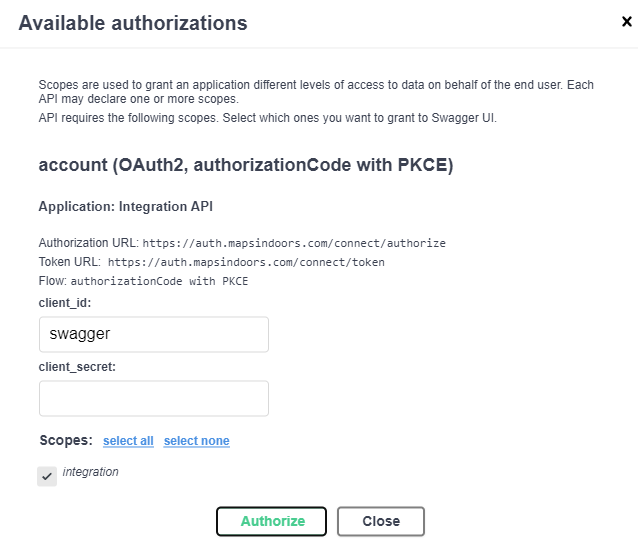

# Access with Swagger

#### Getting started using swagger[​](https://docs.mapsindoors.com/access-with-swagger#getting-started-using-swagger) 

The Integration API can be accessed using our [swagger](https://integration.mapsindoors.com/doc/index.html) frontend. The first thing you want to do is to log in. This is done by pressing Authorize:

<figure><figcaption></figcaption></figure>

After this, a confirmation window will be shown. Everything is already prefilled here, so **do not change the `client_id` and `client_secret` input fields — just press Authorize**, and you will be lead to the MapsIndoors authorization service.

<figure><figcaption></figcaption></figure>

Once logged in you can start using the Integration API. Each endpoint will grouped by function like "Categories" and "Geodata". Each of these groups offer a number endpoints that allow you to get existing data, create new data, change existing data or delete data. There are examples of each of these for you to look at, but not that this is a read-only sample solution

> _**NOTE:**_ ⚠️ The sample solution is read-only. If you replace the APIkey with you own can CAN write to your own data.

We use the four standard HTTP methods to access Mapsindoors data:

* **GET** for getting data. (Marked with blue color)
* **POST** for creating new data (Marked with green color)
* **PUT** for updating existing data (Marked with yellow color)
* **DELETE** for deleting data (Marked with red color)

When you change data (using PUT) you'll need to inform us what what you want to change, so you MUST include an Id. Other than that you only need to mention what you want to change; The rest will stay the same. When creating **new** data (using POST) you´ll need to include ALL data needed for the given object type (but **not** an Id - that will be assigned for you). Otherwise the call will result in a 400 Bad Request (and feedback on what's wrong).

> _**NOTE:**_ ⚠️
>
> * The sample solution is read-only. If you replace the APIkey with your own, you can CAN write to your own data.
> * ALL POST and PUT endpoints takes arrays of objects, so even if you only want to change one object you still need to surround it in brackets: "\[ {JSON model} ]"
