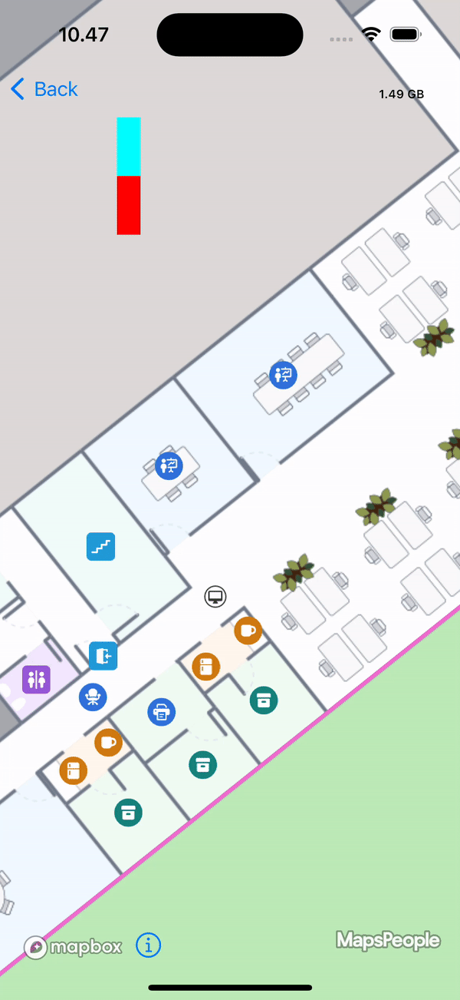

# Custom Floor Selector

### How to implement a custom floor selector[​](https://docs.mapsindoors.com/Map/Map%20Styling/custom-floor-selector#how-to-implement-a-custom-floor-selector) <a href="#how-to-implement-a-custom-floor-selector" id="how-to-implement-a-custom-floor-selector"></a>

To get started, create a class that conforms to both `MPCustomFloorSelector` and `UIView`. Please bear in mind that the provided example is solely for illustrative purposes. It is essential to appropriately integrate and customize it to align with your specific requirements and design preferences.

```swift
  //Custom Floor selector class that conforms to both UIView and MPCustomFloorSelector
    class MyFloorSelector: UIView, MPCustomFloorSelector {
        
        override init(frame: CGRect) {
            super.init(frame: frame)
        }
        
        required init?(coder: NSCoder) {
            super.init(coder: coder)
        }
        
        func remove() {
            removeFromSuperview()
        }
        
        var building: MapsIndoors.MPBuilding?
        
        var delegate: MapsIndoors.MPFloorSelectorDelegate?
        
        var floorIndex: NSNumber?
        
        func onShow() {
            //Shows the floor selector
            self.isHidden = false
            returnView()
        }
        
        func onHide() {
            //Hides the floor selector
            self.isHidden = true
        }
        
        func returnView() {
            let oneFloorUpButton = UIButton(frame: CGRect(x: 0, y: 0, width: 20, height: 50))
            oneFloorUpButton.backgroundColor = .cyan
            oneFloorUpButton.addTarget(self, action: #selector(oneFloorUp), for: .touchUpInside)
            self.addSubview(oneFloorUpButton)
            let oneFloorDownButton = UIButton(frame: CGRect(x: 0, y: 50, width: 20, height: 50))
            oneFloorDownButton.backgroundColor = .red
            oneFloorDownButton.addTarget(self, action: #selector(oneFloorDown), for: .touchUpInside)
            self.addSubview(oneFloorDownButton)
        }
        
        @objc func oneFloorUp(sender: UIButton!) {
            var mpFloorIndex: NSNumber = 10.00
            floorIndex = NSNumber(value: floorIndex!.doubleValue + mpFloorIndex.doubleValue)
            
            //Using MPFloorSelectorDelegate
            delegate?.onFloorIndexChanged(floorIndex!)
        }

        @objc func oneFloorDown(sender: UIButton!) {
            var mpFloorIndex: NSNumber = 10.00
            floorIndex = NSNumber(value: floorIndex!.doubleValue - mpFloorIndex.doubleValue)
            
            //Using MPFloorSelectorDelegate
            delegate?.onFloorIndexChanged(floorIndex!)
        }
    }
```

Next step is to initialize and add the class to `MPMapControl`.

```swift
//Initialize a custom floor selector with a CGRect
let customFLoorSelector = MyFloorSelector(frame: CGRect(x: 100, y: 100, width: 20, height: 100))
//Set the mapControl´s floorSelector to your newly created floorSelector
mapControl?.floorSelector = customFLoorSelector
```

TIP

When configuring the floor selector class `MyFloorSelector`, it is necessary to align the x and y coordinates according to your specific requirements. Utilizing constraints to ensure compatibility across various devices is highly recommended.

Next step is to handle the floor index. In this example, the floor selector requires knowledge of the current floor index, which can be obtained by reading the value from the current building.

```swift
floorIndex = mapControl?.currentBuilding?.currentFloor
```

Assign the `currentFloor` to the `floorIndex` variable.

```swift
// Add a global variable for keeping track of the current floorIndex
var floorIndex: NSNumber
```



It is important that the class representing the custom floor selector you have developed must conform to both the `UIView` and `MPCustomFloorSelector` protocols.


### Expected Result[​](https://docs.mapsindoors.com/Map/Map%20Styling/custom-floor-selector#expected-result) <a href="#expected-result" id="expected-result"></a>

### &#x20;<a href="#expected-result" id="expected-result"></a>

<figure><figcaption></figcaption></figure>
