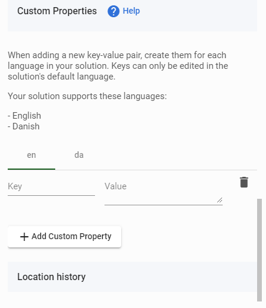
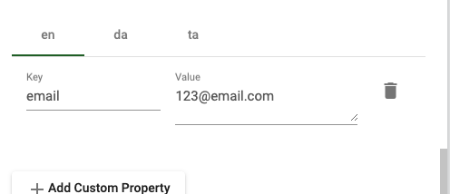

# Custom Properties

Custom Properties are key/value data that can be associated with any piece of geodata within MapsIndoors. MapsIndoors supports two different types of Custom Properties:

* Language-specific Custom Properties
* Generic Custom Properties

Language-specific Custom Properties are meant for values that is displayed to the enduser in their preferred language. Using language-specific Custom Properties, it is possible to store a key/value combination in multiple different languages. The MapsIndoors SDKs allows for retrieval of the correct values based on the user's preferred language. If your Solution has multiple languages, you must provide the necessary translations for each Custom Property in each of these languages.

Generic Custom Properties are meant for tagging data with key/value data that is relevant for the apps using the map data. These values will be available to the app regardless of the language of the end user, and are often not directly displayed. Examples of values that might be added as Generic Custom Properties could be:

* Whether or not a room is bookable
* The calendar id of a room used for booking
* Ids of a location in other systems

If a Key exists as both a Generic Custom Property and Language-specific Custom Property, the most specific element decides the value. This means that the language-specific Custom Property value will be supplied to the SDKs, as it is considered to be the most specific. This table shows the possible interactions between Generic Custom Property and a Language-specific Custom Property. Scenario 1 shows what happens if a Key is defined as a Generic Custom Property and given the value A, while a Language-specific Custom Property with the same Key is either not defined, or given an empty value:

| Scenario | Generic | Language Specific | SDK Value |
| -------- | :-----: | :---------------: | :-------: |
| 1        |    A    |                   |     A     |
| 2        |         |         B         |     B     |
| 3        |    A    |         B         |     B     |
| 4        |         |                   |           |

If a Solution uses more than one language, it is possible to give a value for a particular Key in only a subset of the languages. If for example a Solution uses both English and German, a Language-specific Custom Property could be given a value for only the German language. In this scenario if the app requests the German language, it would be given the German-specific value, while if the app requests the English language, it would be given either an empty value, or the value of the Generic Custom Property with the same Key if such a property is defined.

#### Custom Property Templates[​](https://docs.mapsindoors.com/custom-properties#custom-property-templates) <a href="#custom-property-templates" id="custom-property-templates"></a>

On Types it is possible to define Custom Property templates, which can ease getting consistent Custom Property Keys across multiple Locations. Keys added as Custom Property templates on a Type will be shown in the CMS on all Locations of that Type. This ensure that the key naming is consistent across all locations of that type. Adding values to the keys results in key/value pairs being available trough the SDK.

### Creating Custom Properties[​](https://docs.mapsindoors.com/custom-properties#creating-custom-properties) <a href="#creating-custom-properties" id="creating-custom-properties"></a>

Custom Properties are created for each Location, defined using a `key` and a `value`. This is found in a section in the menu for each Location. When adding a Generic Custom Property through the CMS, a value input field will be provided for each language in your Solution allowing you to input the translated values directly in the CMS.

<figure><figcaption></figcaption></figure>

You can add Custom Properties through the Integration API with the exact same requirements and options as when adding them via the MapsIndoors CMS.

### Reading Custom Properties[​](https://docs.mapsindoors.com/custom-properties#reading-custom-properties) <a href="#reading-custom-properties" id="reading-custom-properties"></a>

The method for reading and using these custom properties depends on which platform you're developing for. Here is an example:

<figure><figcaption></figcaption></figure>

Using the above screenshot as an example basis you fetch the entire custom property using the following code:

```swift
let data = location.property(key: "email")
```

To retrieve individual segments of the property, you can use:

```swift
let text = data.text
let value = data.value
let type = data.type
```

* `let text = data.text` retrieves the content of the `key` field, and in the given example, would return `email`.
* `let value = data.value` retrieves the content of the `value` field, and in the given example, would return `123@email.com`.
* `let type = data.type` retrieves the type of the Custom Property, and will in most known cases return `text`.

#### Example 1[​](https://docs.mapsindoors.com/custom-properties#example-1) <a href="#example-1" id="example-1"></a>

You are a conference organizer that needs to associate some pieces of data with each exhibitor, like the sponsor level they are are on, and what the size of their stand should be. You would create two Language-specific Custom Properties, one called `sponsorLevel` and another called `standSize`. When building your app on top of our SDK, you could use these Custom Properties to assign a gold color to your highest paying sponsors' names, and a larger image because of their larger stand size.

#### Example 2[​](https://docs.mapsindoors.com/custom-properties#example-2) <a href="#example-2" id="example-2"></a>

You are a museum operator providing a digital map of your venue. Your digital map presents points of interest for the various exhibits and you would like to associate both a text description of the item exhibited as well as a link to a video of an expert giving additional insight about the item. To accomplish this you create a Generic Custom Property called `itemDescription` and provide a description for each language your Solution supports. You choose a Generic Custom Property for this purpose as the values is to be displayed to the end user and you need the user to be given description in their preferred language.

In addition to this you create a Language-specific Custom Property called `videoLink` to store the link to the explanation video. As this is a Language-specific Custom Property, it will be available to the app regardless of the user's preferred language.
