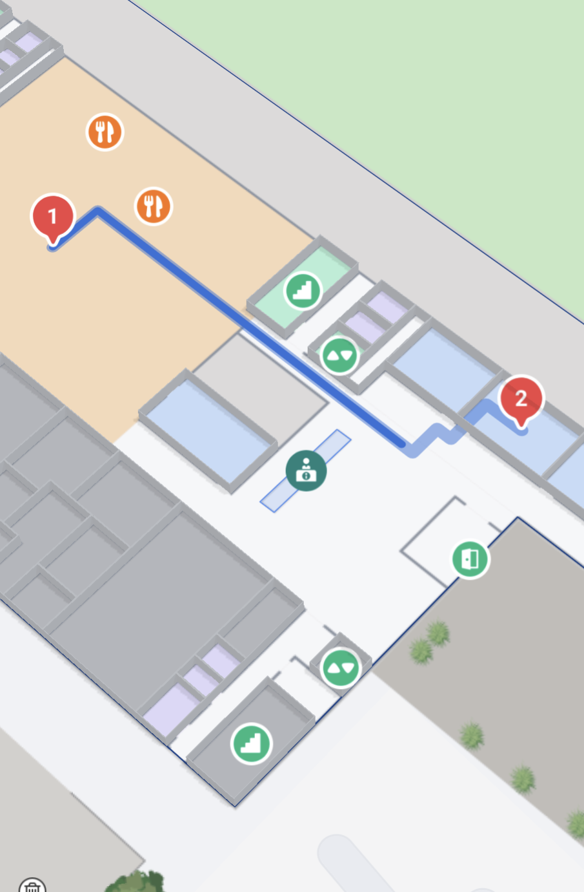
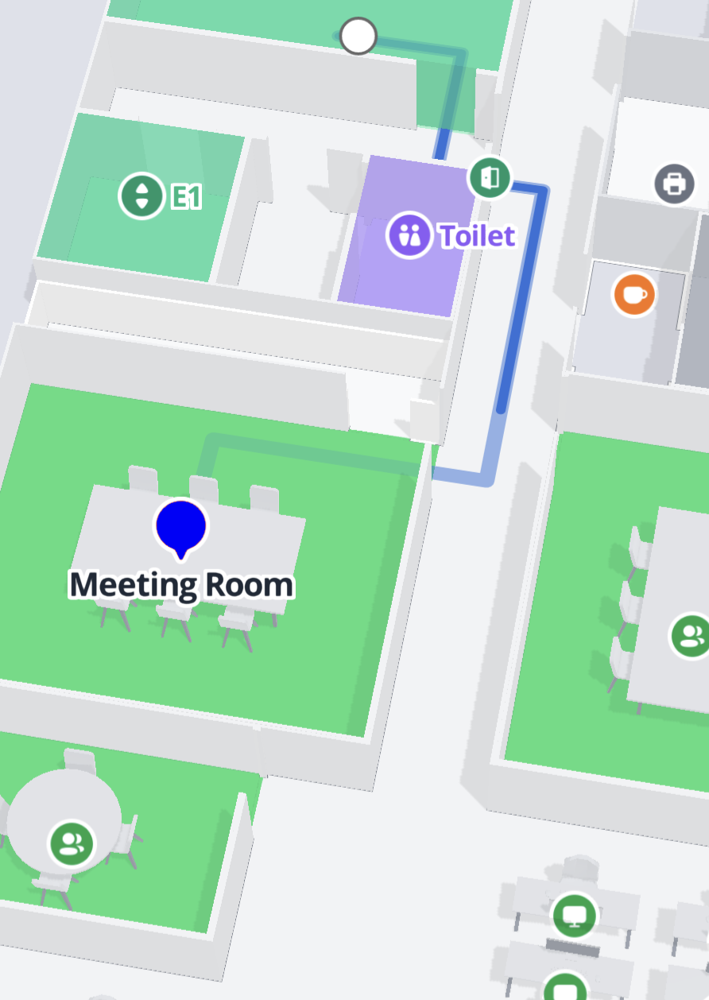

# Using multi-stop navigation

### Querying a multi-stop route

To query a multi-stop route, describe an array of either `MPLocation` or `MPPoint` on the `MPDirectionsQuery`. These points will be visited in order they are defined in, by default. You can enable an optimized ordering of the stops by setting the `optimizeRoute` property to `true`. If they multi-stop route is optimized, use the `orderedStopIndexes` property on the resulting `MPRoute` to determine how the original stop ordering maps to the now optimized ordering.

```swift
let query = MPDirectionsQuery(
    originPoint: .init(latitude: 57.05800975, longitude: 9.949916517, z: 0),
    destinationPoint: .init(latitude: 57.058278, longitude: 9.9512196, z: 10)
)

query.stopsPoints = [ 
    MPPoint(latitude: 57.0582701, longitude: 9.9508396, z: 0.0),
    MPPoint(latitude: 57.0580431, longitude: 9.9505475, z: 0.0),
    MPPoint(latitude: 57.0580843, longitude: 9.9506085, z: 10.0),
]

query.optimizeRoute = true

if let route = try await MPMapsIndoors.shared.directionsService.routingWith(query: query) {
    print(route)
}
```

### Showing and configuring a multi-stop route on the map

With the introduction of the multi-stop routes. There has also been added new functionality to the `MPDirectionsRenderer` to facilitate the new multi-stop routes.

In addition to how a regular route would be shown on the map - multi-stop routes have a default visualization for the stops along the route. Each stop gets assigned a pin marker, with a number indicating its place in the order of stops along the route.

<figure><figcaption><p>By default route stops will be shown as a red pin with numbers</p></figcaption></figure>

You can customize the visualization of stops in two ways. Firstly, you can use the default implementation of the `MPRouteStopIconProvider` protocol, `MPRouteStopIconConfig`. This allows for customization of the pin color, whether the pins should be numbered and if it should show a simple label string.

```swift
if let renderer = self.mapControl?.newDirectionsRenderer() {
    renderer.defaultRouteStopIcon = MPRouteStopIconConfig(numbered: false, color: .blue, label: "Meeting Room")
    
    renderer.route = route
    renderer.routeLegIndex = 0
    renderer.animate(duration: 3)
}
```

<figure><figcaption><p>Customized MPRouteStopIconConfig</p></figcaption></figure>

This will apply to all stops along the route. Alternatively, you can choose how each individual stop should be visualized.

```swift
renderer.render(stopIcons: [
    1: MPRouteStopIconConfig(numbered: true, color: .red),
    2: MPRouteStopIconConfig(numbered: true, color: .green),
    3: MPRouteStopIconConfig(numbered: true, color: .blue, label: "Third stop"),
])
```

This will show the first stop on the route as a red pin, the second a green pin and the third as a blue pin - all numbered accordingly. The last pin will display the label _"Third stop"_.

You can take it a step further and provide your own implementation of the `MPRouteStopIconProvider` to either the `render` method or the `defaultRouteStopIcon` property on the `MPDirectionsRenderer`. This way, you may provide your own imagery either for all stops, or for each individual stop.

```swift
/// Implement this protocol to provide custom stop icons
@objc public protocol MPRouteStopIconProvider {
    var image: UIImage? { get }
}
```
