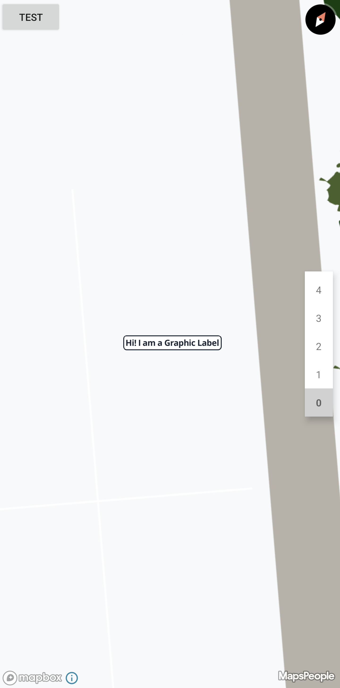
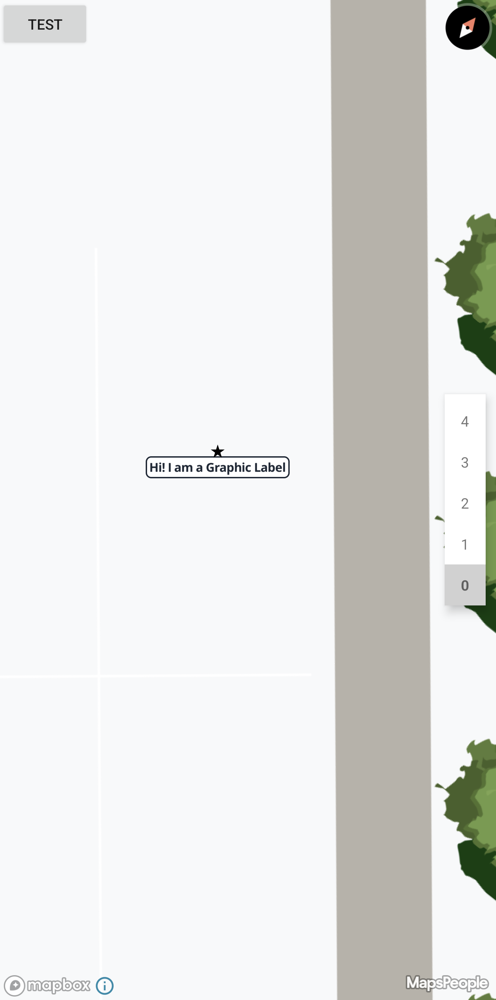

# Label styling through Display Rules

On this page you will gain knowledge of how to style marker labels using Display Rules. NB: the stylings show on this page are only available when using MapsIndoors together with the Mapbox Maps SDK.


This feature is available as of SDK version 4.3.0



To get an overview of what Display Rules are and can be used for, read the [Display Rules](../../../products/cms/display-rules.md) page first.


### Basic Styling

There are a number of fields in Display Rules that can be used to style the label:

```swift
let displayRule = MPMapsIndoors.shared.displayRuleFor(displayRuleType: .main)
displayRule?.labelStyleTextColor = .yellow
displayRule?.labelStyleTextSize = 12
displayRule?.labelStyleTextOpacity = 0.5
displayRule?.labelStyleHaloColor = .red
displayRule?.labelStyleHaloBlur = 10
displayRule?.labelStyleHaloWidth = 5
```

In addition to these styling fields there are also fields that determine when to display the label. If you want a full list of the fields available for configuration on Display Rules, [look here](../../../products/cms/display-rules.md).

### Styling the label text

With these fields it is possible to style the label to fit your design. In the following example we create a function that changes the styling on a label by doubling the size of the text, and changing the text color to green.

```swift
func styleLabelText(displayRule: MPDisplayRule) {
    displayRule.labelStyleTextSize *= 2
    displayRule.labelStyleTextColor = .green
}
```

If we apply this function to a Display Rule, it could look like this:

<figure><figcaption><p>An example of large green text labels</p></figcaption></figure>

### Styling the label halo

It is also possible to style the halo, but the halo is a bit harder to properly style. The `haloWidth` and `haloBlur` fields have immense impact on the feel of the labels, so make sure to try out many possible configurations! In this example we change the text size to be `24` to get a bigger range out of the halo. Here we want a soft halo, so we make the `haloBlur` larger than the `haloWidth`:

```swift
func styleLabelHalo(displayRule: MPDisplayRule) {
    displayRule.labelStyleTextSize = 24
    displayRule.labelStyleHaloWidth = 1
    displayRule.labelStyleHaloColor = .blue
    displayRule.labelStyleHaloBlur = 3
}
```

If applied it might look like this:

<figure><figcaption><p>An example of a blue halo on large text</p></figcaption></figure>

### Styling text and halo

With the knowledge of styling the text and label we can now coordinate the styling of the entire label, and create a style that utilizes both. In this example we have a function that modifies the label to be twice as large as it was set in the CMS, and make the text white, with a thin outline halo.

```swift
func styleLabel(displayRule: MPDisplayRule) {
    displayRule.labelStyleTextSize *= 2
    displayRule.labelStyleTextColor = .white
    displayRule.labelStyleHaloWidth = 1
    displayRule.labelStyleHaloColor = .black
    displayRule.labelStyleHaloBlur = 0
}
```

If applied it might look like this:

<figure><figcaption><p>An example of labels with white text and a black outline</p></figcaption></figure>

## Flat labels

By changing the `labelType` field from the default `.floating` to `.flat`, it becomes possible to align the label with the map instead of the camera.

Flat labels are best shown by disabling the icon, letting the text become centered on the location. Here is an example of a function that changes to type of a label to `.flat` and hides the icon to center the label:

```swift
func setLabeToFlat(displayRule: MPDisplayRule) {
    displayRule.iconVisible = false
    displayRule.labelType = .flat
}
```

Now the label will be drawn "below" the marker, flat on the ground.

<figure><figcaption><p>An example of flat labels without icons</p></figcaption></figure>

It is possible to change the rotation of the label by modifying the `bearing` field, this field is measured in degrees where 0° is pointing north and [90° is pointing west.](#user-content-fn-1)[^1] Here is an example where the type is changed to flat and the bearing of the label is changed to a new value:

```swift
func changeLabelBearing(displayRule: MPDisplayRule, newBearing: Double) {
    displayRule.labelType = .flat
    displayRule.labelStyleBearing = newBearing
}
```

If applied with a bearing of 45° it might look like this:

<figure><figcaption><p>An example of flat labels rotated to 45° north</p></figcaption></figure>

A `.flat` label is styleable, just like a `.floating` label:

```swift
func styleFlatLabel(displayRule: MPDisplayRule) {
    displayRule.iconVisible = false
    displayRule.labelType = .flat
    displayRule.labelStyleBearing = 45
    displayRule.labelStyleTextColor = .red
    displayRule.labelStyleTextSize = 100
    displayRule.labelStyleHaloColor = .yellow
    displayRule.labelStyleHaloWidth = 3
}
```

If applied the labels might look like this:

<figure><figcaption><p>An example of labels being flat and fully customized with display rules</p></figcaption></figure>

You now have knowledge of how to style labels and create flat labels when using MapsIndoors on iOS – use it wisely.

## Graphic Labels

The idea behind Graphic Labels is based on [9-slicing](https://en.wikipedia.org/wiki/9-slice\_scaling) and [Mapbox's stretchable images](https://docs.mapbox.com/mapbox-gl-js/example/add-image-stretchable/).

By changing the `labelType` field from the default `floating` to `graphic`, the label will be moved to center on the anchor point and it will be adorned with a background, like shown here below:

<figure><figcaption></figcaption></figure>

### Parts of a Graphic Label

A graphic label is a combination of multiple values that make it work, namely: a Label, a Background image, a content area, and stretch points in both the vertical (Y) and horizontal (X) directions. Most of these values are kept in a `MPLabelGraphic`, which is used to ensure that the values are inherited together. This is important because changing just a single one of these values will have major implications on the entire graphic label.

```json
"graphic": {
    "backgroundImage": "https://someurl.com",
    "stretchX": [
        [
            15,
            16
        ]
    ],
    "stretchY": [
        [
            15,
            16
        ]
    ],
    "content": [
        9,
        9,
        17,
        17
    ]
}
```

Above is an example of the contents of the `MPLabelGraphic` in JSON format, in this example the size of the image is 32x32px. Notice that the label itself is not present in the data structure, that is because the graphic label itself **is invariant to the label**, these values will ensure that no matter then length, size or styling of the label text, the graphic label will adapt.

#### Label

The label is the same as for all the other label types, and all styling still applies. If you skipped the part click [here](label-styling-through-display-rules.md#basic-styling) to learn more about label styling.

#### Background Image

The background image is in essence just an image with specific dimension. It is important that if the background image is changed, it must maintain the same size as the previous image, otherwise you might encounter weird stretching behavior, or in the worst case the graphic will not even show.

#### Content Area

The content area denotes a rectangle defined as `[left, top, right, bottom]` where each value is the number of pixels from the images origin.

The content area describes the area within the image where it can place the text from the label.

#### StretchX/StretchY

The stretch points describe areas that should be repeated to seamlessly stretch the image to contain the text.

A stretch point is defined as a double array `[[Int]]`, because it is possible to define multiple stretch points. each area is defined in the inner array, like `[[15,16]]`. In that stretch point we have defined that the Graphic Label can duplicate, or stretch, the pixels from 15 to 16 in order to contain the label text.

it is possible to set multiple stretch point in the same direction, take this example: `[[15,16],[31,32]]`, in this example we have some element between pixel `16` and `31` that we do not want to stretch, therefore we have placed the stretch points on both sides of the element.


It is not possible to set the stretch point to be placed on the same pixel, eg. `[[15,15]] will not work.`


If you want to see an example of how a graphic label could be defined, see [this](label-styling-through-display-rules.md#example) section.

### Showing Graphic Labels

To start showing Graphic Labels you simply need to update the `labelType` on the Display Rule to `MPLabelType.GRAPHIC`

<pre class="language-swift"><code class="lang-swift">func setLabelToGraphic(rule: MPDisplayRule) {
<strong>    rule.labelType = .graphic
</strong>}
</code></pre>

### Inserting Custom Graphics

To insert your own Graphic Label, you will have to reference an image using a URL and override the Display Rule with it.

```swift
func setNewGraphicLabel(rule: MPDisplayRule, imageUrl: String) {
    rule.labelStyleGraphicBackgroundImage = imageUrl
}
```

Configuring the graphic label's scaling is a bit more involved, follow the example below to get a better idea of how to set it up.

#### Example

In this example we will create a simple graphic label with rounded corners, and one that is similar, but also has a feature in the middle that we have to work around. We will make the graphic in 200x200px as this makes it a bit easier to see how the graphic will look when stretched. In essence we only need the graphic to encompass the un-stretchable features + 2 pixels per stretch point.

<figure><figcaption><p>A graphic with rounded corners, a white background and a black border.</p></figcaption></figure>

Above we have the example, the corners have a radius of 16 pixels. Now we have to define the stretchable areas, which should range from the end of the first corner to the start of the next corner. We also want to define a content area, here we want 6 pixels of padding from the black border.

<figure><figcaption><p>A simple white graphic with rounded corners, notice that StretchX/Y encompass the entire image aside from the corners.</p></figcaption></figure>

Above the `StretchX/Y` has been illustrated, with the Content area in <mark style="background-color:red;">red</mark>, the `StretchX` in <mark style="background-color:blue;">blue</mark> and `StretchY` in <mark style="background-color:green;">green</mark>. Notice how the stretchable areas are already repeating a lot, in theory this image could be reduced to 32x32 pixels!

<figure><figcaption><p>The same graphic but reduced to its smallest possible size</p></figcaption></figure>

Lets define the graphic label in numbers:

```swift
func setNewGraphicLabel(rule: MPDisplayRule) {
    rule.labelStyleGraphicBackgroundImage = "https://www.website.com/graphic.png" // not a real link
    rule.labelStyleGraphicStretchX = [[15, 184]] // use all the flat pixels
    rule.labelStyleGraphicStretchY = [[15, 184]]
    rule.labelStyleGraphicContent = [10, 10, 189, 189] // the border is 4px wide + 6px padding
}
```

This example is similar to the first, but has a star on top of the box, and as we do not want to stretch the star, so we will have to be more creative with our stretchable areas.

<figure><figcaption><p>A graphic with rounded corners, a white background, a black border, and a star on top.</p></figcaption></figure>

We can color in the stretchable areas and the content area:

<figure><figcaption><p>A white graphic with rounded corners and a star in the middle, as we do not want to stretch the star, StretchX have been split in two, placed on both sides of  the star.</p></figcaption></figure>

This example can be described numerically like this:

```swift
func setNewGraphicLabel(rule: MPDisplayRule) {
    rule.labelStyleGraphicBackgroundImage = "https://www.website.com/graphic_with_star.png" // not a real link
    rule.labelStyleGraphicStretchX = [[15, 79], [120, 184]]
    rule.labelStyleGraphicStretchY = [[55, 184]]
    rule.labelStyleGraphicContent = [10, 50, 189, 189]
}
```

And this is how it will look when place on the map:

<figure><figcaption></figcaption></figure>

Now you know how to enable Graphic Labels, and how to define your own.


[^1]: 
