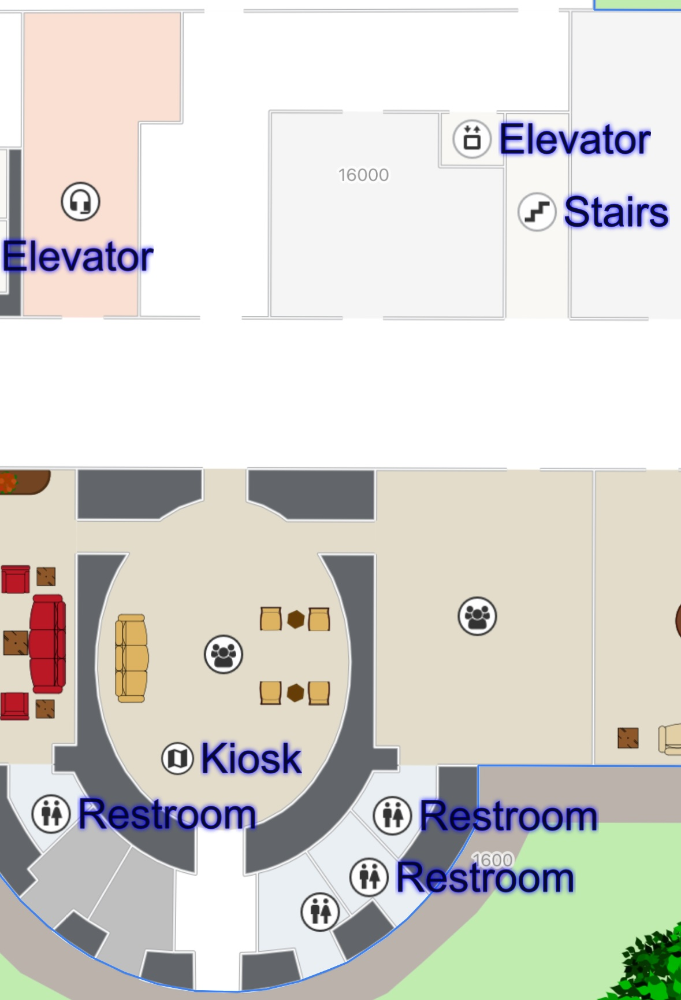

# Label styling through Display Rules

On this page you will gain knowledge of how to style marker labels using Display Rules. NB: the stylings show on this page are only available when using MapsIndoors together with the Mapbox Maps SDK.


This feature is available as of SDK version 4.3.0



To get an overview of what Display Rules are and can be used for, read the [Display Rules](../../../products/cms/display-rules.md) page first.


### Basic Styling

There are a number of fields in Display Rules that can be used to style the label:

```swift
let displayRule = MPMapsIndoors.shared.displayRuleFor(displayRuleType: .main)
displayRule?.labelStyleTextColor = .yellow
displayRule?.labelStyleTextSize = 12
displayRule?.labelStyleTextOpacity = 0.5
displayRule?.labelStyleHaloColor = .red
displayRule?.labelStyleHaloBlur = 10
displayRule?.labelStyleHaloWidth = 5
```

In addition to these styling fields there are also fields that determine when to display the label. If you want a full list of the fields available for configuration on Display Rules, [look here](../../../products/cms/display-rules.md).

### Styling the label text

With these fields it is possible to style the label to fit your design. In the following example we create a function that changes the styling on a label by doubling the size of the text, and changing the text color to green.

```swift
func styleLabelText(displayRule: MPDisplayRule) {
    displayRule.labelStyleTextSize *= 2
    displayRule.labelStyleTextColor = .green
}
```

If we apply this function to a Display Rule, it could look like this:

<figure><figcaption><p>An example of large green text labels</p></figcaption></figure>

### Styling the label halo

It is also possible to style the halo, but the halo is a bit harder to properly style. The `haloWidth` and `haloBlur` fields have immense impact on the feel of the labels, so make sure to try out many possible configurations! In this example we change the text size to be `24` to get a bigger range out of the halo. Here we want a soft halo, so we make the `haloBlur` larger than the `haloWidth`:

```swift
func styleLabelHalo(displayRule: MPDisplayRule) {
    displayRule.labelStyleTextSize = 24
    displayRule.labelStyleHaloWidth = 1
    displayRule.labelStyleHaloColor = .blue
    displayRule.labelStyleHaloBlur = 3
}
```

If applied it might look like this:

<figure><figcaption><p>An example of a blue halo on large text</p></figcaption></figure>

### Styling text and halo

With the knowledge of styling the text and label we can now coordinate the styling of the entire label, and create a style that utilizes both. In this example we have a function that modifies the label to be twice as large as it was set in the CMS, and make the text white, with a thin outline halo.

```swift
func styleLabel(displayRule: MPDisplayRule) {
    displayRule.labelStyleTextSize *= 2
    displayRule.labelStyleTextColor = .white
    displayRule.labelStyleHaloWidth = 1
    displayRule.labelStyleHaloColor = .black
    displayRule.labelStyleHaloBlur = 0
}
```

If applied it might look like this:

<figure><figcaption><p>An example of labels with white text and a black outline</p></figcaption></figure>

## Flat labels

By changing the `labelType` field from the default `.floating` to `.flat`, it becomes possible to align the label with the map instead of the camera.

Flat labels are best shown by disabling the icon, letting the text become centered on the location. Here is an example of a function that changes to type of a label to `.flat` and hides the icon to center the label:

```swift
func setLabeToFlat(displayRule: MPDisplayRule) {
    displayRule.iconVisible = false
    displayRule.labelType = .flat
}
```

Now the label will be drawn "below" the marker, flat on the ground.

<figure><figcaption><p>An example of flat labels without icons</p></figcaption></figure>

It is possible to change the rotation of the label by modifying the `bearing` field, this field is measured in degrees where 0° is pointing north and [90° is pointing west.](#user-content-fn-1)[^1] Here is an example where the type is changed to flat and the bearing of the label is changed to a new value:

```swift
func changeLabelBearing(displayRule: MPDisplayRule, newBearing: Double) {
    displayRule.labelType = .flat
    displayRule.labelStyleBearing = newBearing
}
```

If applied with a bearing of 45° it might look like this:

<figure><figcaption><p>An example of flat labels rotated to 45° north</p></figcaption></figure>

A `.flat` label is styleable, just like a `.floating` label:

```swift
func styleFlatLabel(displayRule: MPDisplayRule) {
    displayRule.iconVisible = false
    displayRule.labelType = .flat
    displayRule.labelStyleBearing = 45
    displayRule.labelStyleTextColor = .red
    displayRule.labelStyleTextSize = 100
    displayRule.labelStyleHaloColor = .yellow
    displayRule.labelStyleHaloWidth = 3
}
```

If applied the labels might look like this:

<figure><figcaption><p>An example of labels being flat and fully customized with display rules</p></figcaption></figure>

You now have knowledge of how to style labels and create flat labels when using MapsIndoors on iOS – use it wisely.

[^1]: 
