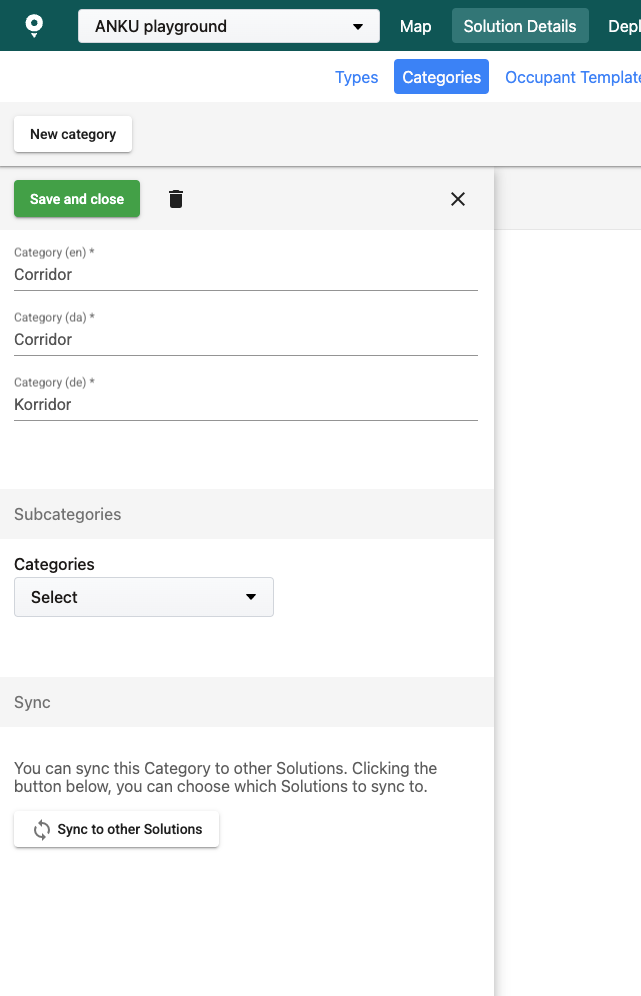

# Display a Map

Now that we have the prerequisite API keys, and the project set up, we can start adding basic functionality to the app. We will start by having the app display a map.

### Display a Map with MapsIndoors[​](https://docs.mapsindoors.com/getting-started/android/v4/map#show-a-map-with-mapsindoors) <a href="#show-a-map-with-mapsindoors" id="show-a-map-with-mapsindoors"></a>

Examples

1. Check out this Github repo for the full Getting Started code: [iOS v4 Getting Started](https://github.com/MapsPeople/MapsIndoors-iOS-Examples).
2. Note: Later in the Examples, `Map Engine` and `Map Provider` can refer to Google Maps and/or Mapbox.

In order to accomplish this we will be utilizing the [MPMapControl Class](https://app.mapsindoors.com/mapsindoors/reference/ios/4.9.5/documentation/mapsindoors/mpmapcontrol) and adding code to initialize MapsIndoors and show a map.

#### Import MapsIndoors and use MPMapControl <a href="#import-mapsindoors" id="import-mapsindoors"></a>



Within the `ViewController` class, make the following changes:





Provide the API Key for Google Maps within the AppDelegate:

`AppDelegate.swift`

```swift
import GoogleMaps

func application(_ application: UIApplication, didFinishLaunchingWithOptions launchOptions: [UIApplication.LaunchOptionsKey: Any]?) -> Bool {
    GMSServices.provideAPIKey(AppDelegate.gApiKey!)
    return true
}
```

Within the ViewController class, make the following changes:

`ViewController.swift`

```swift
import MapsIndoorsCore
import MapsIndoorsGoogleMaps
import GoogleMaps

override func viewDidLoad() {
    super.viewDidLoad()
    
    // Set up the Google Maps view. Centered on The White House. Change this to center on a building in your MapsIndoors dataset
    let camera = GMSCameraPosition.camera(withLatitude: 38.8977, longitude: -77.0365, zoom: 20)
    mapView = GMSMapView.map(withFrame: view.bounds, camera: camera)
    view.addSubview(mapView)

    // Set up the autoresizing mask to keep the map's frame synced with the view controller's frame.
    mapView.autoresizingMask = [.flexibleWidth, .flexibleHeight]

    // Initialize the MPMapConfig with the GMSMapView
    mapConfig = MPMapConfig(gmsMapView: mapView, googleApiKey: [YOUR_GOOGLE_API_KEY])
        
    // Initialize the MPMapControl with the MPMapConfig.
    Task {
        // Load MapsIndoors with the MapsIndoors API key.
        try await MPMapsIndoors.shared.load(apiKey: [YOUR_MAPSINDOORS_API_KEY])
        if let mapConfig = mapConfig {
            mapControl = MPMapsIndoors.createMapControl(mapConfig: mapConfig)
            // Use MapsIndoors SDK to add your functionality.
            // ...
        }
    }
}
```



The [MPMapControl Class](https://app.mapsindoors.com/mapsindoors/reference/ios/4.9.5/documentation/mapsindoors/mpmapcontrol) is the connective class between the Map Engine and MapsIndoors. It allows the two services to collaborate by overlaying the MapsIndoors information over the Map Engine information.

We have now added a _very_ simple, non-interactive search feature! Running the app now should yield a combined map of The White House, showing both the external and internal geographical information. However, let us try and understand what is actually happening.

### Expected Result[​](https://docs.mapsindoors.com/getting-started/ios/v4/display-a-map#expected-result) <a href="#expected-result" id="expected-result"></a>

<figure><figcaption></figcaption></figure>

Feel free to change the query from the solution "mapspeople3d" to a known building in your MapsIndoors dataset.

Next, let us look into how we can add a search feature and interact with it. We set up a Query and Filter based on the [MPQuery Class](https://app.mapsindoors.com/mapsindoors/reference/ios/4.9.5/documentation/mapsindoors/mpquery) and [MPFilter Class](https://app.mapsindoors.com/mapsindoors/reference/ios/4.9.5/documentation/mapsindoors/mpfilter), respectively. These serve as our search specifications. Finally, we call the [`MPMapsIndoors.shared.locationsWith(query:filter:)`](https://app.mapsindoors.com/mapsindoors/reference/ios/4.9.5/documentation/mapsindoors/mapsindoorsshared/locationswith\(query:filter:\)) method, which searches through the full collection of locations based on our previously established query and filter. We then select the desired location and floor index on the map using the `mapControl` instance. This handles the selection for MapsIndoors.
