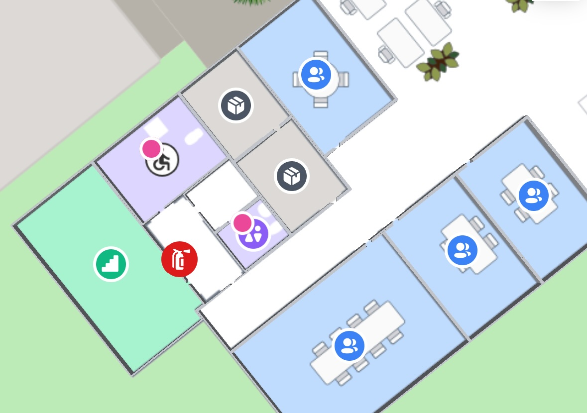
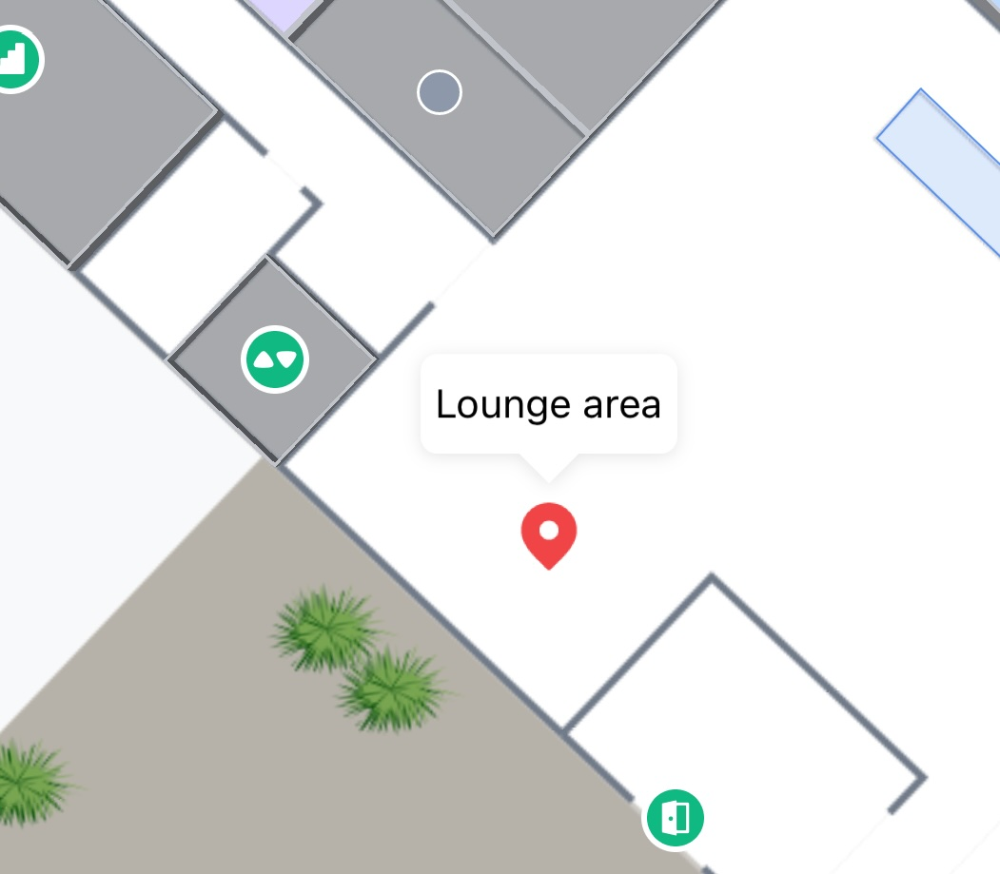

# Highlight and Select

## How to change the appearance of different states <a href="#how-to-change-the-appearance-of-different-states" id="how-to-change-the-appearance-of-different-states"></a>

The MapsIndoors iOS SDK supports Select and Highlight Display Rules and they can be retrieved and edited through `MPMapsIndoors.shared`.

#### **Example**

```swift
// Changing the visibility of a polygon for selection
if let displayRule = MPMapsIndoors.shared.displayRuleFor(displayRuleType: .selection) {
    displayRule.polygonVisible = true
}

​// Changing the visibility of a label for highlights
if let displayRule = MPMapsIndoors.shared.displayRuleFor(displayRuleType: .highlight) {
    displayRule.labelVisible = false
}
```

## Highlight <a href="#highlight" id="highlight"></a>

### **Highlight all Restrooms**

```swift
// Create a filter to only receive locations with the category Toilet
let filter =  MPFilter()
filter.categories = ["Toilet"]

// Query locations with the created filter
let locations = await MPMapsIndoors.shared.locationsWith(query: nil, filter: filter)

// Highlighting all current toilets, with the default MPHighlightBehavior.
// The MPHighlightBehavior can be used to customize the camera and map behavior,
// like fitting the view to show all highlighted locations.
mapControl?.setHighlight(locations: locations, behavior: .default)
```

<figure><figcaption><p>An example of the highlight solution Display Rule in action</p></figcaption></figure>

#### Clear the highlight

```swift
mapControl?.clearHighlight()
```

### Styling the Highlight Badge <a href="#selection" id="selection"></a>

The new Highlight Display Rule has a collection of new properties that can be used to change the style of the Highlight badge. You can see all current Display Rule properties in [the reference documentation](https://app.mapsindoors.com/mapsindoors/reference/ios/4.9.6/documentation/mapsindoors/mpdisplayrule#instance-properties).

#### Example: Change the color of the Highlight Badge

```swift
if let highlightRule = MPMapsIndoors.shared.displayRuleFor(displayRuleType: .highlight) {
    highlightRule.badgeFillColor = .blue
    highlightRule.badgeStrokeColor = .red
}
mapControl?.setHighlight(locations: [loc], behavior: .default)
```

#### Example: Hide the Highlight Badge

```swift
if let highlightRule = MPMapsIndoors.shared.displayRuleFor(displayRuleType: .highlight) {
    highlightRule.badgeVisible = false
}
mapControl?.setHighlight(locations: [loc], behavior: .default)
```

## Selection <a href="#selection" id="selection"></a>

The selection Display Rule is for changing the appearance of single selected Location, for example when the user clicks on it. To select a Location programmatically, call the method [MPMapControl.select(location:behavior)](https://app.mapsindoors.com/mapsindoors/reference/ios/4.9.6/documentation/mapsindoors/mpmapcontrol/select\(location:behavior:\)/)

```swift
mapControl?.select(location: location, behavior: .default)
```

<figure><figcaption><p>An example of the selection solution DisplayRule in action</p></figcaption></figure>

#### **Clear current Selection**

```swift
mapControl?.select(location: nil, behavior: .default)
```

### Styling the Selection Marker <a href="#previous-selection" id="previous-selection"></a>

You can easily change the icon to an image from your app Asset Catalogue. In this example it is assumed that you have an image in the project Asset Catalogue named `selectionIcon`:

```swift
if let selectionRule = MPMapsIndoors.shared.displayRuleFor(displayRuleType: .selection) {
    selectionRule.icon = UIImage(named: "selectionIcon")
}
mapControl?.select(location: loc, behavior: .default)
```

<figure><figcaption><p>Example of a custom Selection Marker.</p></figcaption></figure>

## Deprecated Selection Highlight <a href="#previous-selection" id="previous-selection"></a>

Before the release of 4.3.0 the MapsIndoors SDK already had a visual implementation of selection with a Display Rule. That Display Rule can also be changed like the newly introduced Selection Display Rule. If you want to retain the old selection rendering, it can be toggled through the Solution Config on the SDK.

#### **Example**

```swift
MPMapsIndoors.shared.solution?.config.newSelection = false
let selectionRule = MPMapsIndoors.shared.displayRuleFor(displayRuleType: .selectionHighlight)
selectionRule?.polygonFillColor = .blue
selectionRule?.polygonFillOpacity = 0.2
selectionRule?.polygonStrokeWidth = 2.0
selectionRule?.polygonStrokeColor = .blue
selectionRule?.polygonVisible = true
selectionRule?.iconVisible = false
```

Note that the `newSelection` setting lives on the Solution, so with any subsequent load of MapsIndoors it will be necessary to set the value to `false` again, as it defaults to `true`.
