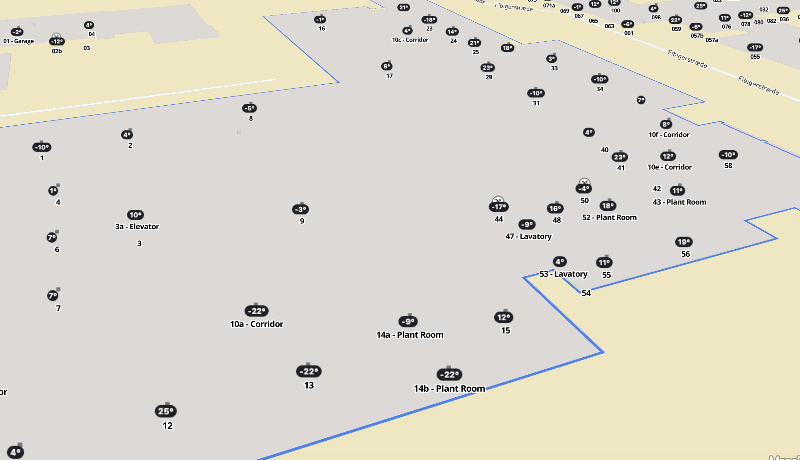
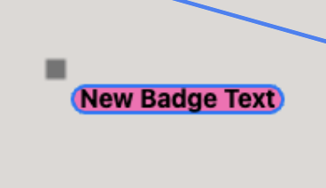

# BadgeRenderer

The `BadgeRenderer` class is used and exposed by the Web SDK. Internally, it is used to visualize live data updates for different locations. Based on the type of live data updates we receive for a location, the badge may look different. The following example showcases the style of badge `temperature` updates.

<figure><figcaption></figcaption></figure>

### Customize the BadgeRenderer

Since the `BadgeRenderer` is a public class, you have the option to customize and make use of it in your own application. ([class definition](https://app.mapsindoors.com/mapsindoors/js/sdk/latest/docs/mapsindoors.BadgeRenderer.html))

Following the next example will allow you to update a location's icon with a custom badge.

1. Create a new instance of our `BadgeRenderer` class providing a config optionally including the following properties:


<table data-full-width="true"><thead><tr><th>Name</th><th>Type</th><th>Description</th><th>Default Value</th></tr></thead><tbody><tr><td><code>backgroundColor</code></td><td><code>string</code></td><td><strong>T</strong>he background color of the badge. </td><td><code>#1E2025</code></td></tr><tr><td><code>fontFamily</code></td><td><code>string</code></td><td>The font family is used for the text inside the badge. </td><td><code>'Inter, -apple-system, BlinkMacSystemFont, "Segoe UI", Roboto, Oxygen, Ubuntu, Cantarell, "Fira Sans", "Droid Sans", "Helvetica Neue", Arial, sans-serif, "Apple Color Emoji", "Segoe UI Emoji", "Segoe UI Symbol"</code></td></tr><tr><td><code>fontSize</code></td><td><code>string</code></td><td>The font size used for the text inside the badge. </td><td><code>14px</code></td></tr><tr><td><code>fontWeight</code></td><td><code>string</code></td><td><strong>T</strong>he font-weight used for the text inside the badge. </td><td><code>bold</code></td></tr><tr><td><code>position</code></td><td><code>string</code></td><td>The position of the badge in relation to the icon. Options are: <code>top_left</code>, <code>top_right</code>, <code>bottom_right</code>, <code>bottom_left</code>. Please note that other badges may overlap. E.g. the highlight badge is on the top left corner of the icon.</td><td><code>bottom_left</code></td></tr><tr><td><code>size</code></td><td><code>object</code></td><td>The size of the badge.<br><code>{ width: number, height: number }</code></td><td><code>null</code></td></tr><tr><td><code>strokeColor</code></td><td><code>string</code></td><td>The color of the outline of the badge.</td><td><code>null</code></td></tr><tr><td><code>strokeWidth</code></td><td><code>string</code></td><td><strong>T</strong>he width of the outline of the badge.</td><td><code>0</code></td></tr><tr><td><code>text</code></td><td><code>string</code></td><td>The text inside the badge.</td><td><code>null</code></td></tr><tr><td><code>textColor</code></td><td><code>string</code></td><td>The color of the text inside the badge.</td><td><code>#FCFCFC</code></td></tr></tbody></table>

```
const badgeRenderer = new mapsindoors.BadgeRenderer({
  backgroundColor: '#FF69B4',
  fontFamily: 'Inter, -apple-system, BlinkMacSystemFont, "Segoe UI", Roboto, Oxygen, Ubuntu, Cantarell, "Fira Sans", "Droid Sans", "Helvetica Neue", Arial, sans-serif, "Apple Color Emoji", "Segoe UI Emoji", "Segoe UI Symbol"',
  fontSize: '15px',
  fontWeight: 'bold',
  position: 'bottom_right',
  size: { width: 50, height: 50 },
  strokeColor: '#0078FE',
  strokeWidth: 2,
  text: 'Default Badge Text',
  textColor: '#FFFFFF'
});
```

2. Get the location's icon as an `Image` instance. You can use the `MapsIndoors` instance for this.

```
const mapsIndoorsInstance = new mapsindoors.MapsIndoors({ ... });
const statefulDisplayRule = mapsIndoorsInstance.getStatefulDisplayRule([LOCATION_ID], true);
const icon = await statefulDisplayRule.getIcon(); 
```

3. Invoke the `overlay` method on the `badgeRenderer` object. The `overlay` method takes 2 parameters.
   * image - the image you want to modify. Please make sure that it is an instance of `Image` and _not_ just a simple string URL.
   * custom settings - This parameter offers the flexibility to override and tailor the badge configuration according to your specific requirements, thereby allowing customization beyond the default settings established during the instantiation of a new instance of the `BadgeRenderer`. You have the option to customize any of the properties described above for the `BadgeRenderer` class.

```
const newIcon = await badgeRenderer.overlay(
    icon, 
    {
        text: 'New Badge Text',
        textColor: '#000000'
    }
);
```

4. Set the a new Display Rule for your location.

```
const newDisplayRule = { icon: newIcon };
mi.setDisplayRule([LOCATION_ID], newDisplayRule);
```

<figure><figcaption></figcaption></figure>


<pre><code>&#x3C;!-- index.html -->

&#x3C;!DOCTYPE html>
&#x3C;html lang="en">
&#x3C;head>
  &#x3C;meta charset="UTF-8">
  &#x3C;meta http-equiv="X-UA-Compatible" content="IE=edge">
  &#x3C;meta name="viewport" content="width=device-width, initial-scale=1.0">
  &#x3C;title>MapsIndoors&#x3C;/title>
  &#x3C;script src="https://app.mapsindoors.com/mapsindoors/js/sdk/4.33.0/mapsindoors-4.33.0.js.gz?apikey=YOUR_MAPSINDOORS_API_KEY">&#x3C;/script>
  &#x3C;script src='https://api.mapbox.com/mapbox-gl-js/v2.14.1/mapbox-gl.js'>&#x3C;/script>
  &#x3C;link href='https://api.mapbox.com/mapbox-gl-js/v2.14.1/mapbox-gl.css' rel='stylesheet' />
&#x3C;/head>

&#x3C;body>
  &#x3C;div id="map" style="width: 600px; height: 600px;">&#x3C;/div>
  
  &#x3C;script>
    const mapViewInstance = new mapsindoors.mapView.MapboxView({
        accessToken: YOUR_ACCESS_TOKEN,
        element: document.getElementById('map'),
        center: { lat: 38.8974905, lng: -77.0362723 }, // The White House
        zoom: 17,
        maxZoom: 22
    });
    
    const mapsIndoorsInstance = new mapsindoors.MapsIndoors({
        mapView: mapViewInstance
    });
    
    const badgeRenderer = new mapsindoors.BadgeRenderer({
        backgroundColor: '#FF69B4',
        fontFamily: 'Inter, -apple-system, BlinkMacSystemFont, "Segoe UI", Roboto, Oxygen, Ubuntu, Cantarell, "Fira Sans", "Droid Sans", "Helvetica Neue", Arial, sans-serif, "Apple Color Emoji", "Segoe UI Emoji", "Segoe UI Symbol"',
        fontSize: '15px',
        fontWeight: 'bold',
        position: 'bottom_right',
        size: { width: 50, height: 50 },
        strokeColor: '#0078FE',
        strokeWidth: 2,
        text: 'Default Badge Text',
        textColor: '#FFFFFF'
    });
    
<strong>    mapsIndoorsInstance.on('click', async function (location) {
</strong>        const statefulDisplayRule = mapsIndoorsInstance.getStatefulDisplayRule(location, true);
        const icon = await statefulDisplayRule.getIcon();

        const newIcon = await badgeRenderer.overlay(
            icon,
            {
                text: 'New Badge Text',
                textColor: '#000000'
            }
        );

        const displayRuleOverrides = {
            icon: newIcon,
            iconSize: { width: 150, height: 150 }
        };
        
        mapsIndoorsInstance.setDisplayRule(location.id, displayRuleOverrides);
    });
  &#x3C;/script>
&#x3C;/body>
&#x3C;/html>
</code></pre>
