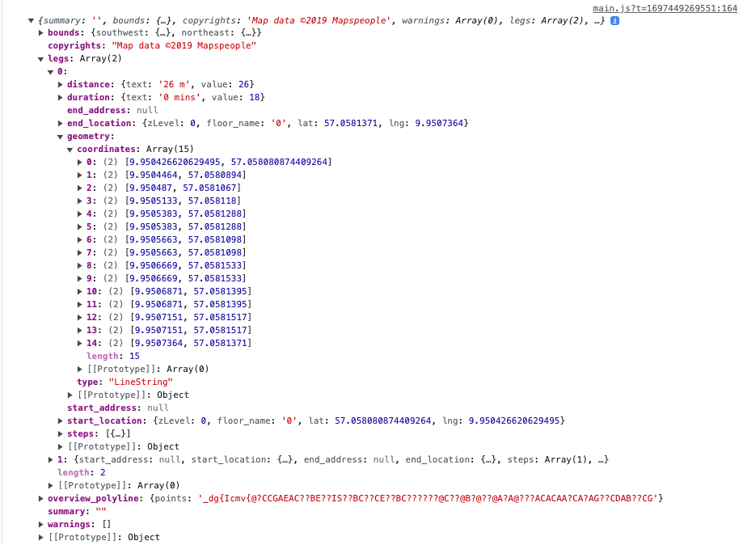

# Directions Renderer

When getting the result route from a [Directions Service](https://docs.mapsindoors.com/directions-service/), we can use the `DirectionsRenderer` to display this Route on a map.&#x20;

Once the `miDirectionsServiceInstance` and `miDirectionsRendererInstance` are initialized, the methods used from them should be agnostic to the map provider (whether it's Mapbox, Google Maps, etc.) with the exception of getting routes via TRANSIT, which requires Google as the external provider.

This example shows how to set up a query for a route and display the result on a Google Map using the DirectionsRenderer:

for Google Maps

```javascript
const externalDirectionsProvider = new mapsindoors.directions.GoogleMapsProvider();
```

for Mapbox

```javascript
const externalDirectionsProvider = new mapsindoors.directions.MapboxProvider();
```

```javascript

const miDirectionsServiceInstance = new mapsindoors.services.DirectionsService(externalDirectionsProvider);
const directionsRendererOptions = { mapsIndoors: mapsIndoorsInstance }
const miDirectionsRendererInstance = new mapsindoors.directions.DirectionsRenderer(directionsRendererOptions);

//recall that your coordinates can be found on the location objects here:
// longitude = location.properties.anchor.coordinates[0]
// latitude = location.properties.anchor.coordinates[1]
// floorIndex = location.properties.floor

const routeParameters = {
  origin: { lat: 38.897389429704695, lng: -77.03740973527613, floor: 0 }, // Oval Office, The White House
  destination: { lat: 38.897579747054046, lng: -77.03658652944773, floor: 1 } // Blue Room, The White House
};

miDirectionsServiceInstance.getRoute(routeParameters).then(directionsResult => {
  miDirectionsRendererInstance.setRoute(directionsResult);
});
```

> See all available directions render options in the [reference documentation](https://app.mapsindoors.com/mapsindoors/js/sdk/latest/docs/mapsindoors.directions.DirectionsRenderer.html).

As previously mentioned, the route object is separated into objects of [Leg](https://app.mapsindoors.com/mapsindoors/js/sdk/latest/docs/Leg.html) and these legs are again separated into objects of [Step](https://app.mapsindoors.com/mapsindoors/js/sdk/latest/docs/Step.html). Unless the Route only contains one leg, the Directions Renderer does not allow the full Route to be rendered all at once. A specific part of the route can be rendered by setting the step index and/or leg index using the `DirectionsRenderer`.

```javascript
miDirectionsRendererInstance.setStepIndex(stepIndex, legIndex)
```

> See all available methods in the [reference documentation](https://app.mapsindoors.com/mapsindoors/js/sdk/latest/docs/mapsindoors.directions.DirectionsRenderer.html)

The length of the legs and steps arrays determines the possible values of `legIndex` and `stepIndex`.

**Implementing the route rendering along with a UI**

The route renderer has the ability to update the polyline via its methods.

If a route is broken down into multiple legs, steps, and sub-steps (referred to as steps within the step objects), it will be very helpful if a user can iterate through those steps prior to and even during their journey.

If using a positioning service to get the current position of the end user, you may wish to even update this programmatically. In any case, it will be more helpful to understand the data structure of the route response.


Directions response object


<figure><figcaption></figcaption></figure>


Route object



Leg object



Step object


We recommend after getting the route, to set the route, get the current leg index as and also the current step index. This will be helpful in maintaining where in the directions response you are.

```javascript
let currentLegIndex = null;
let currentStepIndex = null;

miDirectionsRendererInstance.setRoute(directionsResult);
currentLegIndex = miDirectionsRendererInstance.getLegIndex();
currentStepIndex = miDirectionsRendererInstance.getStepIndex();
```

If the user wishes to iterate to the next step or even next leg, the directions renderer will handle that for you if you choose to use nextStep or nextLeg, respectively. It will even handle things like floor changes, reanimating the polyline, and changing zooming in or out based on the distance length.

