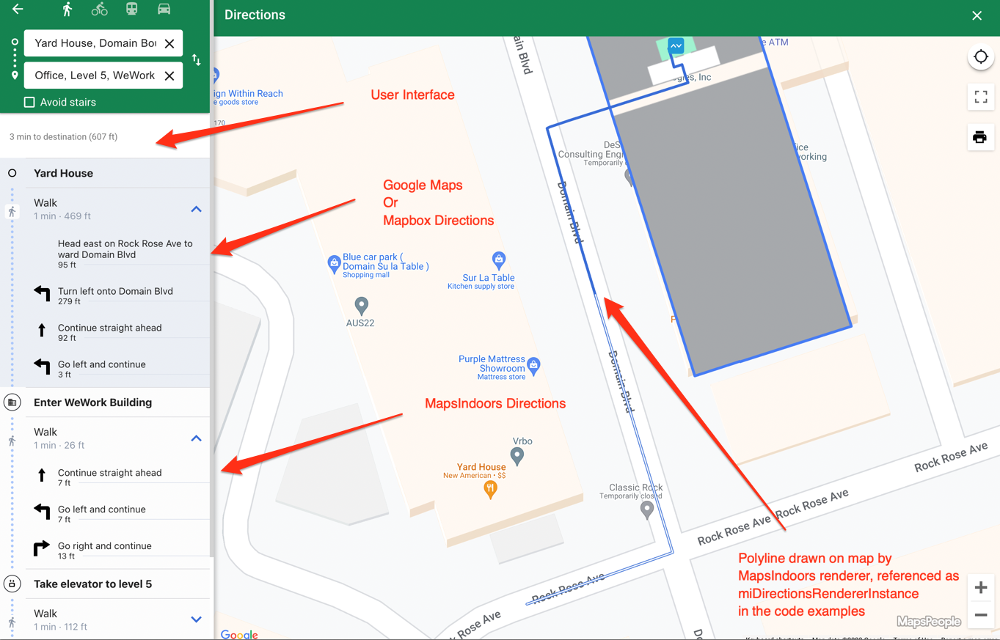
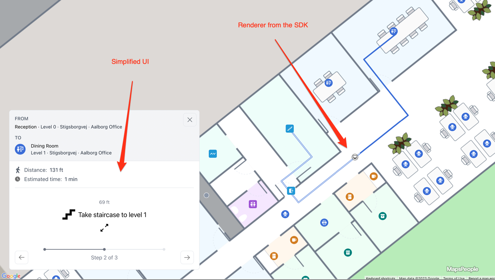

---
layout:
  title:
    visible: true
  description:
    visible: true
  tableOfContents:
    visible: true
  outline:
    visible: true
  pagination:
    visible: false
---

# Directions Service

Ready to add indoor navigation to your app with MapsIndoors SDK?&#x20;

This guide will show you how to implement directions, render routes, and interact with them in your application.&#x20;

**Design**

* Would you like to show textual directions in a UI?
  * What will your user interface look like?
  * What will the user experience be like
* Would you like to show directions on the map?
  * How will the end user let the map know it's time to update with the next part of their journey?

<figure><figcaption></figcaption></figure>

<figure><figcaption></figcaption></figure>


From an implementation standpoint, there are two functional things that need to be taken care of.

1. Setting up and requesting directions

<figure><figcaption><p>Getting directions via the SDK</p></figcaption></figure>

2. [Handling and rendering directions responses](../wayfinding/directions-renderer.md)

<figure><figcaption><p>What you can do once you have the response.</p></figcaption></figure>


The first step in getting directions is initializaing the directions service instance. By passing the externalDirectionsProvider, the MapsIndoors SDK will handle merging responses from the base map, e.g. outdoor directions that will charge billable requests if you request from somewhere else other than MapsIndoors data (e.g. an end users house, to somewhere indoors.)

**Implementation**

The class `DirectionsService` is used to request routes from one point to another. The minimal required input is an `origin` and a `destination`. &#x20;

Mapbox (required parameter of the DirectionsService instance)

```javascript
const externalDirectionsProvider = new mapsindoors.directions.MapboxProvider();
const miDirectionsServiceInstance = new mapsindoors.services.DirectionsService(externalDirectionsProvider);
```

Google (not required for legacy reasons, but recommended to pass an externalDirectionsProvider as a parameter)

```javascript
const externalDirectionsProvider = new mapsindoors.directions.GoogleMapsProvider();
const miDirectionsServiceInstance = new mapsindoors.services.DirectionsService(externalDirectionsProvider);
```

In the below example, the coordinates are hard coded, but you'll likely want to retrieve them from location objects. It's recommended to get those from the anchor points, e.g.&#x20;

```javascript
lat: originLocation.properties.anchor.coordinates[1], lng: originLocation.properties.anchor.coordinates[0], floor: originLocation.properties.floor
```

```javascript
const routeParameters = {
  origin: { lat: 38.897389429704695, lng: -77.03740973527613, floor: 0 }, // Oval Office, The White House
  destination: { lat: 38.897579747054046, lng: -77.03658652944773, floor: 1 } // Blue Room, The White House
};

miDirectionsServiceInstance.getRoute(routeParameters).then(directionsResult => {
  console.log(directionsResult);
});
```

### Change Transportation Mode[​](https://docs.mapsindoors.com/directions-service#change-transportation-mode-3) <a href="#change-transportation-mode-3" id="change-transportation-mode-3"></a>

In MapsIndoors, the transportation mode is referred to as travel mode. There are four travel modes, walking, bicycling, driving and transit (public transportation). The travel modes generally apply to outdoor navigation. Indoor navigation calculations are based on walking travel mode.

Set travel mode on your request using the `travelMode` property on `routeParameters`:

```
const routeParameters = {
  origin: { lat: 38.897389429704695, lng: -77.03740973527613, floor: 0 }, // Oval Office, The White House
  destination: { lat: 38.897579747054046, lng: -77.03658652944773, floor: 1 }, // Blue Room, The White House
  travelMode: 'WALKING'
};
```

Relevant for outdoor directions only

* DRIVING
* BYCYCLING
* WALKING
* TRANSIT (Only supported with Google Maps as the external provider)

### Route Restrictions[​](https://docs.mapsindoors.com/directions-service#route-restrictions-3) <a href="#route-restrictions-3" id="route-restrictions-3"></a>

#### Avoiding Stairs and Steps[​](https://docs.mapsindoors.com/directions-service#avoiding-stairs-and-steps-3) <a href="#avoiding-stairs-and-steps-3" id="avoiding-stairs-and-steps-3"></a>

For a wheelchair user or a user with physical disabilities it could be relevant to request a Route that avoids stairs, escalators and steps.

Set avoid stairs on your request using the `avoidStairs` property on `routeParameters`:

```
const routeParameters = {
  origin: { lat: 38.897389429704695, lng: -77.03740973527613, floor: 0 }, // Oval Office, The White House
  destination: { lat: 38.897579747054046, lng: -77.03658652944773, floor: 1 }, // Blue Room, The White House
  avoidStairs: 'true'
};
```

#### App User Role Restrictions[​](https://docs.mapsindoors.com/directions-service#app-user-role-restrictions-3) <a href="#app-user-role-restrictions-3" id="app-user-role-restrictions-3"></a>

Application User Roles is a feature that lets you define various roles, you can assign to your users. In the context of route calculation, the feature is used to differentiate routing from one user type to the another. In the MapsIndoors CMS it is possible to restrict paths and doors in the route network for certain [User Roles](../other-guides/application-user-roles.md).

You can get available Roles for your MapsIndoors Solution with the help of the `SolutionsService:`

```
mapsindoors.services.SolutionsService.getUserRoles().then(userRoles => {
  console.log(userRoles);
});
```

> For more information, see the [getUserRoles documentation](https://app.mapsindoors.com/mapsindoors/js/sdk/latest/docs/mapsindoors.services.SolutionsService.html#getUserRoles) which returns [User Role objects](https://app.mapsindoors.com/mapsindoors/js/sdk/latest/docs/mapsindoors.UserRole.html).

User Roles can be set on a global level using `mapsindoors.MapsIndoors.setUserRoles()`.

```
mapsindoors.MapsIndoors.setUserRoles(['myUserRoleId']);
```

> For more information, see the [setUserRoles method in our documentation.](https://app.mapsindoors.com/mapsindoors/js/sdk/latest/docs/mapsindoors.MapsIndoors.html#.setUserRoles)

This will affect all following Directions requests, visibility of Locations as well as search queries with `LocationsService`. Be mindful of what restrictions are set on locations if your solution is to utilize user roles within MapsIndoors.

### Transit Departure and Arrival Time[​](https://docs.mapsindoors.com/directions-service#transit-departure-and-arrival-time-3) <a href="#transit-departure-and-arrival-time-3" id="transit-departure-and-arrival-time-3"></a>

Set a departure date or an arrival date on the route using the `transitOptions` property. It will only make sense to set one of these properties at a time.&#x20;

This parameter is only implemented on our side with Google Maps, not Mapbox.

```
const departureDate = new Date(new Date().getTime() + 30*60000); // 30 minutes from now

const routeParameters = {
  origin: { lat: 38.897389429704695, lng: -77.03740973527613, floor: 0 }, // Oval Office, The White House
  destination: { lat: 38.897579747054046, lng: -77.03658652944773, floor: 1 }, // Blue Room, The White House
  travelMode: 'TRANSIT',
  transitOptions: {
    departureTime: departureDate
  }
};
```

> For more information about available options on the `transitOption` object, see [google.com/maps/documentation](https://developers.google.com/maps/documentation/javascript/reference/directions#TransitOptions.departureTime).&#x20;

**Additional reading**

For more information on the options you can provide, check the [documentation on getting routes](https://app.mapsindoors.com/mapsindoors/js/sdk/latest/docs/mapsindoors.services.DirectionsService.html).
