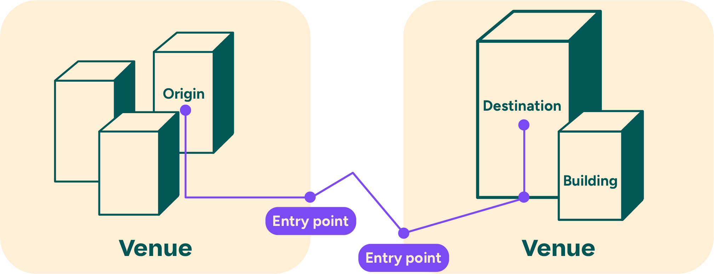

# Directions

## Introduction to Directions

As a key element in the MapsIndoors platform, we offer APIs for efficiently calculating and displaying the most optimal routes from anywhere in the world to any Location in MapsIndoors. In the case of travelling inside a Venue, this calculation can be done on a local map provided by MapsIndoors. In the case of travelling between Venues or from outdoors to indoors, MapsIndoors provides a seamless journey outline from a specified Origin through automatically selected Entry Points at the edge of your Venues to the specified destination. See illustration below:

<figure><figcaption></figcaption></figure>

In order to provide a route between Venues, MapsIndoors integrates with external and global map engines (Mapbox and Google Maps).

The central components that utilize a Directions experience is the [Directions Service](https://docs.mapsindoors.com/directions-service/) and the [Directions Renderer](https://docs.mapsindoors.com/directions-renderer/). Let's examine some key concepts first.

### Entry Points[​](https://docs.mapsindoors.com/directions-intro#entry-points) 

Entry Points are specified points in a MapsIndoors Venue that enable a transition between a global or regional map and the local map in MapsIndoors. The Entry Point often specifies which travel modes are suitable for entering/exiting the Venue. There are four travel modes: Walking, Bicycling, Driving and Transit (Public Transportation). As such, the Entry Point may be a bike shed for the Bicycling travel mode, a carpark for Driving and a bus stop for Transit. As a consequence, it is often at the Entry Point that the Travel Mode changes from Bicycling, Driving or Transit to Walking. The selection of an Entry Point for transitioning between route networks is based on a combination of automatic calculation, estimation and optimization.

### The Route Model[​](https://docs.mapsindoors.com/directions-intro#the-route-model) 

When requesting a route with MapsIndoors Directions Service, the Route model in MapsIndoors is separated into Legs, and these Legs are again separated into Steps.&#x20;

#### The Route Leg Model[​](https://docs.mapsindoors.com/directions-intro#the-route-leg-model) 

A leg represents a logical subset of the journey from Origin to Destination. A Route will break into legs when:

* Travelling from one floor level to another.
* Changing context, such as entering or exiting a building.
* Changing travel mode, for example parking your car and continuing by foot.

If you examine the illustration above, you will see that the purple line representing the Route has been marked with purple circles where the Route would be separated into legs.

#### The Route Step Model[​](https://docs.mapsindoors.com/directions-intro#the-route-step-model) 

A Route Step can have different representations depending on where on a Route it is placed. A Step may represent yet another subset of the journey within a leg. Furthermore, it may represent a required action and/or manoeuvre, such as traversing floors, changing directions (left, right, etc.). A step will also contain textual instructions. Examples include “Make a right turn”, “Continue straight ahead”, “Take the elevator to Floor 4” and the like.
