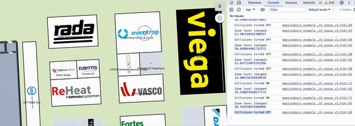

# Turn Off Collisions Based on Zoom Level

**Handling Label Collisions in MapsIndoors SDK with Mapbox**

**Overview**

When utilizing the MapsIndoors SDK, managing label collisions—particularly at high zoom levels—can be crucial to maintain a clean and informative map display. The SDK's collision detection may sometimes hide labels of Points of Interest (POIs) that are situated closely together, to avoid visual clutter and overlap. This guide introduces a method to manually control label visibility at specific zoom levels.

**Why It Matters**

* **Visibility vs Clarity**: Ensuring labels are always visible might be vital for certain use cases or specific POIs. However, enabling labels to overlap can disrupt map clarity and user experience.
* **Zoom Level Sensitivity**: At high zoom levels, the preference might lean towards always displaying labels, despite close proximity to others.

**Limitations**

* **Map Provider Dependency**: This workaround for web is only available on Mapbox. For Mobile, this approach can be done on both Google Maps and Mapbox. Please see relevant mobile documentation for more details on implementation.
* **Global Application**: The approach impacts all labels in MapsIndoors. For granular control over specific labels, consider employing display rules via the MapsIndoors CMS or the SDK as you normally handle most use-cases.

**Cost-Benefit Analysis**

* **Cost**: Enabling overlap can result in labels obscuring each other, potentially hindering readability and aesthetic appeal, especially at low zoom levels like zoom 17, 18, 19.
* **Benefit**: Guarantees label visibility at all times, especially at higher zoom levels, ensuring crucial information is always displayed, which might make sense at zoom levels 21, 22, 23, 24, 25 (we support zoom levels up to 25 with Mapbox).

**Implementation Example**

The following example demonstrates how to manage label collisions by enabling or disabling the `text-allow-overlap` property based on zoom levels.

<figure><figcaption></figcaption></figure>


```javascript
mapsIndoorsInstance.addListener('zoom_changed', (zoomLevel) => {
    console.log('Zoom level changed: ', zoomLevel);
    if (zoomLevel > 20) {
        mapsIndoorsInstance.getMap().setLayoutProperty('MI_POINT_LAYER', 'text-allow-overlap', true);
        console.log('Collisions turned OFF'); // Labels can overlap
    } else {
        mapsIndoorsInstance.getMap().setLayoutProperty('MI_POINT_LAYER', 'text-allow-overlap', false);
        console.log('Collisions turned ON'); // Labels cannot overlap
    }
});
```

**Explanation**

* **`zoom_changed` Listener**: Detects changes in zoom level, triggering the condition check.
* **Conditional Check**: Compares the current zoom level against the

maximum permissible zoom level (retrieved via [mapsIndoorsInstance.getMaxZoom()](https://app.mapsindoors.com/mapsindoors/js/sdk/latest/docs/mapsindoors.MapsIndoors.html#getMaxZoom) ) to determine label rendering behavior.

* **`setLayoutProperty`**: Adjusts the `text-allow-overlap` property of the 'MI\_POINT\_LAYER' to either allow or prevent label overlap, depending on the zoom condition.
