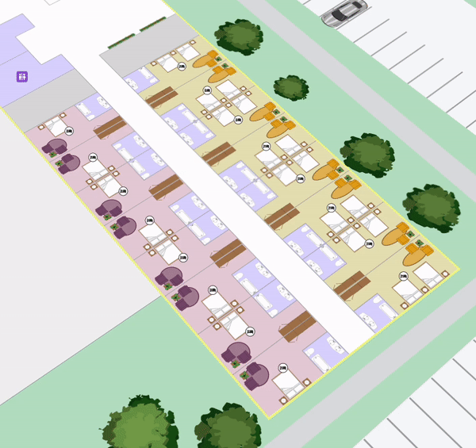

# Change Building Outline

**Crafting a Dynamic, Color-Transitioning Example**

Here's a code snippet that alternates the building outline color every second, cycling through a palette of contrasting colors, it's not the most practical application, but it shows how to achieve it.

You may desire a way to change the stroke color based on user requirements to make the map meet different accessibility requirements.

<figure><figcaption><p>Changing border color programmatically</p></figcaption></figure>

```javascript
const colors = ['#E63946', '#F1FA8C', '#A8DADC', '#457B9D'];

// Initialize an index to keep track of the current color
let colorIndex = 0;

// Use setInterval to create a loop that runs every 1000 milliseconds (1 second)
setInterval(() => {
    // Set the building outline color to the current color
    mapsIndoorsInstance.setBuildingOutlineOptions({strokeColor: colors[colorIndex]});

    // Increment the color index, cycling back to 0 if we've reached the end of the colors array
    colorIndex = (colorIndex + 1) % colors.length;
}, 1000);
```

**Additional Details**

To change the building outline color use the [`strokeColor`](https://developer.mozilla.org/en-US/docs/Web/CSS/color\_value) property of the [`BuildingOutlineOptions` interface](https://app.mapsindoors.com/mapsindoors/js/sdk/latest/docs/BuildingOutlineOptions.html). This property accepts any color as defined by conventional CSS color values.&#x20;

See [https://developer.mozilla.org/en-US/docs/Web/CSS/color\_value](https://developer.mozilla.org/en-US/docs/Web/CSS/color\_value) for more information on CSS color values.

To do this in practice, on the MapsIndoors instance, call `setBuildingOutlineOptions` to change the appearance of the building outline.

```
mapsIndoors.setBuildingOutlineOptions({strokeColor: '#3071d9'});
```

The building outline design will be taken from the values set through the CMS. To change the building outline you can use the different properties of the `BuildingOutlineOptions` interface. The properties are the following:

1. `visible` - Controls whether the Building Outline is visible on the map.
   * The value should be a Boolean here, so either `true` or `false`.
2. `zoomFrom` - Sets the minimum Zoom Level at which the Building Outline is visible.
   * The value should be a number between 1 and 25, with 1 being very far away, and 25 being very close (25 not available for all Solutions). In a general use case, most users will only need values between 15 and 25.
3. `zoomTo`- Sets the maximum Zoom Level at which the Building Outline is visible.
   * The value should be a number between 1 and 25, with 1 being very far away, and 25 being very close (25 not available for all Solutions). In a general use case, most users will only need values between 15 and 25.
4. `strokeColor` - Controls the stroke color of the Building Outline.
   * This property accepts any color as defined by conventional CSS color values. See [https://developer.mozilla.org/en-US/docs/Web/CSS/color\_value](https://developer.mozilla.org/en-US/docs/Web/CSS/color\_value) for more information on CSS color values.
5. `strokeWeight` - Controls the stroke width (in pixels) of the Building Outline.
   * The value should be a number between.
6. `strokeOpacity` - Controls the stroke opacity of the Building Outline.
   * The value should be a number between 0 and 1, for example a value of 1 gives 100% opacity, 0.2 gives 20% opacity, etc.

To read more about the `BuildingOutlineOptions` interface see the [reference docs](https://app.mapsindoors.com/mapsindoors/js/sdk/latest/docs/BuildingOutlineOptions.html).

One way to do this in practice, call `setBuildingOutlineOptions` on the MapsIndoors instance, to change the appearance of the building outline.

```
mapsIndoorsInstance.setBuildingOutlineOptions({
    visible: true,
    zoomFrom: 15,
    zoomTo: 20,
    strokeColor: '#fcd305',
    strokeWeight: 5,
    strokeOpacity: 0.8
});
```

Alternatively, you can define the `buildingOutlineOptions` property when creating a new mapsindoors instance.

```
new mapsindoors.MapsIndoors({
    mapView: mapView,
    buildingOutlineOptions: {
        visible: true,
        zoomFrom: 15,
        zoomTo: 20,
        strokeColor: '#fcd305',
        strokeWeight: 5,
        strokeOpacity: 0.8
    }
});
```

[\
](https://docs.mapsindoors.com/display-language)
