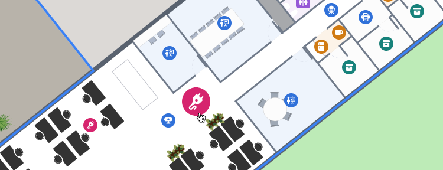

# How to change the state DisplayRules

__This article assumes that you have already read the [Getting Started guide.](../getting-started/README.md)__

The state DisplayRules controls how Locations are displayed on the map in different states For example, you can change the icon scale of a Location when it is hovered over or highlight a search result. The state DisplayRules gives access to the same properties as the regular [DisplayRules](https://app.mapsindoors.com/mapsindoors/js/sdk/latest/docs/DisplayRule.html "MapsIndoors JavaScript SDK - Reference Documentation"), which can be used to control the appearance of Locations.

## Available states

| State | Description |
|---|---|
| hover | The state when the user hovers over a Location. |
| highlight | The state when Locations are programmatically highlighted using the `mapsIndoors.highlight()` method. |
| selection | The state when the user has selected a Location by clicking on it. |
| hoverHighlight | The state when the user hovers over a highlighted Location. |
| hoverSelection | The state when the user hovers over a selected Location. |

To change the state DisplayRules, you can access the Solution Config object using the `mapsIndoors.getSolutionConfig()` method. Once you have the Solution Config object, you can access the state DisplayRules using the `solutionConfig.stateDisplayRules` property.

__Example:__

```javascript
// Get the Solution Config object.
const solutionConfig = mapsIndoors.getSolutionConfig();

// Get the hover state DisplayRule.
const hoverDisplayRule = solutionConfig.stateDisplayRules.hover;

// Set the icon scale to 2. This will result in the icon being scaled to double size on hover.
hoverDisplayRule.iconScale = 2;

// Update the SolutionCofig to apply the changes.
mapsIndoors.setSolutionConfig(solutionConfig);
```



## Hover

The default SDK behaviour is to scale the icon and lighten the fill and stroke color of the polygon and extrusion.

__Default values for the hover DisplayRule:__

```json
{
    'iconScale': 1.25,
    'polygonLightnessFactor': 0.2,
    'extrusionLightnessFactor': 0.2,
    'badgeScale': 1.25
}
```

The lightnessFactor is used to lighten the fill and stroke color of both the polygon and the extrusion by 20%.

### Highlight and Selection

The `hoverHighlight` and `hoverSelection` is two separate state DisplayRules to configure the appearance of highlighted or selected locations when hovered.

__Default values for the hoverHighlight DisplayRule:__

```json
{
    'zoomFrom': 15.0,
    'zoomTo': 999,
    'iconScale': 1.25,
    'polygonZoomFrom': 15.0,
    'polygonZoomTo': 999,
    'polygonLightnessFactor': 0.4,
    'extrusionZoomFrom': 15.0,
    'extrusionZoomTo': 999,
    'extrusionLightnessFactor': 0.4,
    'badgeVisible': true,
    'badgeZoomFrom': 15,
    'badgeZoomTo': 999,
    'badgeRadius': 6,
    'badgeStrokeWidth': 4.0,
    'badgeStrokeColor': '#fafafa',
    'badgeFillColor': '#ec4899',
    'badgeScale': 1.25
};
```

__Default values for the hoverSelection DisplayRule:__

```json
{
    'zoomFrom': 0.0,
    'zoomTo': 999,
    'visible': true,
    'iconVisible': true,
    'icon': 'https://app.mapsindoors.com/mapsindoors/gfx/select-pin.png',
    'iconScale': 1.25,
    'iconPlacement': 'ABOVE',
    'iconSize': {
        'width': 24.0,
        'height': 28.0
    },
    'polygonZoomFrom': 15.0,
    'polygonZoomTo': 999,
    'polygonLightnessFactor': 0.4,
    'extrusionZoomFrom': 15.0,
    'extrusionZoomTo': 999,
    'extrusionLightnessFactor': 0.4
}
```

## Highlight

The default SDK behaiour is to add a small badge to the upper left corner of the Location icon, ensure visibility by setting the zoomFrom and zoomTo values, and the fill and stroke color of the polygon and extrusion.

__Default values for the highlight DisplayRule:__

```json
{
    'zoomFrom': 15.0,
    'zoomTo': 999,
    'polygonZoomFrom': 15.0,
    'polygonZoomTo': 999,
    'polygonLightnessFactor': 0.2,
    'extrusionZoomFrom': 15.0,
    'extrusionZoomTo': 999,
    'extrusionLightnessFactor': 0.2,
    'badgeVisible': true,
    'badgeZoomFrom': 15,
    'badgeZoomTo': 999,
    'badgeRadius': 6,
    'badgeStrokeWidth': 4.0,
    'badgeStrokeColor': '#fafafa',
    'badgeFillColor': '#ec4899',
    'badgeScale': 1
};
```

__Highlight all Meeting Rooms:__

```javascript
// Get the LocationsService object.
const locationsService = mapsindoors.services.LocationsService;

// Get all Locations of the type "Meeting Room".
const meetingRoomLocations = await locationsService.getLocations({ types: ['MeetingRoom'] });

// Highlight the Locations.
mapsIndoors.highlight(meetingRoomLocations.map(location => location.id));
```


__Clear the highlight:__

```javascript
mapsIndoors.highlight([]);
```

## Selection

The selection state is for changing the appearance of a single Location, for example when the user clicks on it. To select a Location, call the mapsIndoors.selectLocation() method, passing in the Location object as the parameter.

__Default values for the selection DisplayRule:__

```json
{
    'zoomFrom': 0.0,
    'zoomTo': 999,
    'visible': true,
    'iconVisible': true,
    'icon': 'https://app.mapsindoors.com/mapsindoors/gfx/select-pin.png',
    'iconScale': 1.0,
    'iconPlacement': 'ABOVE',
    'iconSize': {
        'width': 24.0,
        'height': 28.0
    },
    'polygonZoomFrom': 15.0,
    'polygonZoomTo': 999,
    'polygonLightnessFactor': 0.2,
    'extrusionZoomFrom': 15.0,
    'extrusionZoomTo': 999,
    'extrusionLightnessFactor': 0.2
}
```

__Select a Location, when the user clicks it:__

```javascript
// (location) is the Location object that is clicked by the user.
mapsIndoors.on('click', (location) => {
    mapsIndoors.selectLocation(location);
});
```


__Clear current selection:__

```javascript
mapsIndoors.deselectLocation();
```
