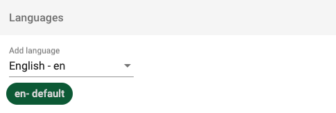
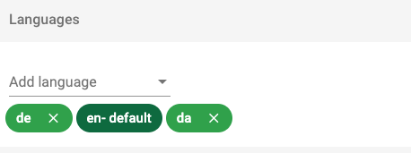
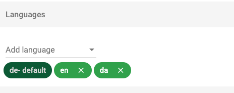
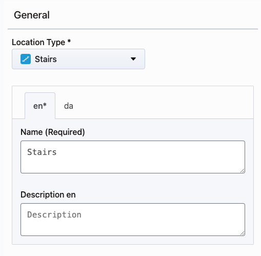

# Languages

MapsIndoors languages are independent of the chosen languages on the device on which the app is used. This means that you need to explicitly tell MapsIndoors which language to use.
Example below shows **'Languages'** section and dropdown from which you can select languages:

    

When solution has only one language, this language will be the default one. You are able to add as many languages as you want to and choose which one should be the default one.
Adding German and Danish languages:

Setting German as default language:

If you do not specify a language, MapsIndoors will show information in the default language defined in the MapsIndoors CMS. Likewise, if you specify a language that is not supported, MapsIndoors will also show information in the default language.

Additionally, aside from methods mentioned here, you can provide translations via the standard method for your device, such as using individual localized strings.

### Configuring POI translations in CMS[​](https://docs.mapsindoors.com/display-language#configuring-poi-translations-in-cms) 

To provide multiple languages for items in the MapsIndoors CMS, such as "Meeting Room" or "Restroom", the translation must be provided by the user in the CMS. A translation can be provided in any language that is defined for this specific solution. In order to add support for additional languages that we currently do not support, please contact your MapsIndoors representative, and we will enable you to add translations in your desired language.

Once language of choice has been added as supported language, you can add the translation by clicking on any POI, which will open a menu on the left side of the screen. Here, you will see the following menu point, where you can enter translations for the languages you wish. If a field is left empty, the fallback language is the default one. In the example below, English (en) and Danish (da) are the enabled languages:

### Use Device Language[​](https://docs.mapsindoors.com/display-language#use-device-language) 

The MapsIndoors language can be aligned with the device language by supplying the current language code of the device.

The web-app will automatically adjust the language to the language set in the user's browser settings, otherwise default to English. When using Safari, the device's language setting will be used. This is limited to the following languages, and will default to English if the selected language is not supported:

* English
* Danish
* Spanish
* Portuguese
* Italian
* French