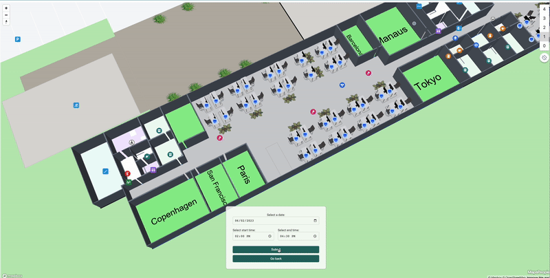
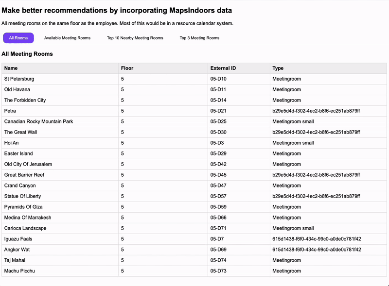

# Using External ID, Geospatial Joins

## Background on External ID

The External ID is a reference from your real-life data to a piece of MapsIndoors geodata.

In a large venue like a conference hall, headquarter, or university, every room will have a unique ID like `1.234AB` or `HALL_A` in a naming scheme that makes sense to that organization.

All MapsIndoors geospatial objects contain an internal ID. While this can be used for performing lookups, it means that in general as a developer you'll need to either query for them, or create your own mapping tables against your own resources.

Our recommendation is to use the `externalId` as the identifier for an your system's ID or another external system of your choosing.

If you have a queue monitoring system and want to display some regularly updated statuses on a piece of geodata in MapsIndoors like a room, poi, or area, you can use the External ID as the common denominator between the systems.

There are many ways you can utilize the power of external ID as a reference point for one of your systems, and we recommend looking at the [Integration API documentation](https://docs.mapsindoors.com/api/) and [getting in touch](https://resources.mapspeople.com/contact-us) to hear more about your options with this feature.

Alternatively, you might need to change the ID for a particular room in your physical building. It might be a large meeting room that is now split in two smaller rooms and one of them keeps that original ID. The external ID should then reflect your naming scheme, and not concern itself with the internal random identifier our database handed out to any of your rooms, as they can potentially be two new ones.

Historically, we referred to this as room ID, so if you see a property on an object when working with the SDK and see a `roomId`, it should be consistent with the external ID property.

## Getting Locations by External ID

A method on MapsIndoors is available to retrieve locations by their external ID. This method generally assumes that your first party system will do querying of different data, and only need to use the externalId to find the equivalent MapsIndoors location.

The function on all 3 platforms functions similarly, returning an Array or List of Locations that match the supplied External ID strings.

The below example shows how to retrieve some MapsIndoors locations based on your own IDs from your system, e.g. 'extId1', 'extId2' and updates the corresponding MapsIndoors locations with display rules.

<figure><figcaption><p>Update the map with display rules based on your own data</p></figcaption></figure>

### Implementation example

```javascript

// Define arrays of external IDs for available and unavailable resources
const availableExternalIds = ['extId1', 'extId2']; // Replace with your actual IDs
const unavailableExternalIds = ['extId3', 'extId4']; // Replace with your actual IDs

// Fetch locations based on external IDs
async function fetchLocationsByExternalIds(externalIds) {
  const promises = externalIds.map(id => mapsindoors.services.LocationsService.getLocationsByExternalId(id));
  return await Promise.all(promises);
}

// Fetch locations for available and unavailable resources
const availableLocations = await fetchLocationsByExternalIds(availableExternalIds);
const unavailableLocations = await fetchLocationsByExternalIds(unavailableExternalIds);

// Segment locations into Meeting Rooms and Workstations
const availableMeetingRooms = availableLocations.filter(location => location.properties.type === 'MeetingRoom');
const availableWorkstations = availableLocations.filter(location => location.properties.type === 'Workstation');

const unavailableMeetingRooms = unavailableLocations.filter(location => location.properties.type === 'MeetingRoom');
const unavailableWorkstations = unavailableLocations.filter(location => location.properties.type === 'Workstation');

// Extract MapsIndoors location Ids
const availableMeetingRoomIds = availableMeetingRooms.map(location => location.id);
const unavailableMeetingRoomIds = unavailableMeetingRooms.map(location => location.id);

const availableWorkstationIds = availableWorkstations.map(location => location.id);
const unavailableWorkstationIds = unavailableWorkstations.map(location => location.id);

// Set display rules for Meeting Rooms
mapsIndoorsInstance.setDisplayRule(availableMeetingRoomIds, {
  polygonVisible: true,
  polygonFillColor: "#90ee90",
  polygonFillOpacity: 1,
  polygonZoomFrom: 16,
  polygonZoomTo: 22,
  visible: true,
});

mapsIndoorsInstance.setDisplayRule(unavailableMeetingRoomIds, {
  polygonVisible: true,
  polygonFillColor: "#ff4d4d",
  polygonFillOpacity: 1,
  polygonZoomFrom: 16,
  polygonZoomTo: 22,
  visible: true,
});

// Set display rules for Workstations
mapsIndoorsInstance.setDisplayRule(availableWorkstationIds, {
  model3DVisible: true,
  model3DModel: 'your_3D_model_URL_for_available_workstations',
  model3DZoomFrom: 16,
  model3DZoomTo: 22,
  visible: true,
});

mapsIndoorsInstance.setDisplayRule(unavailableWorkstationIds, {
  model3DVisible: true,
  model3DModel: 'your_3D_model_URL_for_unavailable_workstations',
  model3DZoomFrom: 16,
  model3DZoomTo: 22,
  visible: true,
});

```

## Adding Geospatial Criteria to Your Own Search

You may wish to have some kind of recommendation system, so returning a list of your objects from your system might get a benefit to adding geospatial information.

* Find all the nearby rooms that require cleaning
* Find the closest nearby available meeting room
* Get me all of the service orders tickets on this floor

Let's dig into how to implement this

### First and foremost, the Map is not required

1. Load the MapsIndoors SDK

Use the relevant script tag for the MapsIndoors SDK. There is no API directly accessible as a developer, so the script tag must be run and therefore you need to have a javascript environment.

As of the date of writing this Dec, 2023 the most recent version is&#x20;

```html
<script src="https://app.mapsindoors.com/mapsindoors/js/sdk/4.26.3/mapsindoors-4.26.3.js.gz"></script>
```

However, you can find the latest version of our SDK [here](https://app.mapsindoors.com/mapsindoors/js/sdk/latest/docs/).

2. Use the getLocationsByExternalId method with whatever list of IDs are returned from your own search handled outside of MapsIndoors.

```
// Define arrays of external IDs for available and unavailable resources
const availableExternalIds = ['extId1', 'extId2']; // Replace with your actual IDs

// Fetch locations based on external IDs
async function fetchLocationsByExternalIds(externalIds) {
  const promises = externalIds.map(id => mapsindoors.services.LocationsService.getLocationsByExternalId(id));
  return await Promise.all(promises);
}

// Fetch locations for available and unavailable resources
const availableLocations = await fetchLocationsByExternalIds(availableExternalIds);
```

For a more full implementation to demonstrate this



<figure><figcaption><p>Narrow recommendations based on walking distance proximity</p></figcaption></figure>


Make sure to use the latest version of the SDK when implementing.&#x20;

Depending on your ambition, you could do things like automatically book the closest nearby for the user if they wish.&#x20;

This particular feature shows value with MapsIndoors even for employees who are quite familiar with their surroundings.


```
<!DOCTYPE html>
<html lang="en">
   <head>
      <meta charset="UTF-8">
      <title>Meeting Room Finder</title>
      <script src="https://app.mapsindoors.com/mapsindoors/js/sdk/4.24.8/mapsindoors-4.24.8.js.gz?apikey=3ddemo"></script>
      <style>
         body {
         font-family: Arial, sans-serif;
         }
         table {
             width: 100%;
             border-collapse: collapse;
             table-layout: fixed; 
         }
         th, td {
             border: 1px solid #dddddd;
             text-align: left;
             padding: 8px;
             word-wrap: break-word; 
         }
         th {
             background-color: #f2f2f2;
             cursor: pointer;
             }
             /* Specify the width of each column */
             th:nth-child(1), td:nth-child(1) { width: 20%; }
             th:nth-child(2), td:nth-child(2) { width: 15%; }
             th:nth-child(3), td:nth-child(3) { width: 10%; }
             th:nth-child(4), td:nth-child(4) { width: 20%; }
             th:nth-child(5), td:nth-child(5) { width: 15%; }
             th:nth-child(6), td:nth-child(6) { width: 20%; }
        .table-container {
            display: none;
         }
         /* Style for buttons */
         #buttons-container button {
             border: none;
             border-radius: 12px;
             padding: 10px 20px;
             margin: 5px;
             cursor: pointer;
             background-color: #ffffff;
             color: #000000;
             transition: all 0.3s ease;
         }
         /* Hover effect */
         #buttons-container button:hover {
             background-color: #ffedd5;
             color: #0f5655;
             box-shadow: 0px 0px 10px 2px #ffedd5;
         }
         /* Selected state */
             #buttons-container button.selected {
             background-color: #7d49f3;
             color: white;
         }
      </style>
   </head>
   <body>
     <section>
    <h2>Make better recommendations by incorporating MapsIndoors data</h2>
    <p id="dynamic-text">All meeting rooms on the same floor as the employee. Most of this would be in a resource calendar system.</p>
</section>

      <div id="buttons-container">
         <button onclick="toggleTable('all-rooms')" class="selected">All Rooms</button>
         <button onclick="toggleTable('available-rooms')">Available Meeting Rooms</button>
         <button onclick="toggleTable('top-rooms')">Top 10 Nearby Meeting Rooms</button>
         <button onclick="toggleTable('top-3-rooms')">Top 3 Meeting Rooms</button>
      </div>
      <div id="all-rooms" class="table-container"></div>
      <div id="available-rooms" class="table-container"></div>
      <div id="top-rooms" class="table-container"></div>
      <div id="top-3-rooms" class="table-container"></div>
      <script>
function toggleTable(id) {
    const tables = ['all-rooms', 'available-rooms', 'top-rooms', 'top-3-rooms'];
    const textElement = document.getElementById('dynamic-text');

    let description = '';
    switch(id) {
        case 'all-rooms':
            description = "All meeting rooms on the same floor as the employee. Most of this would be in a resource calendar system.";
            break;
        case 'available-rooms':
            description = "Dynamic meeting room availability on the employee's floor based on your own data or a calendar system like Outlook or Google Calendar.";
            break;
        case 'top-rooms':
            description = "Starting to optimize the recommended rooms based on their position in the office based on walking distance.";
            break;
        case 'top-3-rooms':
            description = "Optimized greatly the recommendation on where they should go for a meeting based on walking distance.";
            break;
    }

    textElement.innerText = description;

    tables.forEach((tableId) => {
        const el = document.getElementById(tableId);
        const btn = document.querySelector(`button[onclick="toggleTable('${tableId}')"]`);
        if (tableId === id) {
            el.style.display = 'block';
            btn.classList.add('selected');
        } else {
            el.style.display = 'none';
            btn.classList.remove('selected');
        }
    });
}

         
                 function createDirectionsLink(originId, destinationId) {
                     return `<a href="https://map.mapsindoors.com/?apiKey=3ddemo&directionsFrom=${originId}&directionsTo=${destinationId}&pitch=10" target="_blank">Take me there</a>`;
                 }
         
         
                 // Function to create table with distance and directions
         function createTableWithDistance(rows, originId) {
             const headers = ['Name', 'Distance (m)', 'Floor', 'External ID', 'Type', 'Directions'];
             const headerHTML = headers.map(header => `<th>${header}</th>`).join('');
         
             const rowHTML = rows.map(row => {
                 const { name, distance, floor, externalId, type, mapsindoorsId } = row;
                 const directionsLink = createDirectionsLink(originId, mapsindoorsId);
                 return `<tr><td>${name || ''}</td><td>${distance || ''}</td><td>${floor/10 || ''}</td><td>${externalId || ''}</td><td>${type || ''}</td><td>${directionsLink}</td></tr>`;
             }).join('');
         
             return `
                 <table>
                     <thead><tr>${headerHTML}</tr></thead>
                     <tbody>${rowHTML}</tbody>
                 </table>
             `;
         }
         
         // Function to create table without distance and directions
         function createTableWithoutDistance(rows) {
             const headers = ['Name', 'Floor', 'External ID', 'Type'];
             const headerHTML = headers.map(header => `<th>${header}</th>`).join('');
         
             const rowHTML = rows.map(row => {
                 const { name, floor, externalId, type } = row.properties;  // Assuming row.properties contains the required data
                 return `<tr><td>${name || ''}</td><td>${floor/10 || ''}</td><td>${externalId || ''}</td><td>${type || ''}</td></tr>`;
             }).join('');
         
             return `
                 <table>
                     <thead><tr>${headerHTML}</tr></thead>
                     <tbody>${rowHTML}</tbody>
                 </table>
             `;
         }
         
                 (async () => {
                     const allRoomsElement = document.getElementById('all-rooms');
                     const availableRoomsElement = document.getElementById('available-rooms');
                     const topRoomsElement = document.getElementById('top-rooms');
                     const top3RoomsElement = document.getElementById('top-3-rooms');
         
                     const allRooms = await mapsindoors.services.LocationsService.getLocations({
                         floor: 50,
                         types: ['Meetingroom', 'b29e5d4d-f302-4ec2-b8f6-ec251ab879ff', 'Meetingroom small', '615d1438-f6f0-434c-99c0-a0de0c781f42'],
                         take: 50
                     });
         
                     const availableRooms = ['05-D73', '05-D42', '05-D10', '05-D47', '05-D30', '05-D14', '05-D49', '05-D7', '05-D69'];
                     const filteredMeetingRooms = allRooms.filter(room => availableRooms.includes(room.properties.externalId));
         
                     const originsArray = await mapsindoors.services.LocationsService.getLocationsByExternalId('05-Desk393');
                     const origin = originsArray[0];
         
                     const matrix = await mapsindoors.services.DistanceMatrixService.getDistanceMatrix({
                         graphId: 'WEWORK_Graph',
                         origins: [`${origin.properties.anchor.coordinates[1]},${origin.properties.anchor.coordinates[0]},${origin.properties.floor}`],
                         destinations: filteredMeetingRooms.map(room => `${room.properties.anchor.coordinates[1]},${room.properties.anchor.coordinates[0]},${room.properties.floor}`)
                     });
         
                     const sortedRooms = filteredMeetingRooms.map((room, index) => ({
                         name: room.properties.name,
                         distance: matrix.rows[0].elements[index].distance.value,
                         floor: room.properties.floor,
                         externalId: room.properties.externalId,
                         type: room.properties.type,
                         mapsindoorsId: room.id
                     })).sort((a, b) => a.distance - b.distance);
         
                     allRoomsElement.innerHTML = `<h3>All Meeting Rooms</h3>` + createTableWithoutDistance(allRooms);
             availableRoomsElement.innerHTML = `<h3>Available Meeting Rooms</h3>` + createTableWithoutDistance(filteredMeetingRooms);
             topRoomsElement.innerHTML = `<h3>Top 10 Nearby Meeting Rooms</h3>` + createTableWithDistance(sortedRooms.slice(0, 10), origin.id);
             top3RoomsElement.innerHTML = `<h3>Top 3 Meeting Rooms</h3>` + createTableWithDistance(sortedRooms.slice(0, 3), origin.id);
         
                     document.getElementById('all-rooms').style.display = 'block';
         
                 })();
             
      </script>
   </body>
</html>
```
